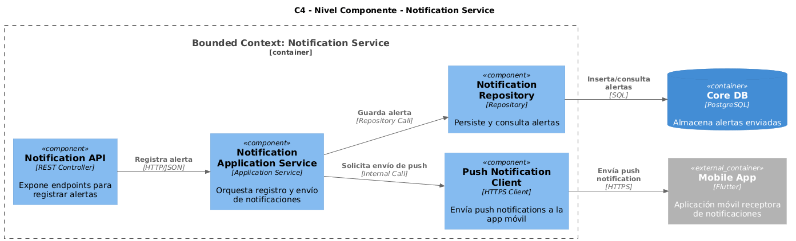

  

    <h2 style="text-align: center;">Universidad Peruana de Ciencias Aplicadas</h2>
    <h4 style="text-align: center;">Ingeniería de Software</h2> 
    <h4 style="text-align: center"> Periodo: 202520 </h4>
    <h4 style="text-align: center"> 1ASI0572 - Desarrollo de Soluciones IOT </h4>
    <h4 style="text-align: center"> NRC: 17755  </h4>
    <h4 style="text-align: center"> Docente: Marco Antonio León Baca </h4>

 

    <h3 style="text-align: center">Informe del Trabajo Final </h3>
    <h4 style="text-align: center;"> Startup: Acua Node </h3>
    <h4 style="text-align: center"> Producto: YakuControl </h4>

 

    
U202224135 — Aponte Cruzado, Andrea Marielena

    
U202116250 — Lopez Acuna, Mario Joaquin 

    
U202310008 — Urrutia Pena, Jasmin Adriana

    
U202311064 — Vivanco Salazar, Rafael Andres

    
U202117342 — Velasquez Chambi, Ruben Genaro

    <h4 style="text-align: center">Lima – abril 2025</h4>

### Registro de Versiones del Informe

| Versión | Fecha | Autor | Descripción de modificación |
| :--- | :--- | :--- | :--- |
| **1.0** | 09/04/2026 | Rafael Vivanco | Creación inicial de la estructura del informe y definición de lineamientos. |
| **2.0** | 12/04/2026 | A. Aponte, M. Lopez, J. Urrutia, R. Vivanco, R. Velasquez | Se completó el Capítulo I: Presentación del proyecto y Background. |
| **3.0** | 15/04/2026 | A. Aponte, M. Lopez, J. Urrutia, R. Vivanco, R. Velasquez | Finalización del Capítulo II: Requirements Development and Software Solution Design. |
| **4.0** | 18/04/2026 | A. Aponte, M. Lopez, J. Urrutia, R. Vivanco, R. Velasquez | Se completó el Capítulo III: Solution UI/UX Design. |
| **5.0** | 21/04/2026 | A. Aponte, M. Lopez, J. Urrutia, R. Vivanco, R. Velasquez | Se completó el Capítulo IV: Product Implementation & Validation. |
| **6.0** | 24/04/2026 | A. Aponte, M. Lopez, J. Urrutia, R. Vivanco, R. Velasquez | Revisión final, levantamiento de observaciones y entrega del informe. |

## Project Report Collaboration Insights

# Student Outcome: Project Report Collaboration Insights

En esta sección se presenta un resumen de las actividades de colaboración realizadas para la elaboración del informe del proyecto.

Se utilizó **GitHub** como plataforma de control de versiones y colaboración en equipo. Se incluye el enlace para acceder al repositorio para el reporte del proyecto: [Ver en Github](https://github.com/AcuaNode/yaku-report)

Los integrantes del equipo y sus nombres de usuario en GitHub son los siguientes:

| Integrantes | Nombre en GitHub |
| :--- | :--- |
| Aponte Cruzado, Andrea Marielena | iconicmiau |
| Lopez Acuna, Mario Joaquin | tertegen |
| Urrutia Pena, Jasmin Adriana | SrtaYeis |
| Vivanco Salazar, Rafael Andres | RafaelVivanco |
| Velasquez Chambi, Ruben Genaro | RubenGenaro10 |

Se usó el flujo de trabajo **GitFlow**, que incluye las siguientes ramas principales:

* **main:** Rama principal que contiene la versión estable y consolidada del documento.
* **develop:** Rama de integración utilizada para fusionar los cambios realizados en las ramas de características.
* **feature/chapter-I:** Rama para el desarrollo del Capítulo I (Startup Profile, Solution Profile, Lean UX Process y Segmentos objetivo).
* **feature/chapter-II:** Rama para el desarrollo del Capítulo II (Análisis competitivo, Entrevistas, Needfinding, EventStorming de alto nivel y Ubiquitous Language).
* **feature/chapter-III:** Rama para el desarrollo del Capítulo III (User Stories, Impact Mapping y estructuración del Product Backlog).
* **feature/chapter-IV:** Rama para el desarrollo del Capítulo IV (Diseño estratégico y táctico con Domain-Driven Design, Context Mapping y Arquitectura de Software C4).
* **release/v1.0.0:** Rama de preparación para la entrega final del 24/04.
* **hotfix/urgent-fix:** Rama para correcciones críticas de último minuto sobre `main`.

## AV1

**Tareas**

Iniciando actividades el **09/04/2026**, el equipo distribuyó las responsabilidades de la siguiente manera:

| Integrantes | Tarea asignada |
| :--- | :--- |
| Aponte Cruzado, Andrea Marielena | - Diseño y análisis de entrevistas   - User Personas, Task Matrix y Journey Mapping   - Empathy Mapping   - Domain Message Flow Modeling   - Tactical Level DDD (Institution Context) |
| Lopez Acuna, Mario Joaquin | - Startup & Solution Profile   - Segmentos objetivo y Competidores   - Ubiquitous Language   - Impact mapping   - Context Mapping   - Tactical Level DDD (Scheduling Context) |
| Urrutia Pena, Jasmin Adriana | - User stories y Product Backlog   - Event Storming documentation   - Candidate Context Discovery   - Tactical Level DDD (Billing & Accounting Context) |
| Vivanco Salazar, Rafael Andres | - Software Architecture (Context, Container & Deployment Diagrams)   - Configuración del Repositorio   - Tactical Level DDD (Enrollment Context) |
| Velasquez Chambi, Ruben Genaro | - Registro de versiones del informe   - Project Report Collaboration Insights   - Student Outcome documentation   - Objetivos SMART   - Bounded Context Canvases   - Tactical Level DDD (Attendance Context) |

**GitHub Collaboration Insights**

A continuación, se presentan las evidencias del trabajo colaborativo en el repositorio, gestionado bajo el flujo GitFlow desde el inicio del proyecto el 09 de abril hasta la fecha de entrega final el 24 de abril.

*Gráfico de red (network graph) de ramas en el repositorio de GitHub.*

*Análisis de líneas de código añadidas por contribuyente (Aponte, Lopez, Urrutia, Vivanco, Velasquez).*

*Análisis de actividad de commits registrada durante el periodo del 09/04 al 24/04.*

# Contenido

### Capítulo I: Introducción
- [1.1. Startup Profile](#11-startup-profile)
  - [1.1.1. Descripción de la Startup](#111-descripción-de-la-startup)
  - [1.1.2. Perfiles de integrantes del equipo](#112-perfiles-de-integrantes-del-equipo)
- [1.2. Solution Profile](#12-solution-profile)
  - [1.2.1. Antecedentes y problemática](#121-antecedentes-y-problemática)
  - [1.2.2. Lean UX Process](#122-lean-ux-process)
    - [1.2.2.1. Lean UX Problem Statements](#1221-lean-ux-problem-statements)
    - [1.2.2.2. Lean UX Assumptions](#1222-lean-ux-assumptions)
    - [1.2.2.3. Lean UX Hypothesis Statements](#1223-lean-ux-hypothesis-statements)
    - [1.2.2.4. Lean UX Canvas](#1224-lean-ux-canvas)
- [1.3. Segmentos objetivo](#13-segmentos-objetivo)

### Capítulo II: Requirements Elicitation & Analysis
- [2.1. Competidores](#21-competidores)
  - [2.1.1. Análisis competitivo](#211-análisis-competitivo)
  - [2.1.2. Estrategias y tácticas frente a competidores](#212-estrategias-y-tácticas-frente-a-competidores)
- [2.2. Entrevistas](#22-entrevistas)
  - [2.2.1. Diseño de entrevistas](#221-diseño-de-entrevistas)
  - [2.2.2. Registro de entrevistas](#222-registro-de-entrevistas)
  - [2.2.3. Análisis de entrevistas](#223-análisis-de-entrevistas)
- [2.3. Needfinding](#23-needfinding)
  - [2.3.1. User Personas](#231-user-personas)
  - [2.3.2. User Task Matrix](#232-user-task-matrix)
  - [2.3.3. User Journey Mapping](#233-user-journey-mapping)
  - [2.3.4. Empathy Mapping](#234-empathy-mapping)
- [2.4. Big Picture EventStorming](#24-big-picture-eventstorming)
- [2.5. Ubiquitous Language](#25-ubiquitous-language)

### Capítulo III: Requirements Specification
- [3.1. User Stories](#31-user-stories)
- [3.2. Impact Mapping](#32-impact-mapping)
- [3.3. Product Backlog](#33-product-backlog)

### Capítulo IV: Solution Software Design
- [4.1. Strategic-Level Domain-Driven Design](#41-strategic-level-domain-driven-design)
  - [4.1.1. Design-Level EventStorming](#411-design-level-eventstorming)
    - [4.1.1.1. Candidate Context Discovery](#4111-candidate-context-discovery)
    - [4.1.1.2. Domain Message Flows Modeling](#4112-domain-message-flows-modeling)
    - [4.1.1.3. Bounded Context Canvases](#4113-bounded-context-canvases)
  - [4.1.2. Context Mapping](#412-context-mapping)
  - [4.1.3. Software Architecture](#413-software-architecture)
    - [4.1.3.1. Software Architecture System Landscape Diagram](#4131-software-architecture-system-landscape-diagram)
    - [4.1.3.2. Software Architecture Context Level Diagrams](#4132-software-architecture-context-level-diagrams)
    - [4.1.3.3. Software Architecture Container Level Diagrams](#4133-software-architecture-container-level-diagrams)
    - [4.1.3.4. Software Architecture Deployment Diagrams](#4134-software-architecture-deployment-diagrams)
- [4.2. Tactical-Level Domain-Driven Design](#42-tactical-level-domain-driven-design)
  - [4.2.X. Bounded Context](#42x-bounded-context)
    - [4.2.X.1. Domain Layer](#42x1-domain-layer)
    - [4.2.X.2. Interface Layer](#42x2-interface-layer)
    - [4.2.X.3. Application Layer](#42x3-application-layer)
    - [4.2.X.4. Infrastructure Layer](#42x4-infrastructure-layer)
    - [4.2.X.5. Bounded Context Software Architecture Component Level Diagrams](#42x5-bounded-context-software-architecture-component-level-diagrams)
    - [4.2.X.6. Bounded Context Software Architecture Code Level Diagrams](#42x6-bounded-context-software-architecture-code-level-diagrams)
      - [4.2.X.6.1. Bounded Context Domain Layer Class Diagrams](#42x61-bounded-context-domain-layer-class-diagrams)
      - [4.2.X.6.2. Bounded Context Database Design Diagram](#42x62-bounded-context-database-design-diagram)

- [Conclusiones](#conclusiones)
- [Bibliografía](#bibliografia)
- [Anexos](#anexos)

# Student Outcome
En el siguiente cuadro se describen las acciones realizadas y enunciados de conclusiones por parte del grupo, que permiten sustentar el haber alcanzado el logro del ABET – EAC - Student Outcome 7.

| Criterio específico | Acciones realizadas | Conclusiones |
| :--- | :--- | :--- |
| **Actualiza conceptos y conocimientos necesarios para su desarrollo profesional y en especial para su proyecto en soluciones de software.** | **Aponte Cruzado, Andrea Marielena** *AV1*: Actualizó conceptos sobre técnicas de elicitación de requerimientos, diseño de entrevistas y modelado de flujos de dominio (Domain Message Flow) aplicados al diseño estratégico.  **Lopez Acuna, Mario Joaquin** *AV1*: Investigó y actualizó conocimientos sobre análisis competitivo y metodologías Lean UX para estructurar el perfil de la solución y mapear el contexto (Context Mapping).  **Urrutia Pena, Jasmin Adriana** *AV1*: Profundizó en la dinámica de EventStorming y el descubrimiento de contextos candidatos, actualizando sus bases teóricas para la correcta redacción de User Stories.  **Vivanco Salazar, Rafael Andres** *AV1*: Actualizó conceptos sobre diseño de arquitectura de software utilizando el modelo C4 y patrones tácticos de DDD aplicados a la configuración inicial del proyecto.  **Velasquez Chambi, Ruben Genaro** *AV1*: Actualizó conocimientos en la estructuración de Bounded Context Canvases y la interpretación de métricas de colaboración en GitHub (Insights) para documentar el progreso. | *AV1:* Consideramos que durante esta primera etapa logramos cumplir un alto nivel de actualización técnica. Como equipo, tuvimos que investigar y afianzar nuestros conocimientos sobre Domain-Driven Design (DDD), arquitectura de software bajo el modelo C4 y metodologías de ideación (Lean UX, EventStorming). Esta asimilación de nuevos conceptos fue fundamental para estructurar correctamente las bases arquitectónicas y los requerimientos de nuestra solución de software, aportando directamente a nuestro desarrollo profesional. |
| **Reconoce la necesidad del aprendizaje permamente para el desempeño profesional y el desarrollo de proyectos en soluciones de software.** | **Aponte Cruzado, Andrea Marielena** *AV1*: Reconoció la necesidad de investigar constantemente nuevas técnicas de mapeo de empatía y diseño de experiencia de usuario para comprender a profundidad las necesidades del cliente.  **Lopez Acuna, Mario Joaquin** *AV1*: Identificó la importancia de mantenerse actualizado sobre las tendencias del mercado y modelos de negocio de competidores para poder definir un Ubiquitous Language preciso y competitivo.  **Urrutia Pena, Jasmin Adriana** *AV1*: Comprendió la necesidad de instruirse continuamente en metodologías ágiles y gestión de Backlog para adaptarse a la complejidad del descubrimiento de dominios del software.  **Vivanco Salazar, Rafael Andres** *AV1*: Identificó la necesidad vital de seguir aprendiendo sobre estándares de flujos de trabajo colaborativos (GitFlow) y evolución de arquitecturas para garantizar un diseño escalable.  **Velasquez Chambi, Ruben Genaro** *AV1*: Reconoció la relevancia de mantenerse al día con los estándares de documentación (ABET) y las mejores prácticas para delimitar contextos (Bounded Contexts) en proyectos complejos. | *AV1:* A nivel grupal, reconocemos que el desarrollo de software exige una mentalidad de formación continua. Al enfrentarnos a la definición estratégica y táctica de nuestro dominio, evidenciamos que las metodologías y herramientas cambian y evolucionan. Entendimos que investigar de manera autónoma, validar nuevas fuentes de información y adaptar nuestro enfoque no es solo un requisito académico, sino una habilidad indispensable para mantener la calidad y vigencia en el ámbito profesional a largo plazo. |

# Objetivos Smart

A continuación, cada integrante del equipo presenta sus objetivos SMART, enfocados en su desarrollo profesional luego de culminar la carrera universitaria.

**Aponte Cruzado, Andrea Marielena (UX/UI & Research)**
Diseñar y documentar un mínimo de 3 perfiles de usuario (User Personas) y sus respectivos flujos (User Journey Maps) basándose en los hallazgos de las entrevistas iniciales. Este mapeo de empatía debe estar finalizado e integrado en el reporte antes del cierre de la segunda semana del sprint, garantizando que el diseño estratégico de la solución esté estrictamente alineado con las necesidades reales del cliente.

**Lopez Acuna, Mario Joaquin (Business & Strategy)**
Elaborar el Lean UX Canvas completo y documentar el análisis de al menos 3 competidores directos en el mercado tecnológico actual. Asimismo, deberá consolidar la primera versión del Lenguaje Ubicuo (Ubiquitous Language) estandarizado para el equipo durante los primeros 10 días del sprint, lo cual servirá como base indispensable para evitar ambigüedades en el modelado del dominio.

**Urrutia Pena, Jasmin Adriana (Requirements & EventStorming)**
Estructurar el Product Backlog inicial redactando y estimando un mínimo de 20 Historias de Usuario priorizadas bajo criterios de valor de negocio. Además, completará el diagrama de EventStorming de alto nivel en la plataforma colaborativa al menos 3 días antes de la entrega final del AV1, permitiendo al equipo tener una visión integral del flujo de eventos del sistema.

**Vivanco Salazar, Rafael Andres (Architecture & DevOps)**
Diseñar los 4 niveles fundamentales de arquitectura de software (System Landscape, Context, Container y Deployment) utilizando el estándar C4. En paralelo, configurará el repositorio oficial implementando las reglas del flujo GitFlow y protecciones de ramas principales, debiendo cumplir con el despliegue de esta infraestructura y documentación técnica a más tardar el 20 de abril para permitir la revisión grupal.

**Velasquez Chambi, Ruben Genaro (Documentation & Context Mapping)**
Consolidar la documentación técnica final integrando los 5 Bounded Context Canvases elaborados por el equipo, garantizando la coherencia del Context Mapping. Además, extraerá y maquetará el reporte de métricas de colaboración de GitHub (Insights) con al menos 3 gráficos clave de rendimiento, entregando la versión candidata del documento en la rama *release* 48 horas antes de la presentación oficial para su auditoría final.

# Capítulo I: Introducción
## 1.1. Startup Profile
### 1.1.1. Descripción de la Startup
### 1.1.2. Perfiles de integrantes del equipo
## 1.2. Solution Profile
### 1.2.1. Antecedentes y problemática
### 1.2.2. Lean UX Process
#### 1.2.2.1. Lean UX Problem Statements
#### 1.2.2.2. Lean UX Assumptions
#### 1.2.2.3. Lean UX Hypothesis Statements
#### 1.2.2.4. Lean UX Canvas
## 1.3. Segmentos objetivo

# Capítulo II: Requirements Elicitation & Analysis
## 2.1. Competidores
### 2.1.1. Análisis competitivo
### 2.1.2. Estrategias y tácticas frente a competidores
## 2.2. Entrevistas
### 2.2.1. Diseño de entrevistas
### 2.2.2. Registro de entrevistas
### 2.2.3. Análisis de entrevistas
## 2.3. Needfinding
### 2.3.1. User Personas
### 2.3.2. User Task Matrix
### 2.3.3. User Journey Mapping
### 2.3.4. Empathy Mapping
## 2.4. Big Picture EventStorming
## 2.5. Ubiquitous Language

# Capítulo III: Requirements Specification
## 3.1. User Stories
## 3.2. Impact Mapping
## 3.3. Product Backlog

# Capítulo IV: Solution Software Design
## 4.1. Strategic-Level Domain-Driven Design
### 4.1.1. Design-Level EventStorming
En esta sección se detalla la aplicación del EventStorming como herramienta estratégica del Domain-Driven Design (DDD). El objetivo es mapear los eventos de dominio que articulan el ecosistema de YakuControl, permitiendo identificar los límites de los futuros Bounded Contexts y las interacciones clave entre los actores. Este enfoque garantiza que la arquitectura de software esté alineada con las reglas de negocio de la acuicultura inteligente y sea capaz de escalar de forma modular.
#### 4.1.1.1. Candidate Context Discovery
##### Step 1
 
##### Step 2
 
##### Step 3
 
##### Step 4
 
##### Step 5
 
##### Step 6
 
##### Step 7
 
##### Step 8
 
##### Step 9
 
##### Step 10
 

Link Miro:  
https://miro.com/welcomeonboard/dGFtbnNmZWozeFE1UnJUcWZiY05ISlBxMGZRTFNnWGhKNHU3YkZRTkd1U2tnd3NzZVoybUtQRWRDNDZkdlI0OGFjS2VBTGU3ZWdsRS8wa3RodTl2a2FhcGk0Qm1HdFJkZDVNdTdkQjR5V3hvNXE5MTFDWTJEaFhUNkg2Sm52bXlQdGo1ZEV3bUdPQWRZUHQzSGl6V2NBPT0hdjE=?share_link_id=635140542507

#### 4.1.1.2. Domain Message Flows Modeling
#### 4.1.1.3. Bounded Context Canvases

### 4.1.2. Context Mapping

Para elaborar el Context Mapping de YakuControl, el equipo revisó los cinco Bounded Context Canvases definidos en la etapa de diseño estratégico: **IAM Context**, **Hardware Context**, **Notification Context**, **Report Context** y **Payment Context**. A partir de esta revisión, se analizaron las dependencias entre contextos, las responsabilidades de cada uno y las posibles alternativas de diseño antes de determinar la estructura final de relaciones.

#### Proceso de análisis: preguntas de diseño candidato

**¿Qué pasaría si movemos la lógica de umbrales críticos del Hardware Context al Notification Context?**
Si el Notification Context asumiera la responsabilidad de decidir cuándo emitir alertas basándose en umbrales, crearía una dependencia directa con los datos de configuración del negocio acuícola. Esto contaminaría al Notification Context con reglas de dominio que no le corresponden, haciéndolo frágil ante cambios en los criterios de calidad del agua. Se descarta esta alternativa: la lógica de umbrales debe permanecer en el Hardware Context, que es quien procesa la telemetría.

**¿Qué pasaría si descomponemos el Hardware Context y separamos la ingesta de telemetría del control de actuadores?**
Podría tener sentido separar el Edge API (ingesta y procesamiento) del módulo de control remoto (actuadores). Sin embargo, dado el tamaño del equipo y la naturaleza del MVP, esta separación generaría overhead de comunicación entre contextos sin beneficio real en esta etapa. Se decide mantenerlos en un único Hardware Context cohesivo, con la posibilidad de descomponerlo en una versión futura del producto.

**¿Qué pasaría si partimos el IAM Context en un contexto de Autenticación y otro de Autorización?**
Separar la emisión de tokens JWT de la gestión de roles (RBAC) permitiría mayor granularidad. Sin embargo, ambas responsabilidades están fuertemente acopladas en la lógica de acceso de YakuControl (el token lleva el rol embebido). Dividirlos introduciría complejidad innecesaria. Se mantiene el IAM Context unificado.

**¿Qué pasaría si tomamos la gestión de usuarios del IAM Context y la unimos con Payment Context para formar un contexto de "Customer Management"?**
La idea de unir la identidad del usuario con su estado de suscripción podría simplificar la verificación de acceso. Sin embargo, mezclaría responsabilidades de dominio distintas: la identidad es un concepto técnico de seguridad, mientras que la suscripción es un concepto de negocio. Mantenerlos separados permite evolucionarlos de forma independiente. Se descarta la unificación.

**¿Qué pasaría si duplicamos la lógica de historial de lecturas entre el Hardware Context y el Report Context para romper su dependencia?**
Duplicar datos de telemetría procesados en ambos contextos permitiría que el Report Context opere de forma completamente autónoma. El costo es la sincronización de datos y el riesgo de inconsistencias. Se opta por una solución intermedia: el Hardware Context publica eventos de dominio que el Report Context consume de forma asíncrona, manteniendo independencia sin duplicación de lógica.

**¿Qué pasaría si creamos un Shared Service de notificaciones para reducir duplicación entre Hardware y Report?**
Tanto el Hardware Context (alertas críticas) como el Report Context (notificaciones de reportes generados) podrían necesitar enviar mensajes al usuario. Centralizar esto en el Notification Context como un shared service es precisamente la solución adoptada: ambos contextos publican eventos y el Notification Context se encarga del canal de entrega (push, SMS), evitando duplicación de integraciones con Firebase o Twilio.

**¿Qué pasaría si aislamos los core capabilities de monitoreo y movemos la facturación a un contexto de soporte externo?**
El core de YakuControl es el monitoreo de calidad del agua y el control de actuadores. El Payment Context es claramente un dominio de soporte, no el núcleo del negocio. Aislarlo como un contexto de soporte con integración externa (Stripe) es la decisión correcta: si el proveedor de pagos cambia, solo se afecta el Payment Context y no el resto del sistema.

---

#### Relaciones entre Bounded Contexts y patrones DDD aplicados

Tras el análisis de alternativas, se definió el siguiente mapa de relaciones para YakuControl:

| Contexto Upstream (U) | Contexto Downstream (D) | Patrón de Relación | Descripción |
| :--- | :--- | :--- | :--- |
| **IAM Context** | **Hardware Context** | Open Host Service (OHS) + ACL | El IAM Context expone un servicio de validación de tokens JWT. El Hardware Context implementa una Anti-Corruption Layer para traducir la identidad del dispositivo/usuario sin depender directamente del modelo interno del IAM. |
| **IAM Context** | **Notification Context** | Open Host Service (OHS) | El IAM Context provee los datos de contacto y tokens de dispositivo necesarios para que el Notification Context envíe alertas al usuario correcto. El Notification Context consume este servicio sin modificar su modelo. |
| **IAM Context** | **Report Context** | Open Host Service (OHS) | El Report Context consulta al IAM Context para verificar el rol del usuario (ROLE_ADMIN) antes de permitir el acceso a reportes históricos y configuraciones avanzadas. |
| **IAM Context** | **Payment Context** | Customer/Supplier | El Payment Context (cliente) depende del IAM Context (proveedor) para obtener la identidad del usuario al momento de procesar una suscripción. El IAM Context tiene influencia sobre el modelo del Payment Context. |
| **Hardware Context** | **Notification Context** | Customer/Supplier | El Hardware Context (proveedor) emite eventos de riesgo cuando el ICA supera el umbral crítico. El Notification Context (cliente) consume estos eventos para disparar alertas push o SMS. |
| **Hardware Context** | **Report Context** | Customer/Supplier | El Hardware Context (proveedor) publica lecturas procesadas de forma asíncrona. El Report Context (cliente) las consume para construir el historial de tendencias y el estado de los estanques. |
| **Payment Context** | **IAM Context** | Conformist | Una vez procesado el pago, el Payment Context notifica al IAM Context el estado activo de la suscripción. El IAM Context adopta esta información para habilitar o restringir el acceso del usuario, conformándose al modelo del Payment Context sin transformarlo. |

#### Conclusión del Context Mapping

El mapa de contextos resultante posiciona al **IAM Context** como el contexto de soporte central del cual dependen todos los demás para validar identidad y permisos. El **Hardware Context** es el núcleo operativo del sistema, siendo la fuente de verdad de la telemetría. El **Notification Context** y el **Report Context** son contextos de soporte especializados que consumen eventos del Hardware Context de forma desacoplada. Finalmente, el **Payment Context** opera como un contexto de soporte de negocio, integrado externamente vía Stripe, con mínima interferencia sobre el resto del dominio.

Esta arquitectura garantiza que los cambios en la lógica de pagos o notificaciones no afecten el core del monitoreo acuícola, y que cada contexto pueda evolucionar, testearse y desplegarse de forma independiente.

### 4.1.3. Software Architecture
#### 4.1.3.1. Software Architecture System Landscape Diagram
En esta sección se ofrece una visión macroscópica del ecosistema tecnológico de la piscigranja. El objetivo de este nivel de abstracción es contextualizar a YakuControl dentro de su entorno operativo real. El diagrama ilustra la convivencia de la plataforma principal con otros sistemas aislados de la empresa y los actores organizacionales. Esto permite comprender los flujos de información y los procesos de negocio en el terreno, existan o no integraciones directas a nivel de código.

 

#### 4.1.3.2. Software Architecture Context Level Diagrams
El propósito de este nivel es definir de manera estricta las fronteras del software en desarrollo. El diagrama detalla a los usuarios directos (el Administrador y el Piscicultor) y las dependencias con sistemas externos críticos para la operatividad y monetización, tales como la infraestructura IoT en los estanques, la pasarela de pagos B2B y las APIs meteorológicas.

 

#### 4.1.3.3. Software Architecture Container Level Diagrams
Se expone la estructura interna de YakuControl y las decisiones tecnológicas de alto nivel. Este esquema identifica las unidades de ejecución independientes que conforman el sistema, abarcando desde las interfaces de usuario (aplicaciones web SPA y aplicaciones móviles nativas) hasta el enrutamiento mediante un API Gateway y la malla de microservicios backend. Asimismo, ilustra la estrategia de persistencia en bases de datos relacionales y de series de tiempo y el modelo de comunicación asíncrona mediante un bus de eventos, demostrando la escalabilidad y el desacoplamiento de la arquitectura.

 

#### 4.1.3.4. Software Architecture Deployment Diagrams
Mapea la arquitectura lógica hacia la infraestructura física y los servicios en la nube. Este nivel visualiza la distribución topológica y geográfica del software, detallando cómo los artefactos y contenedores se instalan en los entornos de ejecución reales. El esquema evidencia la separación estratégica en ejecución en el "Edge", la distribución global del frontend mediante redes de entrega de contenido, y el despliegue seguro del backend dentro de una red virtual privada (VNet) administrada en la nube de Microsoft Azure.

 

## 4.2. Tactical-Level Domain-Driven Design

### 4.2.1. Bounded Context: Report Context
#### 4.2.1.1. Domain Layer
#### 4.2.1.2. Interface Layer
#### 4.2.1.3. Application Layer
#### 4.2.1.4. Infrastructure Layer
#### 4.2.1.5. Bounded Context Software Architecture Component Level Diagrams
#### 4.2.1.6. Bounded Context Software Architecture Code Level Diagrams
##### 4.2.1.6.1. Bounded Context Domain Layer Class Diagrams
##### 4.2.1.6.2. Bounded Context Database Design Diagram

### 4.2.2. Bounded Context: Hardware Context
#### 4.2.2.1. Domain Layer
#### 4.2.2.2. Interface Layer
#### 4.2.2.3. Application Layer
#### 4.2.2.4. Infrastructure Layer
#### 4.2.2.5. Bounded Context Software Architecture Component Level Diagrams
#### 4.2.2.6. Bounded Context Software Architecture Code Level Diagrams
##### 4.2.2.6.1. Bounded Context Domain Layer Class Diagrams
##### 4.2.2.6.2. Bounded Context Database Design Diagram

### 4.2.3. Bounded Context: Iam Context
#### 4.2.3.1. Domain Layer
#### 4.2.3.2. Interface Layer
#### 4.2.3.3. Application Layer
#### 4.2.3.4. Infrastructure Layer
#### 4.2.3.5. Bounded Context Software Architecture Component Level Diagrams
#### 4.2.3.6. Bounded Context Software Architecture Code Level Diagrams
##### 4.2.3.6.1. Bounded Context Domain Layer Class Diagrams
##### 4.2.3.6.2. Bounded Context Database Design Diagram

### 4.2.4. Bounded Context: Notification Context
#### 4.2.4.1. Domain Layer
Bounded Context Notification presenta una descripción estructurada de las clases que conforman el modelo de dominio encargado de la gestión de alertas y notificaciones dentro del sistema IOT de monitoreo en criaderos de truchas. Este modelo se ha diseñado bajo los principios de Domain-Driven Design (DDD), con el objetivo de reflejar fielmente las reglas del negocio en el código, manteniendo una separación clara entre la lógica del dominio y los aspectos técnicos o de infraestructura.

##### Aggregate 
* **Notification** : Representa una alerta (normal o crítica) generada por el sistema cuando los sensores envían datos por debajo del umbral permitido, si hay daño o pérdida de conexión.
##### Entity
* **Recipient** : Representa a la persona (Piscicultor o Administrador/Dueño) que recibe la notificación.
* **SensorData**: Contiene la información capturada por el hardware (temperatura, turbidez, ph, estado de bombas) en el momento de la alerta.
##### Value Object
* **NotificationType**
* **RecipientRole**
* **ContactInfo**
* **HardwareStatus**

#### 4.2.4.2. Interface Layer
La capa de interfaz de usuario (o Interface Layer) en el Bounded Context de Notification actúa como el punto de contacto entre el sistema y el mundo exterior. Su responsabilidad principal es exponer los puntos de enlace (endpoints) RESTful para la gestión de alertas y asegurar que la comunicación con los clientes (App Web y App Móvil) y otros contextos (Hardware) sea estandarizada.

##### Controller
* **NotificationController:** Controlador REST que gestiona las operaciones relacionadas con las notificaciones, permitiendo la recepción de alertas desde el hardware
##### DTO
* **CreateNotificationResource (DTO):** Objeto de transferencia de datos utilizado para capturar la información necesaria al generar una nueva alerta desde los sensores
* **NotificationResource (DTO):** Representa la respuesta estándar del sistema al consultar una notificación, formateada para ser consumida por la aplicación web o móvil.
* **SensorDataResource (DTO):** Objeto de transferencia de datos utilizndo para capturar la informacion del estado de los Sensores.

#### 4.2.4.3. Application Layer
La capa de aplicación en el Bounded Context de Notification define los trabajos que el software debe realizar y dirige los objetos de dominio para que resuelvan los problemas. Siguiendo el principio de inversión de dependencias y el patrón CQRS (separación de comandos y consultas), esta capa se divide en servicios de comandos (para crear alertas) y servicios de consultas (para leer el historial).

##### Command
* **NotificationCommandService:** Servicio encargado de orquestar la creación de nuevas alertas. Coordina la obtención de los destinatarios correspondientes, crea la entidad Notification y hace el llamado para enviar y guardar la alerta.
* **CreateNotificationCommand:** Objeto inmutable que transporta la intención de crear una notificación desde la capa de interfaz hacia la capa de aplicación. Contiene los datos del sensor y el tipo de alerta.

##### Query
* **NotificationQueryService:** Servicio encargado de orquestar las consultas de lectura para que la App Web (Administradores) y App Móvil (Piscicultores) puedan ver el historial de alertas.

#### 4.2.4.4. Infrastructure Layer
La capa de infraestructura proporciona las capacidades técnicas y tecnológicas que soportan a las demás capas (Interfaces, Aplicación y Dominio). Su propósito es implementar las interfaces (puertos) que definimos en la capa de Aplicación, aplicando el principio de Inversión de Dependencias.

Aquí es donde configuramos la conexión a la base de datos (por ejemplo, usando JPA/Hibernate con PostgreSQL o MySQL

**NotificationRepositoryImpl:** Clase que implementa la interfaz NotificationRepository definida en la capa de Aplicación. Traduce las entidades de dominio a NotificationJpaEntity y utiliza un repositorio de Spring Data JPA para guardar o consultar en la base de datos

#### 4.2.4.5. Bounded Context Software Architecture Component Level Diagrams

#### 4.2.4.6. Bounded Context Software Architecture Code Level Diagrams
##### 4.2.4.6.1. Bounded Context Domain Layer Class Diagrams
##### 4.2.4.6.2. Bounded Context Database Design Diagram

### 4.2.5. Bounded Context: Payment Context
#### 4.2.5.1. Domain Layer
#### 4.2.5.2. Interface Layer
#### 4.2.5.3. Application Layer
#### 4.2.5.4. Infrastructure Layer
#### 4.2.5.5. Bounded Context Software Architecture Component Level Diagrams
#### 4.2.5.6. Bounded Context Software Architecture Code Level Diagrams
##### 4.2.5.6.1. Bounded Context Domain Layer Class Diagrams
##### 4.2.5.6.2. Bounded Context Database Design Diagram

# Conclusiones
## Conclusiones y recomendaciones
## Video About-the-Team

# Bibliografía

# Anexos
