<div style="text-align: center;">
  
</div>

<div style="text-align: center;">
    <h2 style="text-align: center;">Universidad Peruana de Ciencias Aplicadas</h2>
    <h4 style="text-align: center;">Ingeniería de Software</h2> 
    <h4 style="text-align: center"> Periodo: 202520 </h4>
    <h4 style="text-align: center"> 1ASI0572 - Desarrollo de Soluciones IOT </h4>
    <h4 style="text-align: center"> NRC: 17755  </h4>
    <h4 style="text-align: center"> Docente: Marco Antonio León Baca </h4>
</div>

<br>

<div style="text-align: center;">
    <h3 style="text-align: center">Informe del Trabajo Final </h3>
    <h4 style="text-align: center;"> Startup: Acua Node </h3>
    <h4 style="text-align: center"> Producto: YakuControl </h4>
</div>

<br>

<div style="text-align:center; margin-top: 10px; font-size: 90%; line-height: 1.6;">
    <p>U202224135 — Aponte Cruzado, Andrea Marielena</p>
    <p>U202116250 — Lopez Acuna, Mario Joaquin </p>
    <p>U202310008 — Urrutia Pena, Jasmin Adriana</p>
    <p>U202311064 — Vivanco Salazar, Rafael Andres</p>
    <p>U202117342 — Velasquez Chambi, Ruben Genaro</p>
</div>


<div style="text-align: center;">
    <h4 style="text-align: center">Lima – abril 2025</h4>
</div>

<div style="page-break-after: always;"></div>

### Registro de Versiones del Informe

| Versión | Fecha | Autor | Descripción de modificación |
| :--- | :--- | :--- | :--- |
| **1.0** | 09/04/2026 | Rafael Vivanco | Creación inicial de la estructura del informe y definición de lineamientos. |
| **2.0** | 12/04/2026 | A. Aponte, M. Lopez, J. Urrutia, R. Vivanco, R. Velasquez | Se completó el Capítulo I: Presentación del proyecto y Background |
| **3.0** | 15/04/2026 | A. Aponte, M. Lopez, J. Urrutia, R. Vivanco, R. Velasquez | Finalización del Capítulo II: Obtención y análisis de requisitos |
| **4.0** | 18/04/2026 | A. Aponte, M. Lopez, J. Urrutia, R. Vivanco, R. Velasquez | Se completó el Capítulo III: Especificación de requisitos |
| **5.0** | 21/04/2026 | A. Aponte, M. Lopez, J. Urrutia, R. Vivanco, R. Velasquez | Se completó el Capítulo IV: Diseño y arquitectura de la solución |
| **6.0** | 24/04/2026 | A. Aponte, M. Lopez, J. Urrutia, R. Vivanco, R. Velasquez | Revisión final, levantamiento de observaciones y entrega del informe. |

<div style="page-break-after: always;"></div>

# Project Report Collaboration Insights

En esta sección se presenta un resumen de las actividades de colaboración realizadas para la elaboración del informe del proyecto.

Se utilizó **GitHub** como plataforma de control de versiones y colaboración en equipo. Se incluye el enlace para acceder al repositorio para el reporte del proyecto: [Ver en Github](https://github.com/AcuaNode/yaku-report)

Los integrantes del equipo y sus nombres de usuario en GitHub son los siguientes:

| Integrantes | Nombre en GitHub |
| :--- | :--- |
| Aponte Cruzado, Andrea Marielena | iconicmiau |
| Lopez Acuna, Mario Joaquin | tertegen |
| Urrutia Pena, Jasmin Adriana | SrtaYeis |
| Vivanco Salazar, Rafael Andres | RafaelVivanco |
| Velasquez Chambi, Ruben Genaro | RubenGenaro10 |

Se usó el flujo de trabajo **GitFlow**, que incluye las siguientes ramas principales:

* **main:** Rama principal que contiene la versión estable y consolidada del documento.
* **develop:** Rama de integración utilizada para fusionar los cambios realizados en las ramas de características.
* **feature/chapter-I:** Rama para el desarrollo del Capítulo I (Startup Profile, Solution Profile, Lean UX Process y Segmentos objetivo).
* **feature/chapter-II:** Rama para el desarrollo del Capítulo II (Análisis competitivo, Entrevistas, Needfinding, EventStorming de alto nivel y Ubiquitous Language).
* **feature/chapter-III:** Rama para el desarrollo del Capítulo III (User Stories, Impact Mapping y estructuración del Product Backlog).
* **feature/chapter-IV:** Rama para el desarrollo del Capítulo IV (Diseño estratégico y táctico con Domain-Driven Design, Context Mapping y Arquitectura de Software C4).
* **release/v1.0.0:** Rama de preparación para la entrega final del 24/04.
* **hotfix/urgent-fix:** Rama para correcciones críticas de último minuto sobre `main`.

<div style="page-break-after: always;"></div>

## AV1

**Tareas**

Iniciando actividades el **09/04/2026**, el equipo distribuyó las responsabilidades de la siguiente manera:

| Integrantes | Tarea asignada |
| :--- | :--- |
| Aponte Cruzado, Andrea Marielena | - Diseño y análisis de entrevistas <br> - User Personas, Task Matrix y Journey Mapping <br> - Empathy Mapping <br> - Domain Message Flow Modeling <br> - Tactical Level DDD (Equipment Context) |
| Lopez Acuna, Mario Joaquin | - Startup & Solution Profile <br> - Segmentos objetivo y Competidores <br> - Ubiquitous Language <br> - Impact mapping <br> - Context Mapping <br> - Tactical Level DDD (Payment Context) |
| Urrutia Pena, Jasmin Adriana | - User stories y Product Backlog <br> - Event Storming documentation <br> - Candidate Context Discovery <br> - Tactical Level DDD (Telemetry Context) |
| Vivanco Salazar, Rafael Andres | - Software Architecture (Context, Container & Deployment Diagrams) <br> - Configuración del Repositorio <br> - Tactical Level DDD (IAM Context) |
| Velasquez Chambi, Ruben Genaro | - Registro de versiones del informe <br> - Project Report Collaboration Insights <br> - Student Outcome documentation <br> - Objetivos SMART <br> - Bounded Context Canvases <br> - Tactical Level DDD (Notification Context) |

**GitHub Collaboration Insights**

A continuación, se presentan las evidencias del trabajo colaborativo en el repositorio, gestionado bajo el flujo GitFlow desde el inicio del proyecto el 09 de abril hasta la fecha de entrega final el 24 de abril.

<div style="text-align: center; margin-top: 1rem; margin-bottom: 1rem;">

*Gráfico de red (network graph) de ramas en el repositorio de GitHub.*

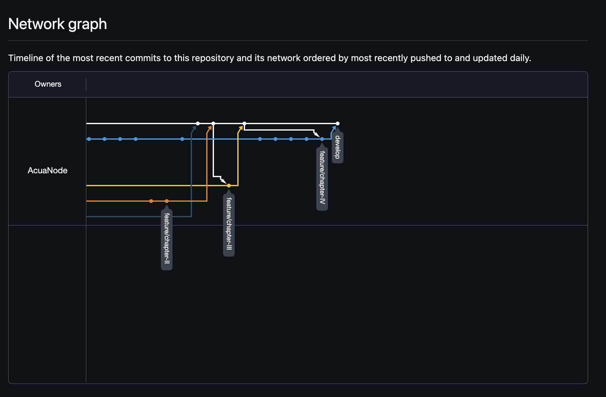

</div>

<div style="text-align: center; margin-top: 1rem; margin-bottom: 1rem;">

*Análisis de líneas de código añadidas por contribuyente (Aponte, Lopez, Urrutia, Vivanco, Velasquez).*

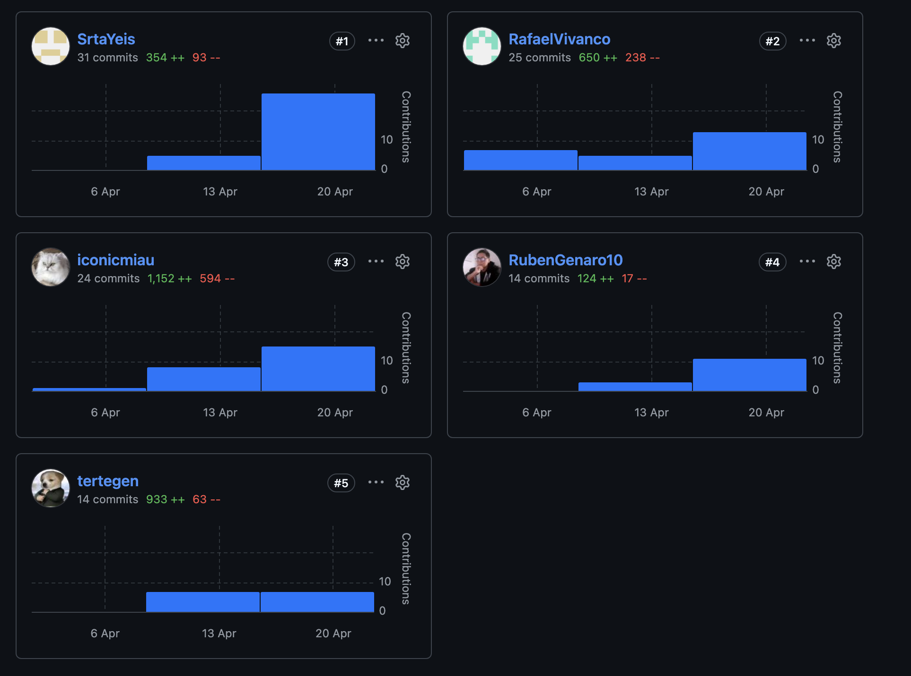

</div>

<div style="text-align: center; margin-top: 1rem; margin-bottom: 1rem;">

*Análisis de actividad de commits registrada durante el periodo del 05/04 al 24/04.*

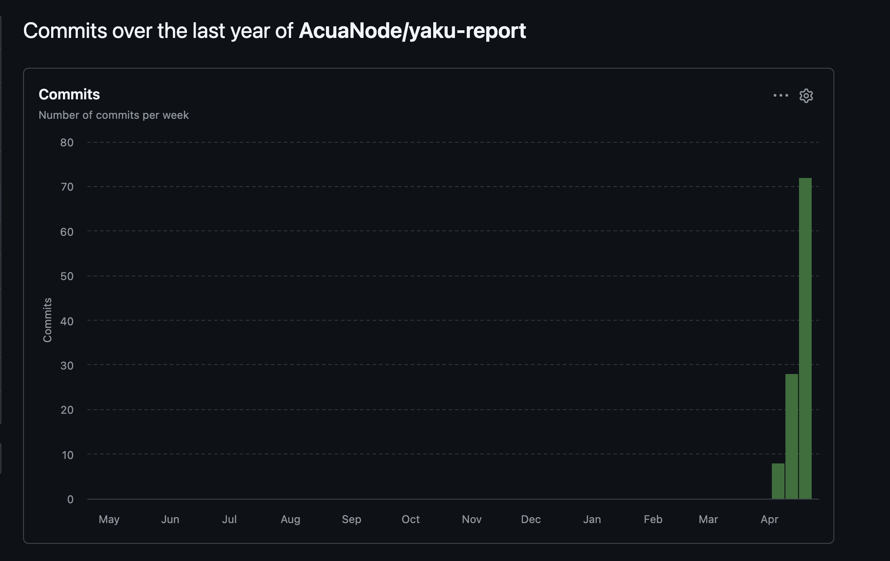

</div>

<div style="page-break-after: always;"></div>

# Contenido

### Capítulo I: Introducción
- [1.1. Startup Profile](#11-startup-profile)
  - [1.1.1. Descripción de la Startup](#111-descripción-de-la-startup)
  - [1.1.2. Perfiles de integrantes del equipo](#112-perfiles-de-integrantes-del-equipo)
- [1.2. Solution Profile](#12-solution-profile)
  - [1.2.1. Antecedentes y problemática](#121-antecedentes-y-problemática)
  - [1.2.2. Lean UX Process](#122-lean-ux-process)
    - [1.2.2.1. Lean UX Problem Statements](#1221-lean-ux-problem-statements)
    - [1.2.2.2. Lean UX Assumptions](#1222-lean-ux-assumptions)
    - [1.2.2.3. Lean UX Hypothesis Statements](#1223-lean-ux-hypothesis-statements)
    - [1.2.2.4. Lean UX Canvas](#1224-lean-ux-canvas)
- [1.3. Segmentos objetivo](#13-segmentos-objetivo)

### Capítulo II: Requirements Elicitation & Analysis
- [2.1. Competidores](#21-competidores)
  - [2.1.1. Análisis competitivo](#211-análisis-competitivo)
  - [2.1.2. Estrategias y tácticas frente a competidores](#212-estrategias-y-tácticas-frente-a-competidores)
- [2.2. Entrevistas](#22-entrevistas)
  - [2.2.1. Diseño de entrevistas](#221-diseño-de-entrevistas)
  - [2.2.2. Registro de entrevistas](#222-registro-de-entrevistas)
  - [2.2.3. Análisis de entrevistas](#223-análisis-de-entrevistas)
- [2.3. Needfinding](#23-needfinding)
  - [2.3.1. User Personas](#231-user-personas)
  - [2.3.2. User Task Matrix](#232-user-task-matrix)
  - [2.3.3. User Journey Mapping](#233-user-journey-mapping)
  - [2.3.4. Empathy Mapping](#234-empathy-mapping)
- [2.4. Big Picture EventStorming](#24-big-picture-eventstorming)
- [2.5. Ubiquitous Language](#25-ubiquitous-language)

### Capítulo III: Requirements Specification
- [3.1. User Stories](#31-user-stories)
- [3.2. Impact Mapping](#32-impact-mapping)
- [3.3. Product Backlog](#33-product-backlog)

### Capítulo IV: Solution Software Design
- [4.1. Strategic-Level Domain-Driven Design](#41-strategic-level-domain-driven-design)
  - [4.1.1. Design-Level EventStorming](#411-design-level-eventstorming)
    - [4.1.1.1. Candidate Context Discovery](#4111-candidate-context-discovery)
    - [4.1.1.2. Domain Message Flows Modeling](#4112-domain-message-flows-modeling)
    - [4.1.1.3. Bounded Context Canvases](#4113-bounded-context-canvases)
  - [4.1.2. Context Mapping](#412-context-mapping)
  - [4.1.3. Software Architecture](#413-software-architecture)
    - [4.1.3.1. Software Architecture System Landscape Diagram](#4131-software-architecture-system-landscape-diagram)
    - [4.1.3.2. Software Architecture Context Level Diagrams](#4132-software-architecture-context-level-diagrams)
    - [4.1.3.3. Software Architecture Container Level Diagrams](#4133-software-architecture-container-level-diagrams)
    - [4.1.3.4. Software Architecture Deployment Diagrams](#4134-software-architecture-deployment-diagrams)
- [4.2. Tactical-Level Domain-Driven Design](#42-tactical-level-domain-driven-design)
  - [4.2.1. Bounded Context: Telemetry Context](#421-bounded-context-telemetry-context)
    - [4.2.1.1. Domain Layer](#4211-domain-layer)
    - [4.2.1.2. Interface Layer](#4212-interface-layer)
    - [4.2.1.3. Application Layer](#4213-application-layer)
    - [4.2.1.4. Infrastructure Layer](#4214-infrastructure-layer)
    - [4.2.1.5. Bounded Context Software Architecture Component Level Diagrams](#4215-bounded-context-software-architecture-component-level-diagrams)
    - [4.2.1.6. Bounded Context Software Architecture Code Level Diagrams](#4216-bounded-context-software-architecture-code-level-diagrams)
  - [4.2.2. Bounded Context: Equipment Context](#422-bounded-context-equipment-context)
    - [4.2.2.1. Domain Layer](#4221-domain-layer)
    - [4.2.2.2. Interface Layer](#4222-interface-layer)
    - [4.2.2.3. Application Layer](#4223-application-layer)
    - [4.2.2.4. Infrastructure Layer](#4224-infrastructure-layer)
    - [4.2.2.5. Bounded Context Software Architecture Component Level Diagrams](#4225-bounded-context-software-architecture-component-level-diagrams)
    - [4.2.2.6. Bounded Context Software Architecture Code Level Diagrams](#4226-bounded-context-software-architecture-code-level-diagrams)
  - [4.2.3. Bounded Context: IAM Context](#423-bounded-context-iam-context)
    - [4.2.3.1. Domain Layer](#4231-domain-layer)
    - [4.2.3.2. Interface Layer](#4232-interface-layer)
    - [4.2.3.3. Application Layer](#4233-application-layer)
    - [4.2.3.4. Infrastructure Layer](#4234-infrastructure-layer)
    - [4.2.3.5. Bounded Context Software Architecture Component Level Diagrams](#4235-bounded-context-software-architecture-component-level-diagrams)
    - [4.2.3.6. Bounded Context Software Architecture Code Level Diagrams](#4236-bounded-context-software-architecture-code-level-diagrams)
  - [4.2.4. Bounded Context: Notification Context](#424-bounded-context-notification-context)
    - [4.2.4.1. Domain Layer](#4241-domain-layer)
    - [4.2.4.2. Interface Layer](#4242-interface-layer)
    - [4.2.4.3. Application Layer](#4243-application-layer)
    - [4.2.4.4. Infrastructure Layer](#4244-infrastructure-layer)
    - [4.2.4.5. Bounded Context Software Architecture Component Level Diagrams](#4245-bounded-context-software-architecture-component-level-diagrams)
    - [4.2.4.6. Bounded Context Software Architecture Code Level Diagrams](#4246-bounded-context-software-architecture-code-level-diagrams)
  - [4.2.5. Bounded Context: Payment Context](#425-bounded-context-payment-context)
    - [4.2.5.1. Domain Layer](#4251-domain-layer)
    - [4.2.5.2. Interface Layer](#4252-interface-layer)
    - [4.2.5.3. Application Layer](#4253-application-layer)
    - [4.2.5.4. Infrastructure Layer](#4254-infrastructure-layer)
    - [4.2.5.5. Bounded Context Software Architecture Component Level Diagrams](#4255-bounded-context-software-architecture-component-level-diagrams)
    - [4.2.5.6. Bounded Context Software Architecture Code Level Diagrams](#4256-bounded-context-software-architecture-code-level-diagrams)

### Capítulo V: Solution UI/UX Design
- [5.1. Style Guidelines](#51-style-guidelines)
  - [5.1.1. General Style Guidelines](#511-general-style-guidelines)
  - [5.1.2. Web, Mobile and IoT Style Guidelines](#512-web-mobile-and-iot-style-guidelines)
- [5.2. Information Architecture](#52-information-architecture)
  - [5.2.1. Organization Systems](#521-organization-systems)
  - [5.2.2. Labeling Systems](#522-labeling-systems)
  - [5.2.3. SEO Tags and Meta Tags](#523-seo-tags-and-meta-tags)
  - [5.2.4. Searching Systems](#524-searching-systems)
  - [5.2.5. Navigation Systems](#525-navigation-systems)
- [5.3. Landing Page UI Design](#53-landing-page-ui-design)
  - [5.3.1. Landing Page Wireframe](#531-landing-page-wireframe)
  - [5.3.2. Landing Page Mock-up](#532-landing-page-mock-up)
- [5.4. Applications UX/UI Design](#54-applications-uxui-design)
  - [5.4.1. Applications Wireframes](#541-applications-wireframes)
  - [5.4.2. Applications Wireflow Diagrams](#542-applications-wireflow-diagrams)
  - [5.4.3. Applications Mock-ups](#543-applications-mock-ups)
  - [5.4.4. Applications User Flow Diagrams](#544-applications-user-flow-diagrams)
- [5.5. Applications Prototyping](#55-applications-prototyping)
- [5.6. IoT Device Design](#56-iot-device-design)

### Capítulo VI: Product Implementation, Validation & Deployment
- [6.1. Software Configuration Management](#61-software-configuration-management)
  - [6.1.1. Software Development Environment Configuration](#611-software-development-environment-configuration)
  - [6.1.2. Source Code Management](#612-source-code-management)
  - [6.1.3. Source Code Style Guide & Conventions](#613-source-code-style-guide--conventions)
  - [6.1.4. Software Deployment Configuration](#614-software-deployment-configuration)
- [6.2. Landing Page, Services & Applications Implementation](#62-landing-page-services--applications-implementation)
  - [6.2.1. Sprint n](#621-sprint-n)
    - [6.2.1.1. Sprint Planning n](#6211-sprint-planning-n)
    - [6.2.1.2. Aspect Leaders and Collaborators](#6212-aspect-leaders-and-collaborators)
    - [6.2.1.3. Sprint Backlog n](#6213-sprint-backlog-n)
    - [6.2.1.4. Development Evidence for Sprint Review](#6214-development-evidence-for-sprint-review)
    - [6.2.1.5. Testing Suite Evidence for Sprint Review](#6215-testing-suite-evidence-for-sprint-review)
    - [6.2.1.6. Execution Evidence for Sprint Review](#6216-execution-evidence-for-sprint-review)
    - [6.2.1.7. Services Documentation Evidence for Sprint Review](#6217-services-documentation-evidence-for-sprint-review)
    - [6.2.1.8. Software Deployment Evidence for Sprint Review](#6218-software-deployment-evidence-for-sprint-review)
    - [6.2.1.9. Team Collaboration Insights during Sprint](#6219-team-collaboration-insights-during-sprint)
    
- [Conclusiones](#conclusiones)
- [Bibliografía](#bibliografia)
- [Anexos](#anexos)


<div style="page-break-after: always;"></div>

# Student Outcome
En el siguiente cuadro se describen las acciones realizadas y enunciados de conclusiones por parte del grupo, que permiten sustentar el haber alcanzado el logro del ABET – EAC - Student Outcome 7.

| Criterio específico | Acciones realizadas | Conclusiones |
| :--- | :--- | :--- |
| **Actualiza conceptos y conocimientos necesarios para su desarrollo profesional y en especial para su proyecto en soluciones de software.** | **Aponte Cruzado, Andrea Marielena**<br>*AV1*: Actualizó conceptos sobre técnicas de elicitación de requerimientos, diseño de entrevistas y modelado de flujos de dominio (Domain Message Flow) aplicados al diseño estratégico.<br><br>**Lopez Acuna, Mario Joaquin**<br>*AV1*: Investigó y actualizó conocimientos sobre análisis competitivo y metodologías Lean UX para estructurar el perfil de la solución y mapear el contexto (Context Mapping).<br><br>**Urrutia Pena, Jasmin Adriana**<br>*AV1*: Profundizó en la dinámica de EventStorming y el descubrimiento de contextos candidatos, actualizando sus bases teóricas para la correcta redacción de User Stories.<br><br>**Vivanco Salazar, Rafael Andres**<br>*AV1*: Actualizó conceptos sobre diseño de arquitectura de software utilizando el modelo C4 y patrones tácticos de DDD aplicados a la configuración inicial del proyecto.<br><br>**Velasquez Chambi, Ruben Genaro**<br>*AV1*: Actualizó conocimientos en la estructuración de Bounded Context Canvases y la interpretación de métricas de colaboración en GitHub (Insights) para documentar el progreso. | *AV1:*<br>Consideramos que durante esta primera etapa logramos cumplir un alto nivel de actualización técnica. Como equipo, tuvimos que investigar y afianzar nuestros conocimientos sobre Domain-Driven Design (DDD), arquitectura de software bajo el modelo C4 y metodologías de ideación (Lean UX, EventStorming). Esta asimilación de nuevos conceptos fue fundamental para estructurar correctamente las bases arquitectónicas y los requerimientos de nuestra solución de software, aportando directamente a nuestro desarrollo profesional. |
| **Reconoce la necesidad del aprendizaje permamente para el desempeño profesional y el desarrollo de proyectos en soluciones de software.** | **Aponte Cruzado, Andrea Marielena**<br>*AV1*: Reconoció la necesidad de investigar constantemente nuevas técnicas de mapeo de empatía y diseño de experiencia de usuario para comprender a profundidad las necesidades del cliente.<br><br>**Lopez Acuna, Mario Joaquin**<br>*AV1*: Identificó la importancia de mantenerse actualizado sobre las tendencias del mercado y modelos de negocio de competidores para poder definir un Ubiquitous Language preciso y competitivo.<br><br>**Urrutia Pena, Jasmin Adriana**<br>*AV1*: Comprendió la necesidad de instruirse continuamente en metodologías ágiles y gestión de Backlog para adaptarse a la complejidad del descubrimiento de dominios del software.<br><br>**Vivanco Salazar, Rafael Andres**<br>*AV1*: Identificó la necesidad vital de seguir aprendiendo sobre estándares de flujos de trabajo colaborativos (GitFlow) y evolución de arquitecturas para garantizar un diseño escalable.<br><br>**Velasquez Chambi, Ruben Genaro**<br>*AV1*: Reconoció la relevancia de mantenerse al día con los estándares de documentación (ABET) y las mejores prácticas para delimitar contextos (Bounded Contexts) en proyectos complejos. | *AV1:*<br>A nivel grupal, reconocemos que el desarrollo de software exige una mentalidad de formación continua. Al enfrentarnos a la definición estratégica y táctica de nuestro dominio, evidenciamos que las metodologías y herramientas cambian y evolucionan. Entendimos que investigar de manera autónoma, validar nuevas fuentes de información y adaptar nuestro enfoque no es solo un requisito académico, sino una habilidad indispensable para mantener la calidad y vigencia en el ámbito profesional a largo plazo. |

<div style="page-break-after: always;"></div>

# Objetivos Smart

A continuación, cada integrante del equipo presenta sus objetivos SMART, enfocados en su desarrollo profesional luego de culminar la carrera universitaria.

**Aponte Cruzado, Andrea Marielena (UX/UI & Research)**
Diseñar y documentar un mínimo de 3 perfiles de usuario (User Personas) y sus respectivos flujos (User Journey Maps) basándose en los hallazgos de las entrevistas iniciales. Este mapeo de empatía debe estar finalizado e integrado en el reporte antes del cierre de la segunda semana del sprint, garantizando que el diseño estratégico de la solución esté estrictamente alineado con las necesidades reales del cliente.

**Lopez Acuna, Mario Joaquin (Business & Strategy)**
Elaborar el Lean UX Canvas completo y documentar el análisis de al menos 3 competidores directos en el mercado tecnológico actual. Asimismo, deberá consolidar la primera versión del Lenguaje Ubicuo (Ubiquitous Language) estandarizado para el equipo durante los primeros 10 días del sprint, lo cual servirá como base indispensable para evitar ambigüedades en el modelado del dominio.

**Urrutia Pena, Jasmin Adriana (Requirements & EventStorming)**
Estructurar el Product Backlog inicial redactando y estimando un mínimo de 20 Historias de Usuario priorizadas bajo criterios de valor de negocio. Además, completará el diagrama de EventStorming de alto nivel en la plataforma colaborativa al menos 3 días antes de la entrega final del AV1, permitiendo al equipo tener una visión integral del flujo de eventos del sistema.

**Vivanco Salazar, Rafael Andres (Architecture & DevOps)**
Diseñar los 4 niveles fundamentales de arquitectura de software (System Landscape, Context, Container y Deployment) utilizando el estándar C4. En paralelo, configurará el repositorio oficial implementando las reglas del flujo GitFlow y protecciones de ramas principales, debiendo cumplir con el despliegue de esta infraestructura y documentación técnica a más tardar el 20 de abril para permitir la revisión grupal.

**Velasquez Chambi, Ruben Genaro (Documentation & Context Mapping)**
Consolidar la documentación técnica final integrando los 5 Bounded Context Canvases elaborados por el equipo, garantizando la coherencia del Context Mapping. Además, extraerá y maquetará el reporte de métricas de colaboración de GitHub (Insights) con al menos 3 gráficos clave de rendimiento, entregando la versión candidata del documento en la rama *release* 48 horas antes de la presentación oficial para su auditoría final.

<div style="page-break-after: always;"></div>

# Capítulo I: Introducción
## 1.1. Startup Profile
### 1.1.1. Descripción de la Startup

**AcuaNode** es una startup tecnológica dedicada al desarrollo de soluciones de Smart Farming y monitoreo ambiental, con un enfoque en la modernización de la industria acuícola. La startup nace con el propósito de transformar la gestión tradicional de las piscigranjas en ecosistemas inteligentes y resilientes, utilizando el *Internet de las Cosas (IoT)* y *computación en la nube* para proteger la biodiversidad y la rentabilidad del productor.

**YakuControl** (del quechua *yaku*, "agua") es un ecosistema digital integral que permite a los administradores de piscigranjas monitorear en tiempo real las variables bioquímicas críticas de sus estanques. Mediante el uso de hardware especializado y algoritmos alojados en la nube, el sistema actúa como un soporte vital preventivo par los piscicultores, con el fin de mitigar riesgos de mortalidad masiva causados por variaciones térmicas o intoxicaciones químicas.

El objetivo de YakuTech es promover el acceso a la tecnología a través de un modelo de **Software as a Service (SaaS)** **B2B**. De esta manera, no solo buscamos reducir la brecha digital en el sector agropecuario, sino también optimizar el uso de recursos energéticos y mejorar la calidad final del producto, fomentando una industria acuícola más eficiente, transparente y sostenible.

La relevancia de esta innovación se sustenta en el contexto del sector acuícola nacional. Por un lado, la Organización para la Cooperación y el Desarrollo Económicos (OCDE, 2025) señala que la acuicultura en el Perú enfrenta constantes fluctuaciones y cuantiosas pérdidas de producción asociadas a la alteración en la calidad del agua y la contaminación de los cauces.

A esto se suma que, de los más de 12,700 acuicultores registrados a nivel nacional, un porcentaje crítico opera en la categoría de Acuicultura de Recursos Limitados (AREL), evidenciando una escasa adopción de tecnologías de control (PRODUCE, 2024).

Todo este panorama evidencia la importancia crítica y el respaldo necesario para introducir nuestro producto en el sector, actuando como la herramienta definitiva para cerrar esta profunda brecha tecnológica.

- **Misión:** Impulsar la transformación digital del sector acuícola mediante soluciones IoT de alta precisión, garantizando la seguridad alimentaria y la rentabilidad de nuestros clientes a través de la prevención de desastres biológicos.

- **Visión:** Consolidarse para el año 2030 como la plataforma líder en monitoreo y analítica predictiva para la acuicultura en América Latina, siendo reconocidos por nuestra capacidad de integrar ingeniería de software avanzada con la preservación de ecosistemas hídricos.

<div style="page-break-after: always;"></div>

### 1.1.2. Perfiles de integrantes del equipo
<table border="1">
  <tr>
      <td style="text-align:center;"></td>
      <td><strong>Aponte Cruzado, Andrea Marielena - u202224135</strong><br>Actualmente estoy en el 8vo ciclo de la carrera de Ingeniería de Software. Tengo conocimientos en desarrollo de software, diseño de bases de datos, arquitectura de sistemas y trabajo colaborativo con metodologías ágiles.</td>
  </tr>
  <tr>
      <td style="text-align:center;">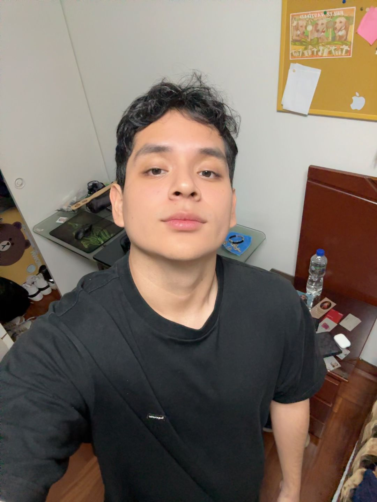</td>
      <td><strong>Lopez Acuna, Mario Joaquin - U202116250</strong><br>Mi nombre es Mario Lopez, tengo 21 años y soy estudiante de la carrera de Ingeniería de Software. Actualmente estoy en séptimo ciclo de la carrera de Ingeniería de Software. Tengo conocimientos en varios lenguajes de programación principalmente en Python y Typescrip, me gusta trabajar en equipo tratando de aportar en lo que pueda y compartiendo mis conocimientos. Me interesa aprender sobre gerencia en proyectos de software.</td>
  </tr>
  <tr>
      <td style="text-align:center;"></td>
      <td><strong>Velasquez Chambi, Ruben Genaro - U202117342 </strong><br>Estudiante del octavo ciclo,tengo 25 años y soy estudiante de la carrera de ingeniera de Software con experiencia en C++, Node.js, TypeScript, Java, Angular,Vue.js y frameworks como springboot y .Net Core. Me especializo en eficiencia de equipo, arquitectura limpia y desarrollo bajo principios SOLID.
      </td>
  </tr>
  <tr>
      <td style="text-align:center;"></td>
      <td><strong>Urrutia Pena, Jasmin Adriana - U202310008</strong><br> Estudiante del 7mo ciclo de la carrera de Ingenieria de Software, Tengo experiencia con diferentes lenguajes de programación y desarrollo de aplicaciones web en diversos frameworks ambos en frontend y backend, asimismo considero que cada paso en la universidad contribuye en mi avance como desarollo profesional. Estoy interesado en continuar mi aprendizaje, por lo que estoy dispuesto a participar en la adecuada realizacion de proyectos.</td>
  </tr>
  <tr>
      <td style="text-align:center;"></td>
      <td><strong>Vivanco Salazar, Rafael Andres - u202311064</strong><br>Actualmente curso el 7mo ciclo de la carrera de Ingeniería de Software. Me considero una persona responsable con facilidad para adaptarme a distintos entornos y manejar varias tareas a la vez. Tengo conocimientos en desarrollo web y nóvil siguiendo buenas prácticas y arquitecturas bajo metodologías ágiles.</td>
  </tr>
</table>

## 1.2. Solution Profile
### 1.2.1. Antecedentes y problemática

#### Antecedentes

La acuicultura de trucha es una actividad económica de alta relevancia en las regiones andinas del Perú, principalmente en Junín, Puno, Cusco y Huancavelica. Sin embargo, los productores enfrentan de manera recurrente eventos de mortalidad masiva ocasionados por variaciones bruscas en las condiciones del agua que pasan desapercibidas hasta que el daño ya es irreversible. Actualmente, el monitoreo se realiza mediante inspecciones físicas periódicas, un método manual, lento e impreciso que no permite reaccionar a tiempo ante cambios críticos.

#### Problemática

**Who (¿Quién?)**<br>
La problemática afecta directamente a dos actores fundamentales en el ecosistema acuícola:
- **Administradores de piscigranja**: Profesionales responsables de la planificación estratégica, rentabilidad financiera y toma de decisiones basada en el rendimiento histórico de producción.

- **Piscicultores:** Personal técnico encargado de la supervisión física diaria, el mantenimiento de los estanques y la ejecución de maniobras de emergencia ante variaciones ambientales.

**What (¿Qué?)** <br>
La ausencia de un sistema de monitoreo inteligente impacta a cada perfil de la siguiente manera:

- **Administrador de piscigranja**: La falta de una plataforma centralizada impide visualizar tendencias o calcular costos operativos. Sin datos históricos, no puede optimizar el uso de recursos ni garantizar la escalabilidad del negocio, quedando vulnerable ante pérdidas masivas de inventario.

- **Piscicultor:** Su limitación es la dependencia de la observación, lo que le impide detectar anomalías invisibles a simple vista. Esto los fuerza a actuar de forma reactiva, enfrentando crisis cuando el pez ya muestra signos de estrés, lo que eleva la carga laboral y riesgo de mortalidad por error humano.

**Where (¿Dónde?)** <br>
 Esta problemática se observa en piscigranjas de truchas arcoíris, particularmente en zonas andinas y rurales del Perú alimentadas por ríos.

**When (¿Cuándo?)** <br>
 El problema es una amenaza constante, pero se intensifica de forma crítica durante anomalías climáticas (como mediodías de calor extremo que disminuyen la solubilidad del oxígeno), lluvias intensas que elevan repentinamente la turbidez del agua (lodo), y tras los ciclos de alimentación intensiva, cuando la concentración de desechos altera el equilibrio químico del estanque.

**Why (¿Por qué?)** <br>
 La raíz del problema es la *falta de adopción tecnológica y de sistemas de telemetría en el sector acuícola.* Muchos productores de las categorías de micro y pequeña escala dependen de la simple observación o de mediciones químicas manuales esporádicas. Esto impide contar con un registro histórico, generando ineficiencia operativa que impide reaccionar a los cambios termodinámicos que destruyen el ecosistema.

**How (¿Cómo?)** <br>
 **YakuControl** propone una solución integrando el Internet de las Cosas (IoT) con una arquitectura en la nube. A través de hardware instalado en los estanques (Edge API), el sistema recopila lecturas de temperatura, pH y turbidez en tiempo real, ejecutando algoritmos que determinan la calidad del agua. Simultáneamente, las aplicaciones cliente (Web y Móvil) alertan a los operarios sobre estados críticos y permiten el encendido remoto (o automatizado) de actuadores de emergencia.

**How Much (¿Cuánto?)**<br>
Uno de los principales desafíos en el sector acuícola es la alta vulnerabilidad ante alteraciones ambientales y bioquímicas en el agua, lo que genera mortalidades masivas y pérdida total del capital. 

Según documenta el portal Actualidad Ambiental (2025), el impacto económico de no contar con un monitoreo preventivo es devastador: incidentes recientes en zonas andinas, ocasionados por contaminación o alteraciones en los cauces, han generado la muerte repentina de hasta 200,000 truchas en un solo evento. Este tipo de desastres representa pérdidas de capital superiores a los S/ 300,000 para una sola piscigranja. 

Todo este panorama evidencia la urgencia de digitalizar el control operativo para evitar la quiebra de los productores locales.

<div style="page-break-after: always;"></div>

### 1.2.2. Lean UX Process
#### 1.2.2.1. Lean UX Problem Statements

**Problem Statement 1 — Administrador de Piscigranja**

El estado actual de la gestión acuícola se ha centrado principalmente en el registro manual de datos y la toma de decisiones basada en la experiencia empírica del productor. Lo que las herramientas existentes no logran abordar es la disponibilidad de datos históricos procesados, tendencias y reportes consolidados que permitan al dueño tomar decisiones preventivas y estratégicas sobre la salud de sus estanques. Considerando la restricción de que los productores evitan realizar grandes inversiones de capital en servidores físicos o licencias costosas, nuestro producto abordará esta brecha mediante un Web Dashboard basado en la nube (modelo SaaS) con visualización de históricos, gráficos de tendencias y un índice global de calidad del agua calculado automáticamente. Nuestro enfoque inicial serán los propietarios y administradores de piscigranjas en el Perú con más de un estanque activo. Sabremos que hemos tenido éxito cuando los dueños reporten una reducción medible en eventos de mortalidad masiva y adopten el dashboard como su herramienta principal de gestión diaria.

**Problem Statement 2 — Piscicultor**

El estado actual del monitoreo de estanques en piscigranjas se ha centrado principalmente en rondas físicas periódicas y observación visual directa por parte del personal de campo. Lo que los métodos y herramientas existentes no logran abordar es la detección temprana y automática de condiciones críticas del agua (pH bajo, turbidez alta, temperatura fuera de rango) durante los largos intervalos entre inspecciones. Asumiendo las restricciones de un entorno rural (conectividad intermitente) y el perfil no técnico de los usuarios, nuestro producto abordará esta brecha mediante una aplicación móvil de interfaz simplificada, conectada a sensores IoT vía Edge API, que emite alertas críticas inmediatas y permite accionar equipos de emergencia de forma remota. Nuestro enfoque inicial serán los operarios y trabajadores de campo de piscigranjas de trucha. Sabremos que hemos tenido éxito cuando los operarios respondan y mitiguen eventos críticos de calidad del agua en menos de 10 minutos desde su detección.

#### 1.2.2.2. Lean UX Assumptions

**Business Assumptions**

1. Creemos que los dueños de piscigranjas están dispuestos a pagar una suscripción mensual recurrente si la plataforma demuestra reducir la mortalidad de truchas de forma tangible. Lograr una tasa de conversión del 20% de los clientes piloto al modelo de pago tras demostrar una reducción de al menos 15% en eventos de mortalidad durante el primer trimestre

2. Creemos que el principal riesgo del negocio es la baja digitalización de los productores acuícolas, que puede generar resistencia a la adopción tecnológica. Lograr que el tiempo promedio de adopción/onboarding sea menor a 48 horas mediante interfaces simplificadas

3. Creemos que el modelo SaaS por estanque es más viable financieramente que la venta única de hardware, ya que genera ingresos recurrentes y permite escalar el servicio. Alcanzar el punto de equilibrio operativo al conectar los primeros 50 estanques en los primeros 6 meses

4. Creemos que las integraciones con servicios externos (clima, SMS) incrementan el valor percibido de la suscripción y reducen la tasa de cancelación. Mantener una tasa de retención mensual superior al 90% en cuentas activas

5. Creemos que el mercado peruano de acuicultura de trucha tiene la escala suficiente para sostener el crecimiento de la startup en sus primeros tres años de operación. Capturar el 5% de las piscigranjas formales en la región andina central en los primeros tres años de operación

**User Assumptions**

1. **¿Quiénes son nuestros usuarios?** Dueños y administradores de piscigranjas de trucha, y sus operarios de campo en regiones andinas del Perú. 
2. **¿Dónde encaja nuestro producto en su trabajo o vida?** En la rutina diaria de monitoreo físico de estanques, y como eje central en la toma de decisiones estratégicas sobre la bioseguridad del ecosistema.
3. **¿Qué problemas resuelve nuestro producto?** La detección tardía de condiciones químicas/térmicas mortales en el agua, la dependencia visual empírica y la falta de datos históricos para anticiparse a desastres.
4. **¿Cuándo y cómo usan nuestro producto?** Los operarios lo usan en campo, en tiempo real, a través de la app móvil conectada a los sensores IoT. Los dueños lo consultan desde el Web Dashboard para revisiones periódicas, control de consumo energético y análisis histórico.
5. **¿Qué características son las más importantes?** Ingesta de datos telemétricos sin latencia, cálculo algorítmico del Índice de Calidad del Agua, alertas push críticas, control remoto de actuadores (Airlift/Bombas) y dashboards analíticos.
6. **¿Cómo debe verse y comportarse el producto?** Altamente responsivo, intuitivo y resiliente ante fallos de red. La App móvil debe priorizar Status Cards para acción inmediata; el Web Dashboard debe priorizar la claridad en gráficos.

#### 1.2.2.3. Lean UX Hypothesis Statements

**Hipótesis 1**
Creemos que lograremos **reducir el tiempo de respuesta ante eventos críticos del agua** si los **operarios de campo** pueden **recibir alertas push inmediatas con el tipo de riesgo detectado** mediante la **funcionalidad de notificaciones en tiempo real de la app móvil**.

**Hipótesis 2**
Creemos que lograremos **incrementar la retención de suscriptores** si los **dueños de piscigranja** pueden **visualizar tendencias históricas y comparar el rendimiento entre estanques** mediante el **Web Dashboard con gráficos de análisis de calidad del agua**.

**Hipótesis 3**
Creemos que lograremos **reducir la mortalidad masiva de truchas** si los **operarios** pueden **accionar remotamente motores y bombas de emergencia desde su celular** mediante los **botones de control IoT de la app móvil**.

**Hipótesis 4**
Creemos que lograremos **validar la disposición a pagar del mercado** si los **dueños de piscigranja con más de un estanque** pueden **gestionar todos sus estanques desde una sola plataforma** mediante el **modelo de suscripción mensual por estanque de YakuControl**.

**Hipótesis 5**
Creemos que lograremos **reducir falsos positivos y alarmas innecesarias** si el **sistema** puede **filtrar lecturas de sensores mediante el Índice de Calidad del Agua ponderado** mediante el **algoritmo matemático ejecutado en el Edge API antes de emitir cualquier alerta**.

#### 1.2.2.4. Lean UX Canvas

<div style="text-align: center; margin-top: 1rem; margin-bottom: 1rem;">

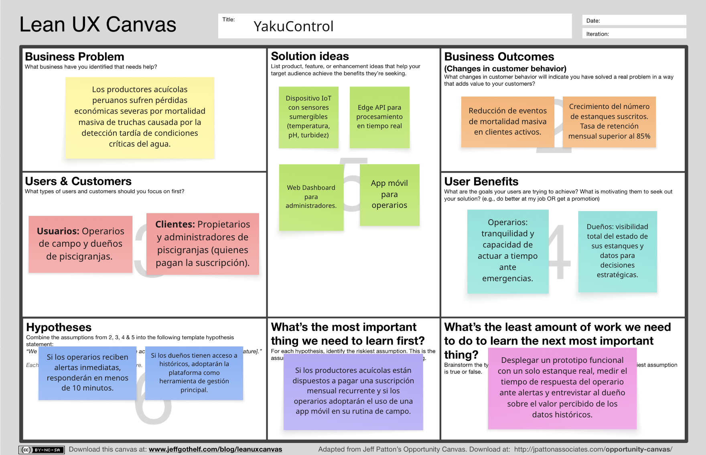

</div>

<div style="page-break-after: always;"></div>

## 1.3. Segmentos objetivo

YakuControl dirige su propuesta de valor a dos segmentos de usuarios con roles, responsabilidades y necesidades claramente diferenciados dentro del ecosistema de una piscigranja:

**Segmento 1: Piscicultores**

Son el personal técnico que realiza las rondas físicas diarias entre los estanques. Su principal responsabilidad es mantener las condiciones operativas de los estanques y responder ante cualquier anomalía. Sus características clave son:

- Realizan múltiples rondas al día en instalaciones que pueden abarcar varios estanques dispersos geográficamente.
- Necesitan información rápida y accionable, no reportes complejos.
- Requieren acceso móvil para recibir alertas críticas (pH bajo, turbidez alta, temperatura fuera de rango) en cualquier momento y desde cualquier punto de la piscigranja.
- Necesitan botones de acción rápida para activar equipos de emergencia (bombas de oxigenación, sistemas de recirculación) de forma remota sin desplazarse físicamente hasta el panel de control.
- Su nivel de digitalización puede ser bajo, por lo que la interfaz debe ser intuitiva y de uso inmediato.

**Segmento 2: Administradores de Piscigranja**

Son los propietarios o gestores del negocio, enfocados en la rentabilidad, la prevención de pérdidas y la toma de decisiones estratégicas a largo plazo. Sus características clave son:

- No necesariamente están presentes físicamente en la piscigranja de forma continua.
- Requieren una visión consolidada del estado de todos sus estanques desde un solo lugar.
- Necesitan acceso a reportes históricos, gráficos de tendencias y el índice global de calidad del agua para identificar patrones y anticipar riesgos.
- Valoran la trazabilidad de eventos para tomar decisiones sobre mantenimiento, inversión en equipos o cambios operativos.
- Son los tomadores de decisión de compra: evalúan el costo de la suscripción frente al costo potencial de una mortalidad masiva.

<div style="page-break-after: always;"></div>

# Capítulo II: Requirements Elicitation & Analysis
## 2.1. Competidores
### 2.1.1. Análisis competitivo

**¿Por qué llevar a cabo este análisis?**

Identificar las fortalezas y debilidades de las soluciones existentes en el mercado de monitoreo acuícola e IoT de calidad del agua, con el fin de posicionar estratégicamente a YakuControl y definir su ventaja competitiva diferenciadora frente a competidores directos e indirectos.

| | | **Acua Node — YakuControl** | **AquaManager** | **Libelium Smart Water** | **Pentair Aquatic Eco-Systems** |
| :--- | :--- | :--- | :--- | :--- | :--- |
| **Perfil** | **Overview** | Startup peruana que desarrolla YakuControl, plataforma IoT integral para monitoreo de calidad del agua en piscigranjas de trucha. Combina hardware propio con sensores sumergibles, procesamiento en la nube y apps móvil y web. | Plataforma holandesa de gestión acuícola basada en software. Permite registrar datos productivos, gestionar stocks, alimentación y salud de los peces. No incluye hardware propio de sensores IoT. | Empresa española especializada en plataformas IoT para monitoreo de calidad del agua. Ofrece kits de sensores inalámbricos para múltiples parámetros hídricos en aplicaciones ambientales, industriales y acuícolas. | División de Pentair especializada en equipos para acuicultura y ecosistemas acuáticos. Ofrece sistemas de recirculación, filtración, aireación y monitoreo de agua para piscigranjas de diversas escalas. |
| | **Ventaja competitiva** | Solución integral diseñada específicamente para el contexto acuícola peruano, con modelo SaaS accesible, algoritmos de procesamiento en tiempo real (Índice de Calidad del Agua) y control remoto de actuadores desde app móvil. | Amplia trayectoria en el mercado global de acuicultura; plataforma robusta con módulos de gestión integral del negocio acuícola (producción, salud, inventarios). | Amplio catálogo de sensores de alta precisión; plataforma IoT agnóstica compatible con múltiples protocolos (LoRa, 4G, Wi-Fi); solución modular y escalable para distintos sectores. | Marca consolidada con décadas de experiencia en acuicultura; catálogo completo de hardware para gestión del agua; red global de distribuidores especializados. |
| **Perfil de Marketing** | **Mercado objetivo** | Piscigranjas de trucha en regiones andinas del Perú (Junín, Puno, Cusco, Huancavelica). Pequeños y medianos productores acuícolas. | Empresas acuícolas de mediana y gran escala a nivel mundial (salmón, camarones, truchas). Enfocado en Europa y mercados desarrollados. | Gobiernos, empresas de utilities e industrias que requieren monitoreo ambiental de calidad del agua a nivel global. Sector agrícola y acuícola de mediana y gran escala. | Piscigranjas comerciales de mediana y gran escala, acuarios públicos e instalaciones de investigación acuícola a nivel mundial. |
| | **Estrategias de marketing** | Venta directa B2B a piscigranjas; alianzas con proveedores de insumos acuícolas; demostración con maqueta física en ferias del sector peruano; landing page para captación de clientes. | Participación en ferias internacionales de acuicultura (Aqua Nor, Aquaculture Europe); marketing de contenidos y demostraciones online; canal de ventas enterprise. | Canal de distribuidores internacionales autorizados; participación en conferencias IoT y medioambientales; documentación técnica extensa y casos de uso publicados. | Catálogos técnicos y venta directa a través de distribuidores especializados en acuicultura; presencia en ferias del sector; alianzas con instituciones de investigación. |
| **Perfil de Producto** | **Productos & Servicios** | Dispositivo IoT con sensores de temperatura, pH y turbidez + Edge API de procesamiento + App móvil para operarios + Web Dashboard para administradores. Suscripción mensual por estanque. | Software SaaS de gestión acuícola (producción, alimentación, salud, inventarios). Requiere integración con sensores de terceros para datos en tiempo real. | Kits de sensores IoT (temperatura, pH, turbidez, oxígeno disuelto, entre otros) + plataforma de visualización en la nube. Venta de hardware con licencia de plataforma. | Equipos físicos de recirculación, aireación, filtración y controladores digitales de parámetros hídricos. Sin plataforma SaaS ni app móvil nativa integrada. |
| | **Precios & Costos** | Hardware ~S/ 250–280 (costo del prototipo). Modelo SaaS con suscripción mensual por estanque monitoreado (precio a validar en mercado). | Suscripción mensual de precio elevado orientada a empresas de gran escala. No publicado abiertamente; cotización personalizada según número de módulos. | Hardware de gama alta con costos elevados (kits desde $500–$2,000 USD). Orientado a proyectos industriales y gubernamentales con presupuesto alto. | Equipos de gama media-alta con inversión inicial elevada. Modelo de venta directa de hardware sin suscripción recurrente. |
| | **Canales de distribución (Web y/o Móvil)** | App móvil (Android/iOS compilada con Flutter) y Web App. Landing page estática para captación B2B. | Exclusivamente Web App. Acceso vía navegador sin app móvil dedicada para campo. | Plataforma web para visualización de datos. Sin app móvil para operarios de campo. Distribución vía resellers. | Catálogo web para consulta técnica. Distribuidores físicos especializados. Sin canal digital de gestión remota. |
| **Análisis SWOT** | **Fortalezas** | Diseño específico para acuicultura peruana; modelo SaaS escalable; procesamiento edge que filtra falsos positivos; control remoto de actuadores; bajo costo de hardware. | Plataforma madura con múltiples módulos integrados; reconocimiento global; soporte técnico especializado; amplia base de clientes internacionales. | Alta precisión y confiabilidad de sensores; soporte para múltiples protocolos de conectividad; amplio historial de proyectos exitosos; alta escalabilidad. | Experiencia consolidada en acuicultura; equipos de alta durabilidad; amplio catálogo de soluciones complementarias; marca reconocida globalmente. |
| | **Debilidades** | Startup en etapa temprana sin historial de clientes; dependencia de conectividad Wi-Fi en zonas rurales; equipo pequeño con recursos limitados. | No incluye hardware IoT propio; precio elevado inaccesible para pequeños productores; no localizado para el mercado peruano ni andino. | Precio inaccesible para pequeñas piscigranjas; sin app móvil para operarios; sin control remoto de actuadores; plataforma genérica no especializada en acuicultura. | No ofrece plataforma SaaS ni app móvil; sin alertas automáticas en tiempo real; sin procesamiento en la nube; costo inicial elevado sin modelo de suscripción. |
| | **Oportunidades** | Mercado acuícola peruano en crecimiento con baja digitalización; potencial de expansión a otras especies y países de la región andina. | Incorporación de módulos IoT de calidad del agua; expansión en mercados emergentes de Latinoamérica. | Creación de verticales especializadas en acuicultura; expansión en mercados emergentes con soluciones más económicas. | Digitalización de sus equipos existentes con plataforma IoT; expansión en mercados emergentes de Latinoamérica. |
| | **Amenazas** | Posible entrada de competidores internacionales con mayor capital; resistencia a la adopción tecnológica; variabilidad en conectividad de zonas andinas. | Startups IoT locales más accesibles y adaptadas al contexto regional que integran hardware y software en una sola solución. | Competidores más económicos con propuestas específicas para acuicultura; startups IoT locales con mejor comprensión del contexto regional. | Startups IoT que ofrecen soluciones completas (hardware + software + app) a menor costo; tendencia del mercado hacia plataformas digitales integradas. |

<div style="page-break-after: always;"></div>

### 2.1.2. Estrategias y tácticas frente a competidores

A partir del análisis competitivo realizado, se identificaron las siguientes estrategias y tácticas que YakuControl adoptará para diferenciarse y ganar participación de mercado frente a sus competidores:

**Estrategia 1: Especialización vertical en el mercado acuícola peruano**

A diferencia de competidores como Libelium o Pentair, que ofrecen soluciones genéricas para múltiples industrias, YakuControl se posiciona como la única plataforma diseñada exclusivamente para piscigranjas de trucha en el contexto andino peruano. Esta especialización permite ofrecer algoritmos calibrados para las condiciones biológicas específicas de la trucha arcoíris (rangos de pH, temperatura y turbidez óptimos), terminología familiar para el productor local y soporte adaptado a las condiciones de conectividad de las regiones andinas.

- **Táctica:** Desarrollar perfiles de alerta predefinidos para trucha arcoíris y documentar casos de uso con piscigranjas reales de Junín y Puno como prueba de concepto.

**Estrategia 2: Accesibilidad económica mediante modelo SaaS por estanque**

Frente a AquaManager y Pentair, cuyos precios están orientados a grandes empresas acuícolas, YakuControl apuesta por un modelo de suscripción mensual de bajo costo por estanque monitoreado. Esto elimina la barrera de la inversión inicial elevada y permite que pequeños y medianos productores accedan a tecnología de monitoreo antes reservada para operaciones industriales.

- **Táctica:** Ofrecer un periodo de prueba gratuito de 30 días por estanque y un plan de onboarding asistido para facilitar la adopción en productores con baja digitalización.

**Estrategia 3: Solución integral hardware + software + app en un solo ecosistema**

La principal debilidad de los competidores identificados es que ninguno ofrece la combinación completa de hardware IoT propio, procesamiento inteligente en la nube y aplicaciones móvil/web en un solo producto. AquaManager no tiene hardware; Libelium no tiene app móvil para operarios; Pentair no tiene plataforma SaaS. YakuControl cubre todo el stack, eliminando la necesidad de integrar soluciones de múltiples proveedores.

- **Táctica:** Enfatizar en el discurso comercial y en la landing page la propuesta de "todo en uno": un solo proveedor, un solo contrato, una sola plataforma para hardware, datos y control remoto.

**Estrategia 4: Ventaja en conectividad de campo mediante app móvil offline-first**

La baja cobertura de internet en zonas rurales andinas es una amenaza real para cualquier solución IoT. A diferencia de los competidores, cuyas plataformas dependen de conexión constante, YakuControl diseña su app móvil con capacidades de operación en condiciones de baja señal, priorizando la recepción de alertas críticas incluso con conectividad intermitente.

- **Táctica:** Implementar caché local en la app Flutter y sincronización diferida con el backend principal para garantizar la funcionalidad básica del operario de campo sin conexión estable.

**Estrategia 5: Construcción de confianza mediante demostración física**

Para superar la resistencia a la adopción tecnológica —una de las principales amenazas identificadas—, YakuControl utilizará su maqueta física con estanque real como herramienta de ventas en ferias y visitas comerciales. Ver el sistema funcionando en tiempo real, con peces reales y actuadores respondiendo a cambios en el agua, genera credibilidad inmediata que ninguna presentación digital puede reemplazar.

- **Táctica:** Participar en ferias agropecuarias y acuícolas regionales (AGROPECUARIA, ferias de PRODUCE) con la maqueta operativa como principal punto de contacto con clientes potenciales.

<div style="page-break-after: always;"></div>

## 2.2. Entrevistas

### 2.2.1. Diseño de entrevistas

En esta sección se presenta el conjunto de preguntas diseñadas para la recolección de información de los dos segmentos objetivo identificados: Piscicultores, quienes son los operadores de campo encargados del monitoreo y manejo directo de los estanques y Administradores de piscigranja, quienes son los dueños y responsables de la gestión del negocio acuícola. Las preguntas han sido elaboradas aplicando buenas prácticas de diseño de entrevistas, con el fin de recopilar información subjetiva que permita construir arquetipos precisos para cada segmento.

#### Segmento 1: Piscicultores

**Preguntas generales**

1. ¿En qué distrito o región trabaja actualmente?
2. ¿Ha recibido alguna capacitación técnica en acuicultura o manejo de estanques?
3. ¿Podría describirnos cómo es un día típico de trabajo en la piscigranja? ¿Cuáles son las tareas que realiza con mayor frecuencia?
4. ¿Qué parámetros del agua monitorea actualmente (temperatura, oxígeno disuelto, pH, turbidez)? ¿Con qué frecuencia lo hace?
5. ¿Cómo registra actualmente los datos que recopila durante su jornada? ¿Utiliza algún cuaderno, planilla, aplicación u otro método?
6. ¿Ha tenido situaciones en las que algún parámetro del agua se salió de control? ¿Cómo se enteró y cómo lo manejó?
7. ¿Cuáles son los mayores problemas o dificultades que enfrenta en su trabajo diario con los estanques?

**Preguntas sobre la solución**

8. ¿Utiliza alguna aplicación móvil o sistema digital en su trabajo? Si es así, ¿cuál y para qué?
9. Si tuviera una herramienta que le alertara automáticamente cuando algún parámetro del agua de la piscigranja está fuera del rango normal ¿cómo cree que cambiaría su trabajo?
10. ¿Qué información le gustaría tener disponible de forma rápida y sencilla desde su celular mientras está en campo?
11. ¿Qué es lo más importante para usted en una herramienta de trabajo: que sea simple?

---

#### Segmento 2: Administradores de piscigranja

**Preguntas generales**

1. ¿En qué región o distrito se ubica la piscigranja que administra?
2. ¿Cómo obtiene actualmente la información sobre el estado de los estanques y la producción? ¿Con qué frecuencia la revisa?
3. ¿Por qué medio sus trabajadores le dan la información diaria sobre el estado de sus estanques?
4. ¿Cuáles son los indicadores que considera más importantes para evaluar el desempeño de la piscigranja?
5. ¿Cuáles son los principales problemas que enfrenta al gestionar la operación de la piscigranja?
6. ¿Ha tenido pérdidas económicas por no contar con información oportuna sobre la calidad del agua o la salud de los peces?

**Preguntas sobre la solución**

7. ¿Qué dispositivos y herramientas digitales utiliza actualmente para la gestión del negocio?
8. ¿Qué información priorizaría ver primero en un dashboard con datos en tiempo real de todos sus estanques?
9. ¿Qué tan importante es para usted recibir alertas automáticas ante situaciones críticas en los estanques?
10. ¿Qué características debería tener una solución tecnológica para que la adoptara en su negocio sin dudarlo?
11. ¿Qué tan dispuesto estaría de invertir en una solución que le permita monitorear los parámetros del agua de sus piscigranjas?

<div style="page-break-after: always;"></div>

### 2.2.2. Registro de entrevistas

A continuación se presenta el registro de las entrevistas realizadas a representantes de los dos segmentos objetivo identificados para YakuControl: Administradores de piscigranja y Piscicultores.

**Segmento Piscicultores:**

**Entrevistado 1**

| Atributo | Detalle |
|---|---|
| **Nombre** | Martín Salcedo |
| **Edad** | 30 |
| **Sexo** | Masculino |
| **Distrito** | Cieneguilla, Lima |
| **Ocupación** | Piscicultor |
| **Fecha de entrevista** | 14/04/2026  |
| **Timing** |00:00 - 5:06|
| **Video** | [Ver entrevista](https://upcedupe-my.sharepoint.com/:v:/g/personal/u202224135_upc_edu_pe/IQD_n1XULMGfT6r-7wQq0cSKAfO03q99yTZ4waqc5zAL-3Y?nav=eyJyZWZlcnJhbEluZm8iOnsicmVmZXJyYWxBcHAiOiJTdHJlYW1XZWJBcHAiLCJyZWZlcnJhbFZpZXciOiJTaGFyZURpYWxvZy1MaW5rIiwicmVmZXJyYWxBcHBQbGF0Zm9ybSI6IldlYiIsInJlZmVycmFsTW9kZSI6InZpZXcifX0%3D&e=2sdw7s) |
| **Captura** | 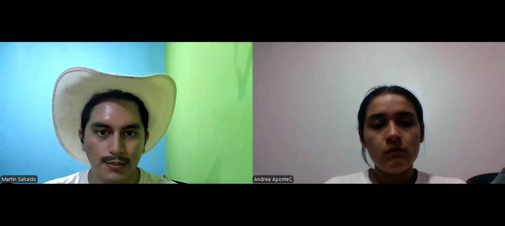 |
| **Resumen** | Martín trabaja en una piscigranja familiar en Cieneguilla donde se dedica al cultivo de tilapia. Ha recibido capacitaciones básicas en acuicultura, manejo de tilapia y control de agua por parte del Ministerio de la Producción. Su jornada comienza a las 6 am revisando los estanques, limpiando bordes, controlando el nivel del agua y verificando el funcionamiento general de los sistemas. Los parámetros que monitorea con mayor frecuencia son el pH y la temperatura; el oxígeno solo lo mide cuando detecta algo fuera de lo normal, como peces que dejan de comer o suben a la superficie. Registra los datos en un cuaderno o en su celular. Ante situaciones críticas como turbidez o cambios en el nivel del agua, restringe la alimentación y regula el flujo de agua. Señala que el costo de los equipos es un factor limitante importante a considerar. Le gustaría contar con una solución que le brinde información sobre el estado del agua, alertas claras ante anomalías y el ciclo de alimentación de los peces. Su principal criterio para adoptar una herramienta es que sea simple y fácil de usar. |

**Entrevistado 2**
 
| Atributo | Detalle |
|---|---|
| **Nombre** | Gabriel Lázaro Gutiérrez |
| **Edad** | 30 |
| **Sexo** | Masculino |
| **Distrito** | Cascas, La Libertad |
| **Ocupación** | Piscicultor |
| **Fecha de entrevista** | 14/04/2026 |
| **Timing** | 05:07 - 11:16 |
| **Video** | [Ver entrevista](https://upcedupe-my.sharepoint.com/:v:/g/personal/u202224135_upc_edu_pe/IQD_n1XULMGfT6r-7wQq0cSKAfO03q99yTZ4waqc5zAL-3Y?nav=eyJyZWZlcnJhbEluZm8iOnsicmVmZXJyYWxBcHAiOiJTdHJlYW1XZWJBcHAiLCJyZWZlcnJhbFZpZXciOiJTaGFyZURpYWxvZy1MaW5rIiwicmVmZXJyYWxBcHBQbGF0Zm9ybSI6IldlYiIsInJlZmVycmFsTW9kZSI6InZpZXcifX0%3D&e=2sdw7s) |
| **Captura** |  |
| **Resumen** | Gabriel aprendió el oficio de forma empírica trabajando en campo. Su rutina diaria incluye revisar los estanques, alimentar los peces, verificar el flujo de agua y realizar limpieza y sedimentación, que considera fundamental. Monitorea principalmente temperatura y en ocasiones oxígeno; no siempre mide pH por falta de equipo. Registra datos en un cuaderno o en Excel. Ha tenido situaciones críticas cuando baja el oxígeno, detectándolo porque los peces suben a la superficie. Menciona el nivel de estrés de las truchas como indicador importante. Considera que una herramienta con alertas le permitiría reaccionar antes y evitar pérdidas. Prioriza que sea simple y fácil de usar, y le gustaría ver datos del agua en tiempo real desde su celular. |
 
**Entrevistado 3**
 
| Atributo | Detalle |
|---|---|
| **Nombre** | Marcelo Pajares Gutiérrez |
| **Edad** | 31 |
| **Sexo** | Masculino |
| **Distrito** | Cascas, La Libertad |
| **Ocupación** | Piscicultor |
| **Fecha de entrevista** | 14/04/2026 |
| **Timing** | 11:17 - 14:16 |
| **Video** | [Ver entrevista](https://upcedupe-my.sharepoint.com/:v:/g/personal/u202224135_upc_edu_pe/IQD_n1XULMGfT6r-7wQq0cSKAfO03q99yTZ4waqc5zAL-3Y?nav=eyJyZWZlcnJhbEluZm8iOnsicmVmZXJyYWxBcHAiOiJTdHJlYW1XZWJBcHAiLCJyZWZlcnJhbFZpZXciOiJTaGFyZURpYWxvZy1MaW5rIiwicmVmZXJyYWxBcHBQbGF0Zm9ybSI6IldlYiIsInJlZmVycmFsTW9kZSI6InZpZXcifX0%3D&e=2sdw7s) |
| **Captura** | 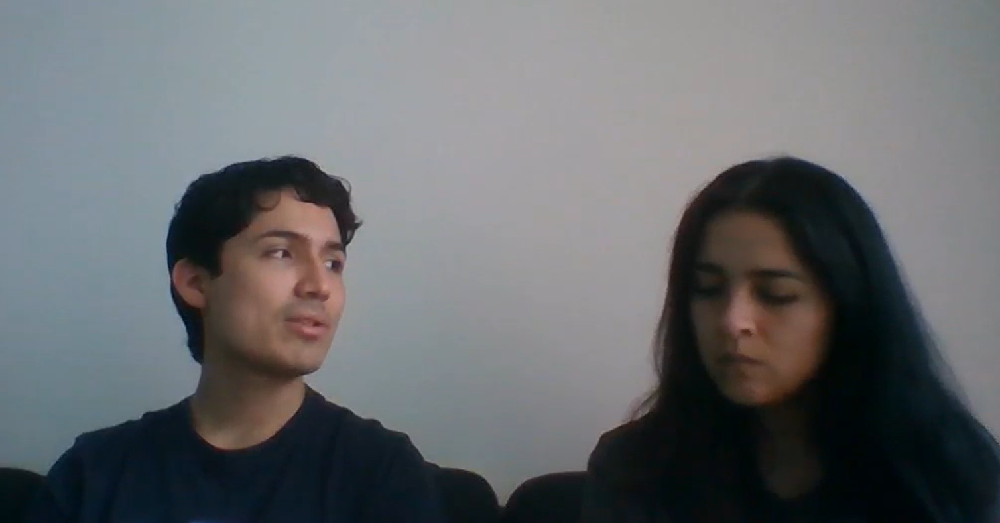 |
| **Resumen** | Marcelo aprendió el oficio ayudando a su hermano Gabriel, sin capacitación formal. Sus tareas diarias incluyen alimentación, limpieza de estanques y revisión de peces enfermos o muertos. Monitorea principalmente temperatura y solo revisa otros parámetros cuando hay problemas. No registra datos de forma sistemática, a veces solo lo tiene en mente o lo comenta con su hermano. Ha tenido problemas cuando el agua se ensucia o cambia el clima, causando estrés y mortalidad en los peces. No utiliza ninguna aplicación digital, solo el celular para llamadas. Considera que una herramienta con alertas les avisaría antes de que ocurra algo grave. Prioriza que sea rápida y no complicada, y le gustaría ver alertas, estado de estanques y recomendaciones desde su celular. |
 
---

**Segmento Administradores de piscigranja:** <br>

**Entrevistado 1**

| Atributo | Detalle |
|---|---|
| **Nombre** | Rafael Mendoza |
| **Edad** | 47 |
| **Sexo** | Masculino |
| **Distrito** | Huaraz, Ancash |
| **Ocupación** | Administrador de piscigranja |
| **Fecha de entrevista** | 12/04/2026 |
| **Timing** | 14:17 - 25:40 |
| **Video** | [Ver entrevista](https://upcedupe-my.sharepoint.com/:v:/g/personal/u202224135_upc_edu_pe/IQD_n1XULMGfT6r-7wQq0cSKAfO03q99yTZ4waqc5zAL-3Y?nav=eyJyZWZlcnJhbEluZm8iOnsicmVmZXJyYWxBcHAiOiJTdHJlYW1XZWJBcHAiLCJyZWZlcnJhbFZpZXciOiJTaGFyZURpYWxvZy1MaW5rIiwicmVmZXJyYWxBcHBQbGF0Zm9ybSI6IldlYiIsInJlZmVycmFsTW9kZSI6InZpZXcifX0%3D&e=2sdw7s) |
| **Captura** | 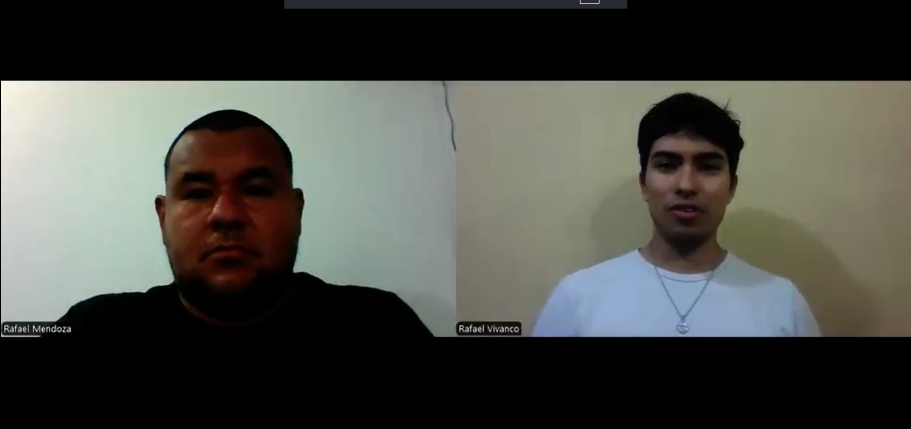 |
| **Resumen** | Rafael administra una piscigranja donde produce truchas y paiches para venta directa a mercados, sin procesar ni filetear el producto. Actualmente recibe información del estado de sus estanques a través de reportes físicos entregados por sus trabajadores de campo, con uso mínimo de WhatsApp. Los factores más importantes para su gestión son el volumen y la calidad del agua, especialmente la turbidez y densidad, ya que de estos depende directamente la rentabilidad del negocio. Ha sufrido pérdidas significativas por el Fenómeno del Niño debido a sequías que redujeron el caudal de agua y afectaron la calidad de sus cultivos. Certifica que sus especies estén bien alimentadas, libres de enfermedades y que no representen riesgo para la salud del consumidor. Considera que un software ideal sería aquel que le permita predecir la disponibilidad de agua a futuro, detectar contaminación con químicos y enviarle alertas automáticas. Priorizaría contratar la solución según su costo y el tamaño de su producción, y en una primera instancia le bastaría con monitorear el volumen del agua en tiempo real. |
 
**Entrevistado 2**
 
| Atributo | Detalle |
|---|---|
| **Nombre** | Bruno Marcelo Ontón Morales |
| **Edad** | 45 |
| **Sexo** | Masculino |
| **Distrito** | Concepción, Junín |
| **Ocupación** | Administrador de piscigranja |
| **Fecha de entrevista** | 12/04/2026 |
| **Timing** | 25:41 - 34:38 |
| **Video** | [Ver entrevista](https://upcedupe-my.sharepoint.com/:v:/g/personal/u202224135_upc_edu_pe/IQD_n1XULMGfT6r-7wQq0cSKAfO03q99yTZ4waqc5zAL-3Y?nav=eyJyZWZlcnJhbEluZm8iOnsicmVmZXJyYWxBcHAiOiJTdHJlYW1XZWJBcHAiLCJyZWZlcnJhbFZpZXciOiJTaGFyZURpYWxvZy1MaW5rIiwicmVmZXJyYWxBcHBQbGF0Zm9ybSI6IldlYiIsInJlZmVycmFsTW9kZSI6InZpZXcifX0%3D&e=2sdw7s) |
| **Captura** | 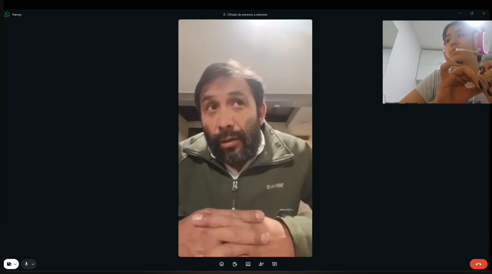 |
| **Resumen** | Bruno administra una piscigranja de truchas en Huancayo, cerca de Concepción, Junín. Revisa los parámetros diariamente a las 6 o 7 de la noche en su computadora, recibiendo información a través de fotos de cuadernos o audios de WhatsApp enviados por su personal de campo, lo que genera problemas porque a veces la letra no se entiende. Los indicadores más importantes para él son el nivel de oxígeno y la temperatura. Tuvo una pérdida de aproximadamente 20,000 soles cuando al mediodía, mientras el personal almorzaba, la temperatura subió drásticamente y encontraron peces flotando. Usa Excel y WhatsApp como únicas herramientas. Considera que el costo es el principal factor para adoptar una solución y que esta debe ser fácil de aprender y usar. |
 
**Entrevistado 3**
 
| Atributo | Detalle |
|---|---|
| **Nombre** | Harvey Peña Franco |
| **Edad** | 48 |
| **Sexo** | Masculino |
| **Distrito** | Pampas, Huancavelica |
| **Ocupación** | Administrador de piscigranja |
| **Fecha de entrevista** | 21/04/2026 |
| **Timing** | 34:39 - 40:03 |
| **Video** | [Ver entrevista](https://upcedupe-my.sharepoint.com/:v:/g/personal/u202224135_upc_edu_pe/IQD_n1XULMGfT6r-7wQq0cSKAfO03q99yTZ4waqc5zAL-3Y?nav=eyJyZWZlcnJhbEluZm8iOnsicmVmZXJyYWxBcHAiOiJTdHJlYW1XZWJBcHAiLCJyZWZlcnJhbFZpZXciOiJTaGFyZURpYWxvZy1MaW5rIiwicmVmZXJyYWxBcHBQbGF0Zm9ybSI6IldlYiIsInJlZmVycmFsTW9kZSI6InZpZXcifX0%3D&e=2sdw7s) |
| **Captura** |  |
| **Resumen** | Harvey administra una piscigranja en la comunidad campesina de Mantacra, Pampas, Huancavelica. La gestión es empírica y reactiva: la información llega de forma semanal o cuando ocurre mortandad. Los indicadores más importantes para él son la oxigenación, densidad y temperatura del agua. Tiene problemas en invierno con parasitosis y turbidez por lodo proveniente del riachuelo. El personal de campo solo informa cuando la mortandad ya ocurrió. Prefiere el celular como dispositivo principal ya que a veces no cuentan ni con laptop. Está dispuesto a invertir lo necesario en una solución tecnológica si esta le facilita la producción, reduce la mortandad y mejora su rentabilidad. |
 
<div style="page-break-after: always;"></div>

### 2.2.3. Análisis de entrevistas

Las entrevistas se realizaron en abril de 2026 a un total de dos participantes: un administrador de piscigranja y un piscicultor de campo, en diferentes zonas de Perú. El objetivo fue comprender sus contextos operativos, frustraciones actuales y validar hipótesis sobre la propuesta de valor de YakuControl.

**Segmento: Piscicultores**

**Total entrevistados:** 3
**Edades:** 30, 30, 31
**Distritos:** Cieneguilla (Lima) y , Cascas (La Libertad)
**Instituciones/Empresas:** Piscigranja negocio normal y familiar
**Fechas:** 14 de abril de 2026

**Características objetivas**
- Aprendieron el oficio de forma empírica o con capacitaciones básicas del Ministerio de la Producción: **3/3 (100%)**
- Monitorean principalmente temperatura; el oxígeno y pH solo ante anomalías o cuando tienen equipo disponible: **3/3 (100%)**
- Registran datos en cuaderno físico, celular o Excel de forma manual: **3/3 (100%)**
- Detectan problemas por el comportamiento visual de los peces (dejan de comer, suben a la superficie): **3/3 (100%)**
- No utilizan ninguna aplicación digital especializada en su trabajo: **3/3 (100%)**
- Usan el celular como principal dispositivo de trabajo: **3/3 (100%)**
- Consideran la limpieza y sedimentación de estanques como una tarea fundamental: **2/3 (67%)**

**Características subjetivas**
- Consideran el costo de los equipos como un factor limitante importante para adoptar tecnología: **3/3 (100%)**
- Valoran que una herramienta sea simple y fácil de usar por encima de otras características: **3/3 (100%)**
- Les gustaría recibir alertas claras y automáticas ante anomalías en el agua: **3/3 (100%)**
- Desean ver el estado del agua en tiempo real desde su celular: **3/3 (100%)**
- Están dispuestos a adoptar YakuControl si simplifica su trabajo diario: **3/3 (100%)**
- Consideran que las alertas tempranas les permitirían reaccionar antes y evitar pérdidas: **3/3 (100%)**
- Desean tener visibilidad del ciclo de alimentación de los peces desde su herramienta: **2/3 (67%)**

**Segmento: Administradores de piscigranja**

**Total entrevistados:** 3
**Edades:** 47, 45, 48 años
**Distritos:** Huaraz (Ancash), Concepción (Junín), Pampas (Huancavelica)
**Instituciones/Empresas:** Piscigranja de truchas y paiches, Piscigranja de truchas, Piscigranja comunidad campesina Mantacra
**Fechas:** 12 y 21 de abril de 2026
 
**Características objetivas**
- Reciben información del estado de los estanques a través de reportes físicos, fotos de cuadernos o audios de WhatsApp: **3/3 (100%)**
- No cuentan con ningún sistema digital especializado para monitorear parámetros del agua: **3/3 (100%)**
- Han sufrido pérdidas económicas por factores climáticos o detección tardía de problemas: **3/3 (100%)**
- Usan Excel y WhatsApp como únicas herramientas de gestión: **3/3 (100%)**
- Realizan venta directa al mercado sin procesamiento del producto: **2/3 (67%)**
- Certifica la sanidad y procedencia de sus especies para cumplir estándares de calidad: **1/3 (33%)**
- La información que reciben del personal de campo llega con retraso o es difícil de interpretar: **3/3 (100%)**

**Características subjetivas**
- Consideran la temperatura y el oxígeno del agua como los factores más críticos del negocio: **3/3 (100%)**
- Evalúan contratar una solución tecnológica principalmente según su costo: **3/3 (100%)**
- Desean recibir alertas automáticas ante cambios críticos en el agua: **3/3 (100%)**
- Valoran poder monitorear sus estanques de forma remota desde el celular: **3/3 (100%)**
- Están dispuestos a invertir en tecnología si reduce la mortandad y mejora la rentabilidad: **3/3 (100%)**
- Valoran la posibilidad de predecir la disponibilidad de agua a futuro: **2/3 (67%)**
- Priorizarían en una primera etapa monitorear el volumen y temperatura del agua: **3/3 (100%)**

**Conclusión general**

El análisis de entrevistas revela patrones claros y consistentes entre ambos segmentos. Tanto piscicultores como administradores coinciden en que la temperatura, el oxígeno y la calidad del agua son los factores más críticos del negocio acuícola, y que la ausencia de herramientas digitales genera retrasos en la detección de problemas y pérdidas económicas evitables. Los piscicultores priorizan la simplicidad de uso y las alertas en tiempo real desde el celular, mientras que los administradores priorizan la visibilidad remota, la capacidad predictiva del sistema y un costo accesible. Estas necesidades complementarias refuerzan directamente la propuesta de valor de YakuControl como solución IoT que conecta a ambos segmentos en tiempo real, previniendo pérdidas y mejorando la rentabilidad del negocio acuícola peruano.

<div style="page-break-after: always;"></div>

## 2.3. Needfinding

El Needfinding permite identificar necesidades reales de los usuarios mediante entrevistas y análisis del contexto. A partir de esta información, se construyeron artefactos clave que ayudaron a comprender mejor sus objetivos, tareas, emociones y frustraciones.

### 2.3.1. User Personas

Los User Personas se construyen a partir del análisis de la información recopilada en entrevistas, representando perfiles clave de los usuarios objetivo. Cada uno integra características demográficas, comportamientos y necesidades, sirviendo como base para orientar el diseño y desarrollo de la solución.

**User persona: Piscicultores**

Representa a los trabajadores encargados del manejo diario de los estanques, enfocados en el monitoreo del agua, alimentación de los peces y detección de problemas operativos.

<p align="center">
  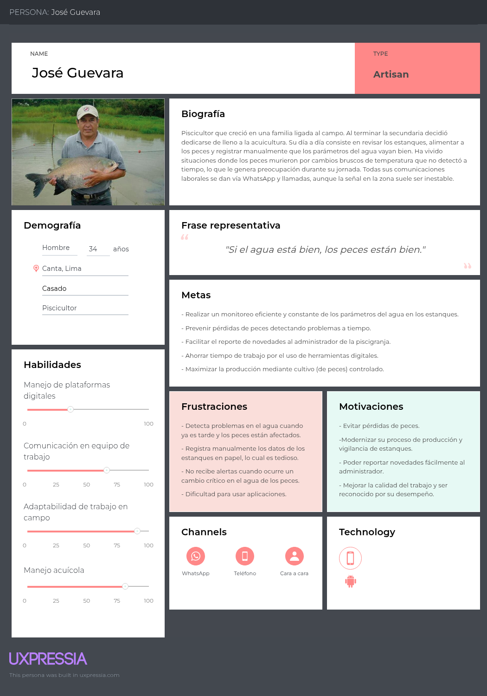
  <br>
  <i>User Persona – Piscicultor</i>
</p>

<div style="page-break-after: always;"></div>

**User persona: Administradores de piscigranjas**

Es la responsable de la gestión y toma de decisiones, quienes supervisan la producción, analizan reportes y coordinan acciones para optimizar el rendimiento de la piscigranja.

<p align="center">
  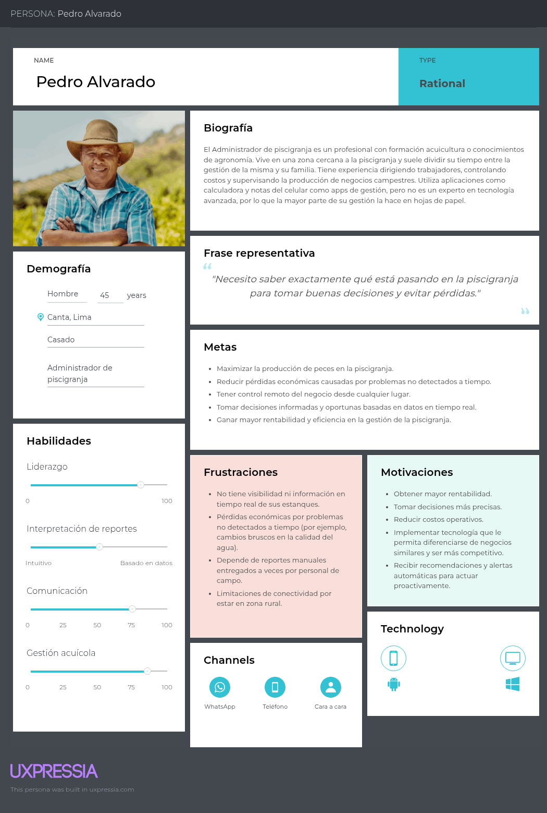
  <br>
  <i>User Persona – Administradores de piscigranjas</i>
</p>

<div style="page-break-after: always;"></div>

## 2.3.2. User Task Matrix
 
En esta sección se presentan las tareas que los User Persona representativos de cada segmento objetivo realizan para cumplir sus metas. Se consideran dos User Persona: José Guevara, piscicultor de campo, y Pedro Alvarado, administrador de piscigranja.
  
| **TAREA** | **José Guevara (Piscicultor) - Frecuencia** | **José Guevara (Piscicultor) - Importancia** |
|---|:---:|:---:|
| Medir manualmente la temperatura del agua en los estanques | Always | High |
| Registrar parámetros del agua manualmente | Always | High |
| Alimentar a los peces según el horario | Always | High |
| Identificar visualmente el comportamiento anormal de los peces | Sometimes | High |
| Verificar el volumen y caudal de agua disponible en los estanques | Always | High |
| Evaluar la turbidez y calidad del agua | Always | High |
| Limpiar y dar mantenimiento a los estanques | Sometimes | Medium |
| Reportar novedades al administrador vía documento físico o WhatsApp | Sometimes | High |
| Reaccionar ante una emergencia en el agua (baja de oxígeno,etc.)| Sometimes | High |
| Coordinar con otros trabajadores de campo | Sometimes | Medium |
| Anotar el consumo de alimento por estanque | Always | Medium |
| Verificar que los peces estén sanos y sin enfermedades | Always | High |
 
| **TAREA** | **Pedro Alvarado (Administrador) - Frecuencia** | **Pedro Alvarado (Administrador) - Importancia** |
|---|:---:|:---:|
| Revisar el reporte físico del piscicultor | Always | High |
| Monitorear el volumen y caudal de agua disponible | Always | High |
| Corroborar la calidad y turbidez del agua de los estanques | Always | High |
| Decidir sobre cambios en la alimentación o tratamiento sanitario | Sometimes | High |
| Controlar los costos operativos y rentabilidad de la piscigranja | Always | High |
| Planificar los ciclos de producción y fechas de "cosecha"(de peces) | Sometimes | High |
| Supervisar el desempeño del personal de campo | Sometimes | High |
| Negociar con compradores del producto | Sometimes | High |
| Evaluar el impacto de factores externos (sequías, fenómeno del niño, etc.) | Sometimes | High |
| Verificar la procedencia y sanidad de las especies para certificación | Sometimes | High |
| Tomar decisiones ante pérdidas o mortalidad de peces | Sometimes | High |
| Proyectar disponibilidad de agua para los próximos meses | Sometimes | High |
 
Las tareas con mayor frecuencia e importancia para José Guevara son la medición del agua, el registro de estos datos y la alimentación diaria, todas actividades repetitivas y críticas que realiza sin apoyo tecnológico. Para Pedro Alvarado, destacan la revisión del reporte y el control de costos como tareas frecuentes de alta importancia, evidenciando su dependencia de información de segunda mano para tomar decisiones. La coincidencia más relevante entre ambos segmentos es la gestión de emergencias en los estanques: José debe reaccionar en campo y Pedro debe decidir a modo de gestión, lo que refuerza la necesidad de una solución como YakuControl que conecte a ambos en tiempo real.

<div style="page-break-after: always;"></div>

### 2.3.3. User Journey Mapping

En esta sección se presentan los User Journey Maps para cada uno de los User Persona identificados. Estos mapas representan la experiencia actual de los usuarios sin la existencia de YakuControl, con el objetivo de identificar sus principales puntos de dolor, frustraciones y oportunidades de mejora.

- User Journey Map de Pedro Alvarado

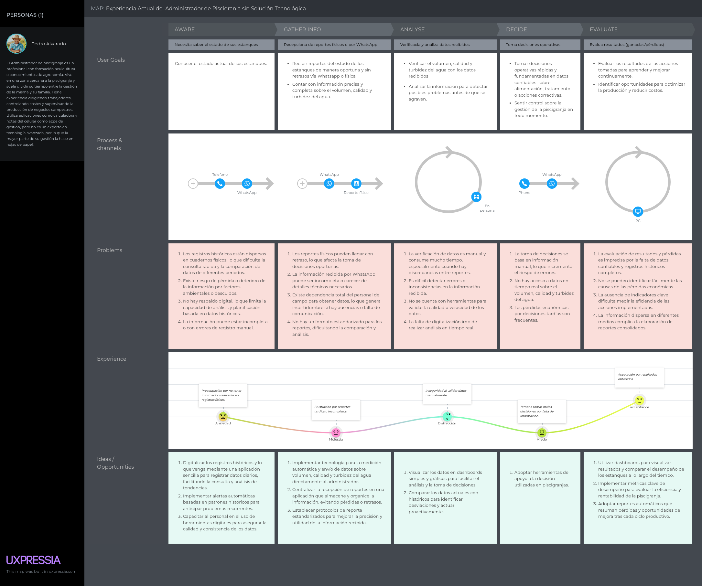

<div style="page-break-after: always;"></div>

- User Journey Map de José Guevara

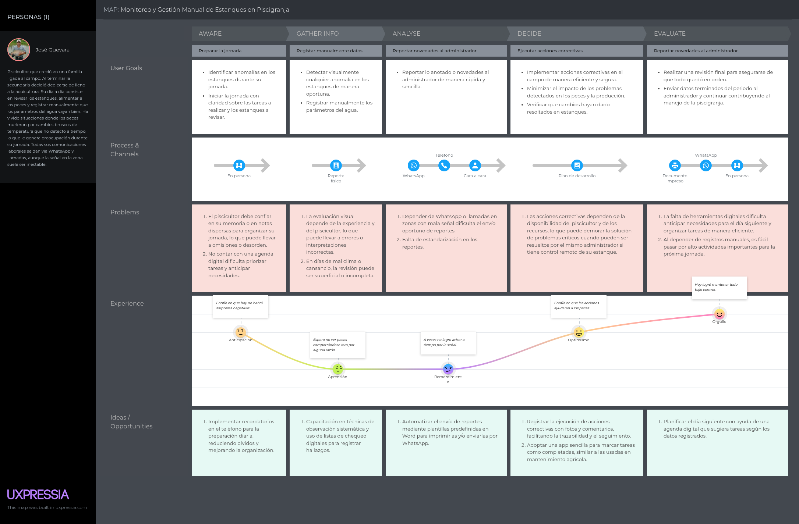

<div style="page-break-after: always;"></div>

### 2.3.4. Empathy Mapping

Se elaboraron los Empathy Maps para los dos User Personas identificados. Este proceso permitió comprender mejor lo que dicen, piensan, hacen y sienten en su día a día, identificando sus principales pains y gains para diseñar una solución que realmente responda a las necesidades del sector acuícola peruano.

- Empathy mapping de Administrador de piscigranja


<p align="center">
  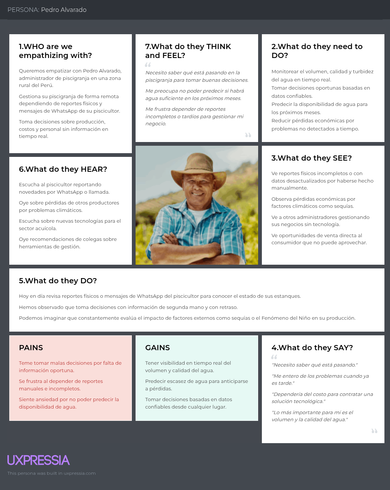
  <br>
  <i>Empathy mapping – Administradores de piscigranjas</i>
</p>

<div style="page-break-after: always;"></div>

- Empathy mapping de Piscicultor

<p align="center">
  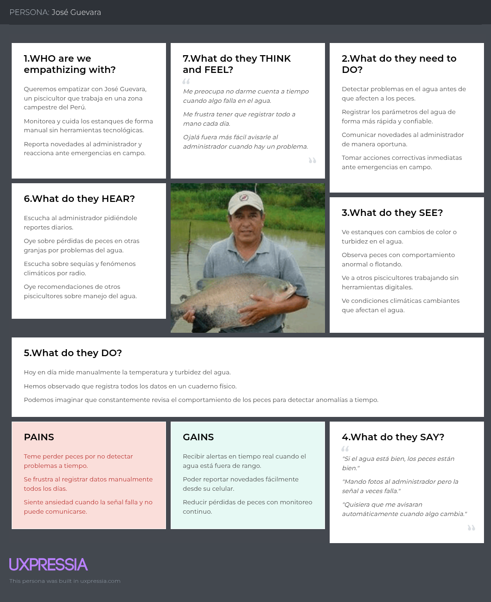
  <br>
  <i>Empathy mapping – Piscicultores</i>
</p>

<div style="page-break-after: always;"></div>

## 2.4. Big Picture EventStorming
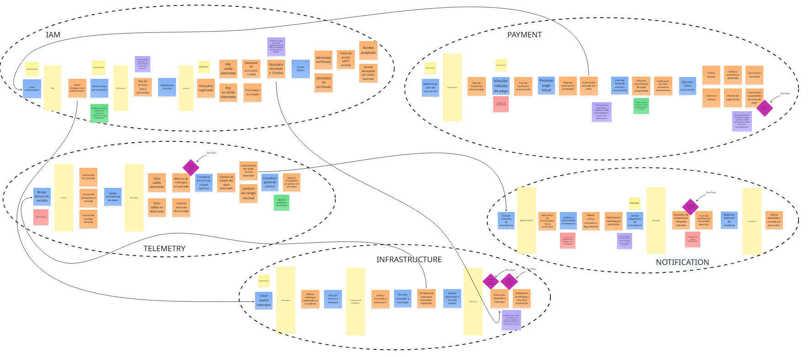
## 2.5. Ubiquitous Language

El Lenguaje Ubicuo (Ubiquitous Language) de YakuControl es el vocabulario compartido y estandarizado que usan tanto el equipo de desarrollo como los expertos del dominio acuícola para comunicarse sin ambigüedades. Todos los términos definidos aquí deben usarse de forma consistente en el código, los modelos, las entrevistas y la documentación del proyecto.

### Términos del Dominio

| Término | Definición | Bounded Context |
| :--- | :--- | :--- |
| **Piscigranja** | Instalación dedicada a la crianza comercial de truchas en estanques controlados. Es la unidad principal de negocio del cliente y la entidad raíz a la que se vinculan usuarios, dispositivos y suscripciones. | General |
| **Estanque** | Depósito de agua individual dentro de una piscigranja donde se aloja y cría un lote de truchas. Es la unidad mínima de monitoreo de YakuControl. | General |
| **Lote** | Conjunto de truchas que comparten un mismo estanque en un periodo productivo determinado. | General |
| **Trucha arcoíris** (*Oncorhynchus mykiss*) | Especie objetivo del sistema. Sus rangos óptimos de supervivencia (pH 6.5–8.0, temperatura 10–18°C, turbidez baja) determinan los umbrales críticos configurados en el sistema. | General |
| **Piscicultor / Operario de campo** | Usuario del sistema con rol `ROLE_WORKER`. Realiza rondas físicas entre los estanques, responde ante alertas críticas y acciona equipos de emergencia desde la app móvil. | Identity & Access |
| **Administrador** | Usuario del sistema con rol `ROLE_ADMIN`. Es el dueño o gestor de la piscigranja. Accede al Web Dashboard para revisar históricos, gestionar usuarios, equipos y suscripciones. | Identity & Access |
| **Farm Key** | Clave única de acceso generada por el IAM Context y asociada a una piscigranja. Utilizada por el dispositivo IoT para autenticarse y enviar telemetría al sistema sin necesidad de credenciales de usuario. | Identity & Access |
| **Token JWT** | Token de autenticación de corta duración emitido por el IAM Context tras el inicio de sesión. Lleva embebido el rol del usuario (`ROLE_WORKER` o `ROLE_ADMIN`) y es validado por todos los contextos para autorizar operaciones. | Identity & Access |
| **Dispositivo IoT** | Hardware físico instalado en el estanque, compuesto por un microcontrolador ESP32-WROOM-32 con sensores sumergibles y actuadores. Registrado y gestionado en el Equipment Context. Envía telemetría bruta al sistema vía Wi-Fi. | Equipment |
| **Sensor** | Componente electrónico del dispositivo IoT que mide una variable bioquímica del agua. Los sensores activos son: temperatura (DS18B20), pH (PH-4502C) y turbidez. Vinculado a un estanque dentro del Equipment Context. | Equipment |
| **Actuador** | Componente electrónico del dispositivo IoT que ejecuta una acción física en el estanque al recibir una instrucción. Actuadores activos: módulo relé (bomba de agua) y módulo MOSFET (tira LED). | Equipment |
| **Vinculación** | Acto de asociar un dispositivo IoT (con sus sensores y actuadores) a un estanque específico dentro de una piscigranja. Solo el Administrador puede realizar esta operación. | Equipment |
| **Telemetría bruta** | Conjunto de valores numéricos crudos enviados por el dispositivo IoT al Edge API de forma continua. Incluye la lectura directa de cada sensor antes de cualquier procesamiento. | Telemetry |
| **Lectura** | Registro puntual de una variable del agua (pH, temperatura o turbidez) en un momento específico, asociado a un estanque determinado. Unidad atómica persistida por el Telemetry Context. | Telemetry |
| **Índice de Calidad del Agua (ICA)** | Puntaje global normalizado calculado por el Edge API que pondera las lecturas de temperatura, pH y turbidez. Si cae por debajo del umbral crítico, el estado del estanque se clasifica como peligroso y se disparan las alertas. | Telemetry |
| **Umbral crítico** | Valor límite predefinido para el ICA o para una variable individual, por debajo (o encima) del cual el sistema considera que las condiciones del agua representan un riesgo para la supervivencia de las truchas. | Telemetry |
| **Falso positivo** | Lectura anómala de un sensor que no refleja un riesgo real (causada por interferencia, suciedad o pico transitorio). El Edge API aplica filtrado para descartarlos antes de emitir eventos de riesgo. | Telemetry |
| **Transmitancia de luz** | Porcentaje de luz capaz de penetrar el agua del estanque, calculado mediante la Ley de Beer-Lambert modificada aplicada al sensor de turbidez. Determina la intensidad de la tira LED compensatoria. | Telemetry |
| **Señal PWM** | Señal de ancho de pulso (Pulse Width Modulation) de 8 bits enviada por el microcontrolador al módulo MOSFET para regular la intensidad de la tira LED en función de la transmitancia calculada. | Telemetry |
| **Estado del estanque** | Clasificación del nivel de riesgo de un estanque en un momento dado, derivada del ICA calculado. Puede ser: **Normal**, **Advertencia** o **Crítico**. | Telemetry |
| **Evento de riesgo** | Mensaje emitido por el Edge API cuando confirma que las condiciones de un estanque superan el umbral crítico. Desencadena el flujo de alertas en el Notification Context. | Telemetry |
| **Alerta crítica** | Notificación generada automáticamente por el Notification Context cuando recibe un evento de riesgo del Telemetry Context. Se envía al piscicultor asignado vía push (Firebase Cloud Messaging) de forma inmediata. | Notification |
| **Alerta de mantenimiento** | Notificación generada por el Notification Context cuando el Equipment Context publica un evento de sensor fuera de línea o estanque sin telemetría activa. Se dirige al Administrador. | Notification |
| **Canal de notificación** | Medio a través del cual el Notification Context entrega un mensaje al usuario. Los canales activos son: notificación push (app móvil vía FCM) y correo electrónico (SMTP). | Notification |
| **Acción de emergencia** | Instrucción remota enviada por el piscicultor desde la app móvil para activar un actuador (encender la bomba o ajustar la LED) ante una condición crítica del agua. | Notification |
| **Suscripción** | Contrato de acceso al servicio YakuControl asociado a una piscigranja. Tiene un ciclo de vida definido: `TRIAL` → `ACTIVE` → `SUSPENDED` → `CANCELLED`. Es el Aggregate Root del Payment Context. | Payment |
| **Plan** | Nivel de servicio contratado dentro de una suscripción. Los planes disponibles son: `BASIC`, `PRO` y `ENTERPRISE`, cada uno con un precio base por estanque monitoreado y límites de funcionalidades incluidas. | Payment |
| **Factura** | Comprobante de cobro individual generado por el Payment Context en cada ciclo de facturación. Tiene su propio ciclo de vida: `PENDING` → `PAID` / `FAILED`. Referencia el cargo externo en Stripe. | Payment |
| **Período de facturación** | Rango de fechas que define el inicio y el vencimiento del ciclo activo de una suscripción. Al vencerse, el Payment Context genera una nueva Factura y renueva el período. | Payment |
| **Edge API** | Microservicio independiente que actúa como primer filtro de la telemetría bruta. Calcula el ICA y la transmitancia, filtra falsos positivos y emite eventos de riesgo al backend principal. | Arquitectura |
| **Backend principal** | Servicio central RESTful que aloja los cinco Bounded Contexts de YakuControl (IAM, Equipment, Telemetry, Notification y Payment) y gestiona la comunicación con las aplicaciones cliente. | Arquitectura |
| **Dashboard** | Interfaz web del Administrador que centraliza el estado en tiempo real de todos los estanques, gráficos de tendencias históricas, gestión de equipos y estado de la suscripción. | Arquitectura |
| **Historial de lecturas** | Registro persistente de todas las lecturas y estados de un estanque a lo largo del tiempo. Utilizado por el Administrador para análisis de tendencias y toma de decisiones estratégicas. | Telemetry |
| **Ronda de campo** | Recorrido físico periódico realizado por el piscicultor entre los estanques para inspección y mantenimiento. YakuControl complementa (no reemplaza) esta actividad con monitoreo continuo. | General |

<div style="page-break-after: always;"></div>

# Capítulo III: Requirements Specification
## 3.1. User Stories

### 1. Cuadro de Epics (Épicas)

| Epic ID | Título | Descripción |
| :--- | :--- | :--- |
| **EP01** | **Presencia Digital e Informativa** | Landing Page y sitio web estático para atracción de clientes y visualización de planes comerciales. |
| **EP02** | **App Móvil (Piscicultor)** | Herramienta de campo para monitoreo en tiempo real, gestión de alertas y control de actuadores. |
| **EP03** | **Web App (Administrador)** | Plataforma de gestión empresarial para análisis de datos, administración de personal y finanzas. |
| **EP04** | **Backend & API (Technical)** | Infraestructura de servicios REST, seguridad JWT e integraciones técnicas. |

---

### 2. Cuadro Único de User Stories y Technical Stories

| Story ID | Título | Descripción | Criterios de Aceptación (Gherkin) | Epic |
| :--- | :--- | :--- | :--- | :--- |
| **US01** | Propuesta de Valor | Como visitante, deseo leer sobre YakuControl en la landing para entender el producto. | **Escenario 1: Visualización de beneficios** <br> **Given** que el visitante carga la página de inicio <br> **When** visualiza la sección principal <br> **Then** el sistema muestra los beneficios clave. <br><br> **Escenario 2: Error de carga** <br> **Given** el servidor falla <br> **When** el visitante carga la landing <br> **Then** muestra un mensaje de error amigable. | EP01 |
| **US02** | Catálogo de Planes | Como visitante, deseo ver los precios de las suscripciones para evaluar mi presupuesto. | **Escenario 1: Consulta de precios** <br> **Given** el visitante está en la sección de precios <br> **When** revisa las tarjetas <br> **Then** el sistema detalla costos y beneficios. <br><br> **Escenario 2: Cambio de moneda** <br> **Given** acceso fuera de Perú <br> **When** carga precios <br> **Then** muestra dólares por defecto. | EP01 |
| **US03** | FAQ de Soporte | Como visitante, deseo ver una sección de preguntas frecuentes para resolver dudas básicas. | **Escenario 1: Resolución de dudas** <br> **Given** el visitante tiene dudas <br> **When** accede a FAQ <br> **Then** despliega respuestas comunes. <br><br> **Escenario 2: Sin resultados** <br> **Given** busca término no registrado <br> **When** ingresa palabra <br> **Then** ofrece botón de contacto. | EP01 |
| **US04** | Formulario de Ventas | Como visitante, deseo dejar mis datos de contacto para que un asesor me llame. | **Escenario 1: Envío exitoso** <br> **Given** completa el formulario <br> **When** presiona enviar <br> **Then** guarda el contacto y confirma éxito. <br><br> **Escenario 2: Campos vacíos** <br> **Given** deja campos obligatorios vacíos <br> **When** intenta enviar <br> **Then** resalta campos y bloquea envío. | EP01 |
| **US05** | Login en App Móvil | Como piscicultor, deseo acceder a la app con mis credenciales para ver mis estanques. | **Escenario 1: Login correcto** <br> **Given** ingresa correo y clave válidos <br> **When** presiona "Entrar" <br> **Then** otorga acceso al tablero. <br><br> **Escenario 2: Clave incorrecta** <br> **Given** ingresa contraseña errónea <br> **When** presiona "Entrar" <br> **Then** deniega acceso y muestra error. | EP02 |
| **US06** | Lectura de Sensores | Como piscicultor, deseo ver el pH y temperatura actual en mi celular para evitar rondas físicas. | **Escenario 1: Datos en tiempo real** <br> **Given** selecciona un estanque <br> **When** dashboard carga <br> **Then** muestra últimos valores del hardware. <br><br> **Escenario 2: Sensor offline** <br> **Given** sensor sin conexión <br> **When** intenta ver datos <br> **Then** muestra último valor con etiqueta "Desconectado". | EP02 |
| **US07** | Alertas Push | Como piscicultor, deseo recibir notificaciones si el agua está fuera de rango para actuar rápido. | **Escenario 1: Notificación crítica** <br> **Given** variable fuera de límite <br> **When** sistema detecta anomalía <br> **Then** móvil emite alerta sonora/visual. <br><br> **Escenario 2: Modo silencio** <br> **Given** móvil en "No molestar" <br> **When** ocurre alerta crítica <br> **Then** fuerza notificación visual persistente. | EP02 |
| **US08** | Control de Aireación | Como piscicultor, deseo prender los aireadores desde la app para oxigenar el agua. | **Escenario 1: Encendido exitoso** <br> **Given** aireador apagado <br> **When** activa switch en app <br> **Then** motor se enciende y confirma estado. <br><br> **Escenario 2: Falla de hardware** <br> **Given** fallo eléctrico en bomba <br> **When** intenta encender <br> **Then** reporta "Error de conexión con actuador". | EP02 |
| **US09** | Registro de Novedades | Como piscicultor, deseo escribir notas rápidas sobre un estanque para informar al dueño. | **Escenario 1: Guardado de nota** <br> **Given** escribe comentario relevante <br> **When** presiona guardar <br> **Then** almacena nota con fecha y hora. <br><br> **Escenario 2: Nota vacía** <br> **Given** cuadro de texto sin caracteres <br> **When** intenta guardar <br> **Then** inhabilita botón de acción. | EP02 |
| **US10** | Gestión de Usuarios | Como administrador, deseo crear cuentas para mis operarios en la web para darles acceso. | **Escenario 1: Invitación enviada** <br> **Given** completa datos de operario <br> **When** presiona "Invitar" <br> **Then** envía acceso directo al correo. <br><br> **Escenario 2: Correo duplicado** <br> **Given** correo ya registrado <br> **When** intenta crear usuario <br> **Then** muestra validación de registro existente. | EP03 |
| **US11** | Reporte de Mortalidad | Como administrador, deseo generar un PDF mensual de bajas para mis registros contables. | **Escenario 1: PDF generado** <br> **Given** selecciona mes anterior <br> **When** pulsa "Generar Reporte" <br> **Then** descarga documento estadístico. <br><br> **Escenario 2: Mes sin datos** <br> **Given** no hubo muertes registradas <br> **When** solicita reporte <br> **Then** genera PDF indicando "Sin registros". | EP03 |
| **US12** | Historial de Tendencias | Como administrador, deseo ver gráficos de pH de todo el año para planificar el próximo ciclo. | **Escenario 1: Gráfico anual** <br> **Given** selecciona filtro anual <br> **When** solicita visualización <br> **Then** muestra evolución temporal de pH. <br><br> **Escenario 2: Tiempo de espera** <br> **Given** consulta de datos masivos <br> **When** solicita historial <br> **Then** muestra barra de progreso y estado. | EP03 |
| **US13** | Configuración de Umbrales | Como administrador, deseo definir los límites de alerta en la web para personalizar el control. | **Escenario 1: Actualización de límites** <br> **Given** edita parámetros <br> **When** guarda cambios <br> **Then** actualiza lógica de notificaciones push. <br><br> **Escenario 2: Lógica inválida** <br> **Given** pH mínimo mayor al máximo <br> **When** intenta guardar <br> **Then** muestra error de validación lógica. | EP03 |
| **US14** | Pago vía Stripe | Como administrador, deseo pagar mi suscripción con Stripe para mantener el servicio activo. | **Escenario 1: Pago exitoso** <br> **Given** selecciona plan <br> **When** procesa pago en Stripe <br> **Then** confirma suscripción y activa servicio. <br><br> **Escenario 2: Tarjeta rechazada** <br> **Given** fondos insuficientes <br> **When** falla cobro <br> **Then** muestra aviso y pasa a estado "Pendiente". | EP03 |
| **US15** | Registro de Nuevo Estanque | Como administrador, deseo añadir estanques para expandir la capacidad productiva. | **Escenario 1: Registro correcto** <br> **Given** nuevo estanque físico <br> **When** ingresa ID de hardware <br> **Then** estanque aparece en lista global. <br><br> **Escenario 2: ID Duplicado** <br> **Given** hardware ya registrado <br> **When** intenta guardar <br> **Then** bloquea acción y avisa duplicidad. | EP03 |
| **US16** | Auditoría de Respuesta | Como administrador, deseo ver el tiempo que tarda un operario en atender una alerta. | **Escenario 1: Reporte de tiempos** <br> **Given** alerta resuelta <br> **When** revisa historial <br> **Then** muestra hora de disparo vs hora de acción. <br><br> **Escenario 2: Gestión automática** <br> **Given** acción por modo autónomo <br> **When** audita evento <br> **Then** indica "Atendido por Sistema". | EP03 |
| **US17** | Control de Limpieza | Como piscicultor, deseo activar filtros de limpieza desde el móvil para remover residuos. | **Escenario 1: Activación remota** <br> **Given** detecta turbidez alta <br> **When** pulsa "Activar Limpieza" <br> **Then** actuador físico inicia ciclo. <br><br> **Escenario 2: Falla eléctrica** <br> **Given** bomba de lodo sin energía <br> **When** intenta encender <br> **Then** reporta error de hardware. | EP02 |
| **TS01** | API de Ingesta | Como developer, deseo un endpoint POST para recibir datos del hardware Edge. | **Escenario 1: Recepción 201** <br> **Given** JSON válido de sensores <br> **When** hardware envía telemetría <br> **Then** API responde 201 y persiste dato. <br><br> **Escenario 2: Bad Request** <br> **Given** parámetros faltantes <br> **When** sensor envía paquete <br> **Then** retorna error 400. | EP04 |
| **TS02** | Seguridad JWT | Como developer, deseo proteger los endpoints con tokens para evitar robos de datos. | **Escenario 1: Token válido** <br> **Given** petición con JWT vigente <br> **When** consulta recurso <br> **Then** API retorna código 200. <br><br> **Escenario 2: No autorizado** <br> **Given** sin token o expirado <br> **When** intenta consultar <br> **Then** retorna error 401. | EP04 |
| **TS03** | Webhook de Alertas | Como developer, deseo un webhook que dispare notificaciones ante anomalías detectadas. | **Escenario 1: Trigger inmediato** <br> **Given** valor fuera de rango <br> **When** confirma anomalía <br> **Then** envía trigger a Firebase Cloud Messaging. <br><br> **Escenario 2: Reintento** <br> **Given** FCM no responde <br> **When** falla el trigger <br> **Then** encola petición para reintento automático. | EP04 |

## 3.2. Impact Mapping
En esta sección hemos elaborado nuestro Impact Mapping. Para ello, utilizamos la hipótesis desarrollada durante nuestro proceso de Lean UX. Reemplazamos los segmentos de cliente por los User Personas, los cuales fueron elaborados en las secciones previas, y conectamos las funcionalidades con los objetivos, para que formen parte del Product Backlog.

<div style="text-align: center; margin-top: 1rem; margin-bottom: 1rem;">

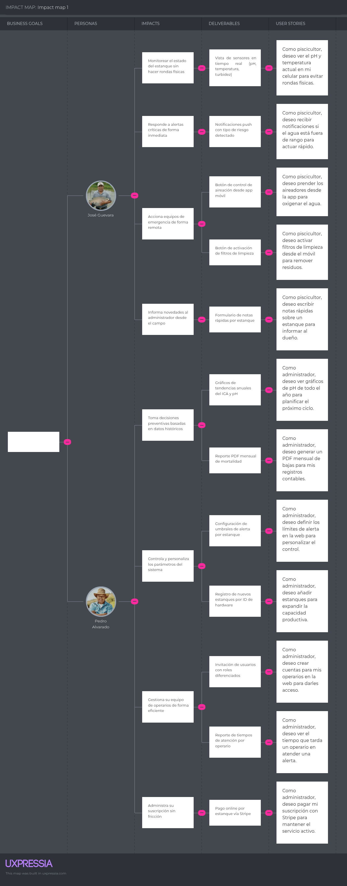

</div>

*El mapa refleja dos personas principales: el Piscicultor, enfocado en el monitoreo y control operativo en campo, y el Administrador, orientado a la gestión estratégica y análisis de datos. Cada impacto se conecta con los entregables del producto y las User Stories priorizadas en el Product Backlog.*

## 3.3. Product Backlog

| # Orden | User Story Id | Título | Descripción | Story Points (1/2/3/5/8) |
| :--- | :--- | :--- | :--- | :--- |
| **1** | **TS02** | Seguridad JWT | Como developer, deseo proteger los endpoints con tokens para evitar robos de datos. | **5** |
| **2** | **US05** | Login en App Móvil | Como piscicultor, deseo acceder a la app con mis credenciales para visualizar mis estanques. | **3** |
| **3** | **US01** | Propuesta de Valor | Como visitante, deseo leer sobre YakuControl en la landing para entender el producto. | **2** |
| **4** | **US02** | Catálogo de Planes | Como visitante, deseo ver los precios de las suscripciones para evaluar mi presupuesto. | **2** |
| **5** | **US04** | Formulario de Ventas | Como visitante, deseo dejar mis datos de contacto para que un asesor me contacte. | **3** |
| **6** | **US03** | FAQ de Soporte | Como visitante, deseo ver una sección de preguntas frecuentes para resolver dudas básicas. | **1** |
| **7** | **TS01** | API de Ingesta | Como developer, deseo un endpoint POST para recibir datos del hardware Edge. | **5** |
| **8** | **US06** | Lectura de Sensores | Como piscicultor, deseo ver el pH y temperatura actual en mi celular para evitar rondas físicas. | **3** |
| **9** | **US07** | Alertas Push | Como piscicultor, deseo recibir notificaciones si el agua está fuera de rango para actuar rápido. | **5** |
| **10** | **TS03** | Webhook de Alertas | Como developer, deseo un webhook que conecte el API con el servicio de notificaciones. | **3** |
| **11** | **US13** | Configuración de Umbrales | Como administrador, deseo definir los límites de alerta en la web para personalizar el control. | **3** |
| **12** | **US14** | Pago vía Stripe | Como administrador, deseo pagar mi suscripción con Stripe para mantener el servicio activo. | **5** |
| **13** | **US15** | Registro de Nuevo Estanque | Como administrador, deseo añadir estanques para expandir la capacidad productiva. | **3** |
| **14** | **US08** | Control de Aireación | Como piscicultor, deseo prender los aireadores desde la app para oxigenar el agua. | **5** |
| **15** | **US10** | Gestión de Usuarios | Como administrador, deseo crear cuentas para mis operarios en la web para delegar el acceso. | **3** |
| **16** | **US17** | Control de Limpieza | Como piscicultor, deseo activar filtros de limpieza desde el móvil para remover residuos. | **5** |
| **17** | **US12** | Historial de Tendencias | Como administrador, deseo ver gráficos de pH de todo el año para planificar el próximo ciclo. | **5** |
| **18** | **US11** | Reporte de Mortalidad | Como administrador, deseo generar un PDF mensual de bajas para mis registros contables. | **3** |
| **19** | **US16** | Auditoría de Respuesta | Como administrador, deseo ver el tiempo que tarda un operario en atender una alerta. | **2** |
| **20** | **US09** | Registro de Novedades | Como piscicultor, deseo escribir notas rápidas sobre un estanque para informar al dueño. | **2** |

Link Trello: https://trello.com/invite/b/69ddbac5fb1fb4d9bc57783e/ATTI6aaf075e45566d05489c8cee7f6e22a5D24DC29E/yaku

<div style="page-break-after: always;"></div>

# Capítulo IV: Solution Software Design
## 4.1. Strategic-Level Domain-Driven Design
### 4.1.1. Design-Level EventStorming

En esta sección se detalla la aplicación del EventStorming como herramienta estratégica del Domain-Driven Design (DDD). El objetivo es mapear los eventos de dominio que articulan el ecosistema de **YakuControl**, permitiendo identificar los límites de los futuros Bounded Contexts y las interacciones clave entre los actores. Este enfoque garantiza que la arquitectura de software esté alineada con las reglas de negocio de la acuicultura inteligente y sea capaz de escalar de forma modular.

---

##### Step 1: Domain Events
El proceso inicia con la identificación de los **Domain Events** (post-its naranjas), representados en tiempo pasado. En esta etapa, se vuelcan de manera libre todos los sucesos relevantes en el ecosistema de AcuaNode, desde la captura de una métrica de PH hasta la confirmación de una suscripción, permitiendo visualizar la magnitud del sistema sin restricciones jerárquicas.

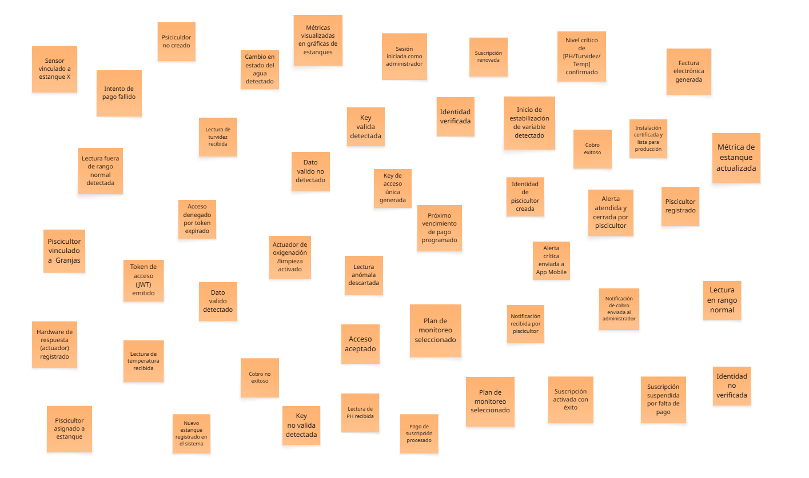

##### Step 2: Timelining
Una vez identificados los eventos, se organizan en una **línea de tiempo lógica** de izquierda a derecha. Esto permite detectar inconsistencias, eventos duplicados o vacíos en el proceso de negocio, asegurando que el flujo desde que un sensor detecta un cambio hasta que el piscicultor es notificado sea coherente y fluido.

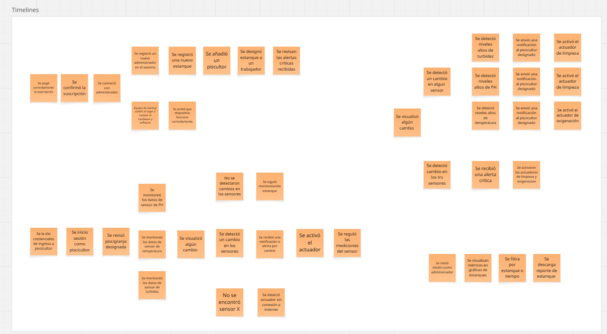

##### Step 3: Pivotal Events & Bounded Contexts Discovery
Se identifican los **Pivotal Events**, sucesos clave que marcan un cambio de fase o responsabilidad (como la emisión de un Token o la generación de una Alerta). Estos puntos de inflexión facilitan la definición de las fronteras de los **Bounded Contexts**, separando responsabilidades como Seguridad (IAM), Monitoreo (Telemetría) y Negocio (Pagos).

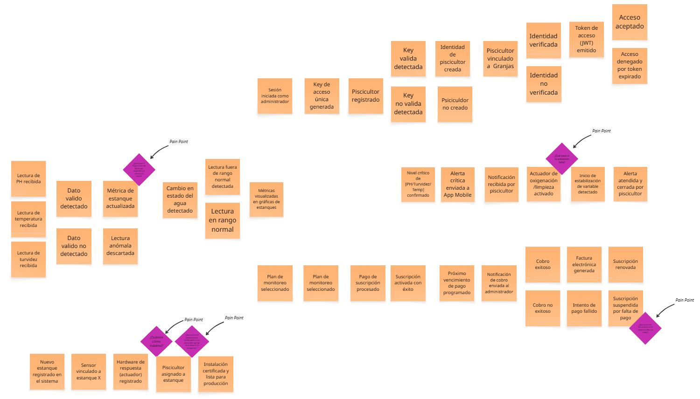

##### Step 4: Commands and Actors
A cada evento se le asocia un **Command** (post-it azul), que representa la intención o acción que lo dispara, y un **Actor** (post-it amarillo pequeño), que identifica quién tiene la responsabilidad de ejecutarlo. En YakuControl, esto clarifica qué acciones realiza el Administrador en la Web frente a las del Piscicultor en la App Mobile.

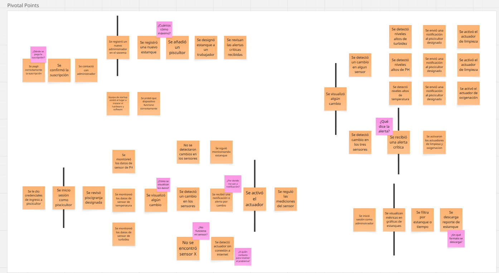

##### Step 5: External Systems
Se integran los **External Systems** (post-its rosas) con los que interactúa la plataforma. Aquí se mapean las dependencias con servicios fuera del control directo de la aplicación, como Pasarelas de Pago (Stripe), servicios de notificaciones (Firebase) o el hardware físico de los actuadores.

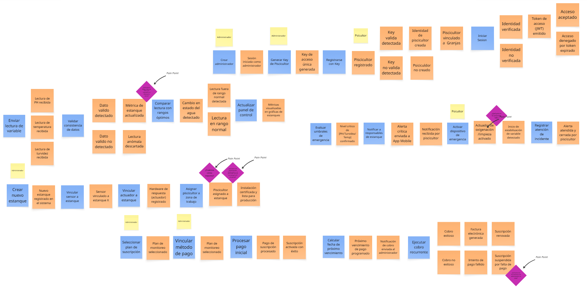

##### Step 6: Aggregates Identification
En este paso se definen los **Aggregates** (post-its amarillos grandes), que funcionan como los núcleos de consistencia del sistema. Son entidades raíz como "Estanque", "Suscripción" o "Usuario", que encapsulan lógica de negocio compleja y aseguran que los comandos solo se ejecuten si cumplen con las reglas del dominio.

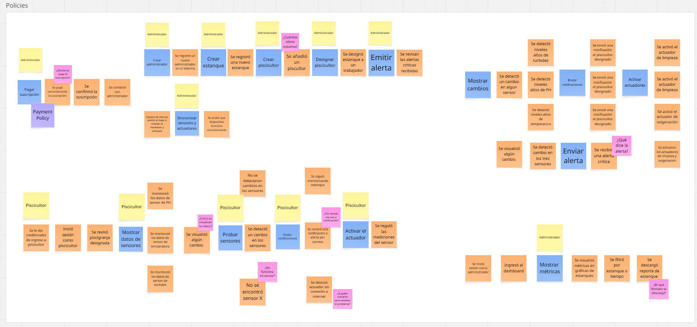

##### Step 7: Policies and Business Rules
Se establecen las **Policies** (post-its lilas), que definen reacciones automáticas bajo la premisa "Siempre que [Evento], entonces [Comando]". Esto es fundamental para la automatización de AcuaNode, como la regla que activa automáticamente un oxigenador tras detectar una lectura crítica de oxígeno disuelto.

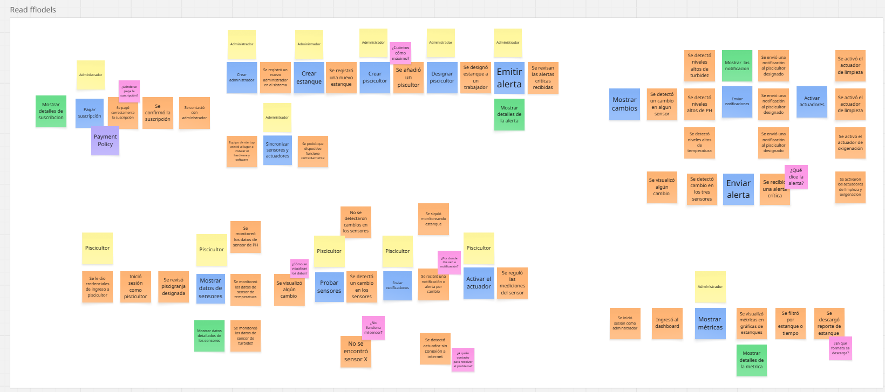

##### Step 8: Read Models (UI/UX)
Se identifican los **Read Models** (post-its verdes), que representan la información optimizada para la vista del usuario. Estos modelos definen qué datos se mostrarán en los dashboards de la aplicación, asegurando que el Piscicultor vea métricas esenciales y el Administrador reportes estadísticos complejos.

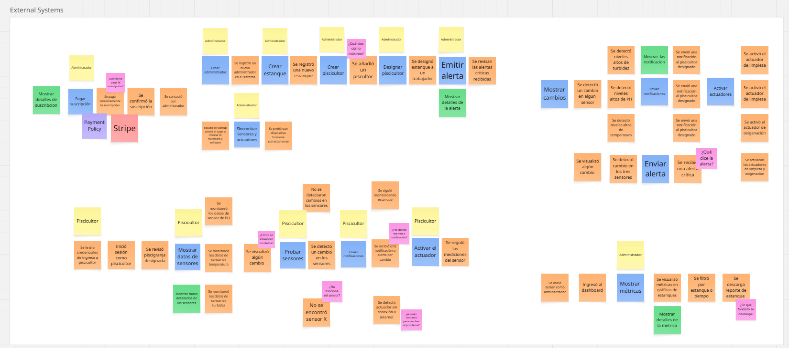

##### Step 9: Pain Points & Hotspots
Se señalan los **Pain Points** (post-its fucsia en diamante), identificando riesgos, dudas o debilidades técnicas. En este proyecto, se destacan retos como la conectividad en zonas rurales y la seguridad de las "Keys de Granja", los cuales se mitigan mediante el uso de arquitecturas **Edge Computing**.

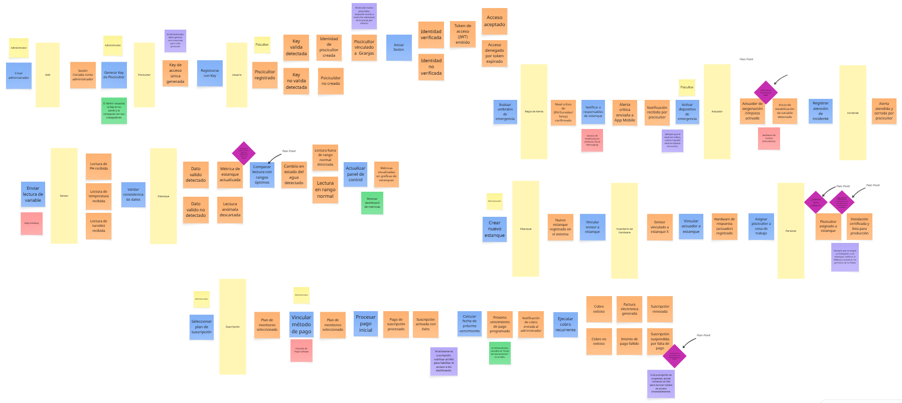

##### Step 10: Final Architecture & Context Mapping
El paso final consiste en consolidar el mapa completo para definir la arquitectura técnica. Se establecen los canales de comunicación entre contextos, asegurando que el **IAM** actúe como guardián transversal mientras que **Telemetría** y **Alertas** funcionan como el motor reactivo de la solución inteligente.


---

**Link Miro:** [Acceso al Tablero de EventStorming - YakuControl](https://miro.com/welcomeonboard/dGFtbnNmZWozeFE1UnJUcWZiY05ISlBxMGZRTFNnWGhKNHU3YkZRTkd1U2tnd3NzZVoybUtQRWRDNDZkdlI0OGFjS2VBTGU3ZWdsRS8wa3RodTl2a2FhcGk0Qm1HdFJkZDVNdTdkQjR5V3hvNXE5MTFDWTJEaFhUNkg2Sm52bXlQdGo1ZEV3bUdPQWRZUHQzSGl6V2NBPT0hdjE=?share_link_id=635140542507)

#### 4.1.1.1. Candidate Context Discovery

En esta sección se presenta el proceso seguido por el equipo para la identificación y clasificación de los **Bounded Contexts** candidatos a partir del Event Storming de **YakuControl**. El objetivo fue identificar los límites naturales del dominio IoT, determinar qué partes del sistema constituyen el núcleo estratégico (Core) y cuáles cumplen roles de apoyo, priorizando el diseño en los elementos que garantizan la supervivencia de la producción acuícola.

#### **Preparación de la sesión**
La sesión de Candidate Context Discovery se desarrolló de forma colaborativa con una duración de 1 hora 30 minutos. Se utilizaron los siguientes insumos:
* La línea de tiempo de eventos organizada cronológicamente.
* Los eventos clave (**Pivotal Events**) como "Lectura fuera de rango detectada" y "Token JWT emitido".
* La lógica de procesamiento **Edge Computing** definida para la resiliencia del sistema.

#### **Técnica aplicada: Start-with-Value**
Se aplicó la técnica **Start-with-Value**, priorizando las partes del dominio que generan el mayor impacto en la reducción de la mortalidad de los peces y la eficiencia operativa. El proceso se organizó en tres pasos:
1.  **Identificación de valor estratégico:** El equipo determinó que la capacidad de reacción autónoma ante anomalías hídricas es el principal diferenciador.
2.  **Agrupación de eventos:** Se consolidaron los clusters de eventos alrededor de los agregados "Estanque", "Sensor" y "Actuador".
3.  **Clasificación Estratégica:** Se categorizaron los contextos en **Core**, **Supporting** y **Generic** según su complejidad y diferenciación competitiva.

#### **Candidate Contexts Identificados**

El análisis permitió identificar los siguientes bounded contexts candidatos:

| Candidate Context | Eventos Clave Asociados | Clasificación | Descripción | Justificación |
| :--- | :--- | :--- | :--- | :--- |
| **Identity & Access (IAM)** | Key de granja generada, Piscicultor vinculado, Token JWT emitido. | **Generic** | Gestión de autenticación, roles y seguridad mediante llaves de granja. | Es vital para la seguridad, pero utiliza estándares (JWT) que no diferencian el negocio acuícola. |
| **Telemetry** | Lectura recibida, Dato válido detectado, Métrica de estanque actualizada. | **Core** | Ingesta y validación de datos en tiempo real provenientes de sensores IoT. | Es el origen de toda la inteligencia del sistema; la precisión del dato es crítica. |
| **Notification** | Lectura fuera de rango, Alerta crítica enviada, Actuador activado. | **Core** | Cerebro reactivo que evalúa umbrales y controla el soporte vital (oxigenadores). | Representa el valor máximo: la capacidad de salvar la producción sin intervención humana. |
| **Equipment** | Estanque registrado, Sensor vinculado, Instalación certificada. | **Supporting** | Gestión del inventario físico y mapeo de la planta acuícola. | Apoya la operación permitiendo saber qué hardware está en cada estanque, pero es administrativo. |
| **Payment** | Plan seleccionado, Pago procesado, Suscripción suspendida por mora. | **Generic** | Control del modelo de negocio SaaS y facturación recurrente. | Necesario para la monetización, pero delegable a pasarelas externas como Stripe o Culqi. |

#### **Clasificación Estratégica**

Como parte del análisis, se distribuyeron los contextos en una matriz de **Diferenciación de Negocio** vs **Complejidad del Modelo**:

* **Core (Alta diferenciación / Alta complejidad):** Telemetry, Notification.
* **Supporting (Baja diferenciación / Mediana complejidad):** Equipment.
* **Generic (Baja diferenciación / Baja-Mediana complejidad):** Identity & Access (IAM), Payment.
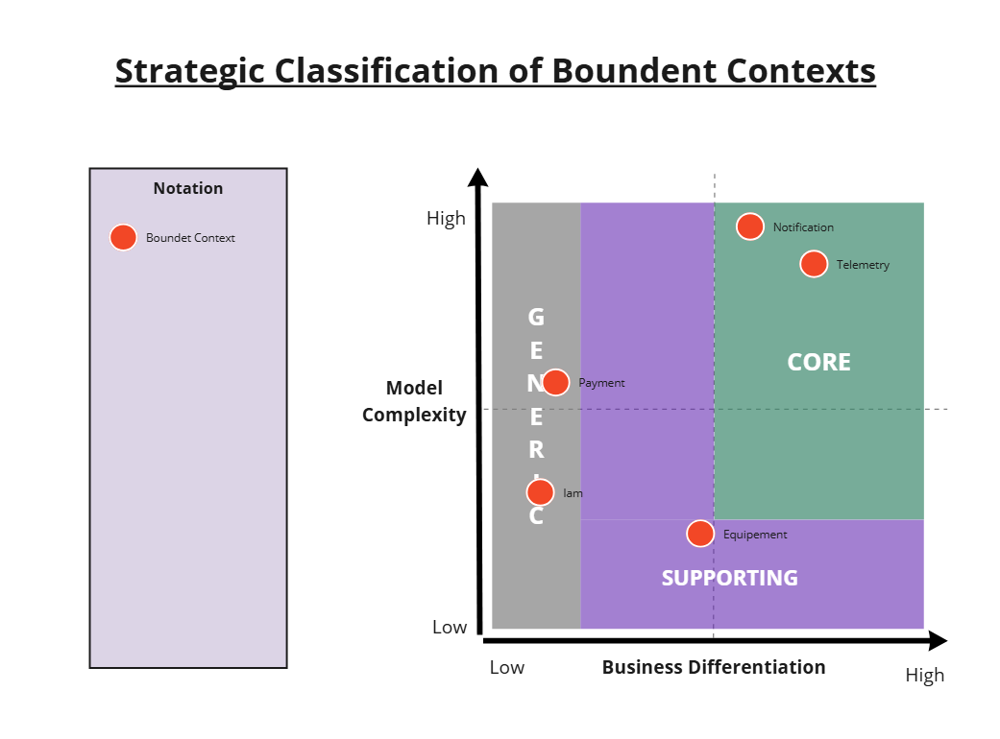
#### **Resultados**

Se definieron **seis bounded contexts candidatos**, los cuales se detallan a continuación según su clasificación estratégica:

* **2 Core (Dominio Principal):** * **Telemetry:** Procesa la ingesta masiva de datos y asegura la fidelidad de las métricas.
    * **Motification:** Ejecuta la lógica de respuesta inmediata y el control de dispositivos físicos.
* **2 Supporting (Soporte Operativo):** * **Equipment:** Administra la relación física entre estanques, sensores y personal.
* **2 Generic (Sistemas Genéricos):** * **Identity & Access (IAM):** Gestiona la seguridad, autenticación y el sistema de llaves de granja.
    * **Payment:** Administra el flujo financiero del modelo SaaS y el acceso comercial.

La aplicación de la técnica **Start-with-Value** permitió asegurar que la atención principal del diseño táctico y la inversión tecnológica (como la implementación de **Edge Computing**) se concentre en los contextos de **Telemetría** y **Automatización**, dado que allí reside la propuesta de valor diferenciadora de **YakuControl**. 

El resto de contextos serán modelados en las siguientes secciones mediante **Bounded Context Canvas** y **Domain Message Flows**, garantizando consistencia y claridad en la arquitectura estratégica.

#### 4.1.1.2. Domain Message Flows Modeling

El Domain Storytelling es una técnica visual y colaborativa que facilita la exploración del conocimiento dentro del dominio del negocio, cuyo propósito principal es generar una comprensión común sobre lo que se desarrolla en un proceso específico, involucrando tanto a los expertos del negocio como a los equipos técnicos.

En este sentido, elaboramos los domain storytelling tomando como referencia las interacciones entre los bounded contexts de YakuControl (IAM, Equipment, Telemetry, Notification y Payment), con el fin de analizar y comprender de manera más clara la lógica del negocio acuícola.


**Escenario 1:** Registrar administrador y crear piscicultor
**Objetivo:** Registrar un nuevo administrador en el sistema, generar su key de acceso y permitirle crear un piscicultor vinculado a su granja.

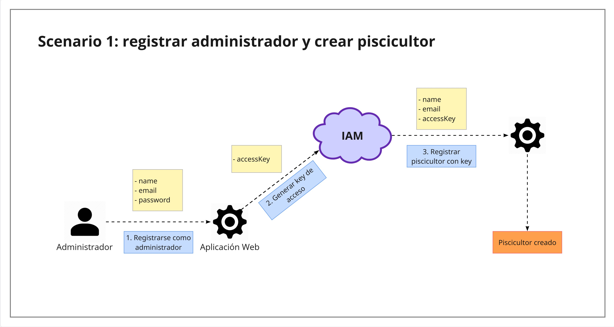

**Escenario 2:** Crear piscigranja y vincular sensores
**Objetivo:** El administrador crea un nuevo estanque en el sistema, vincula los sensores IoT correspondientes e inicia la telemetría para el monitoreo en tiempo real.

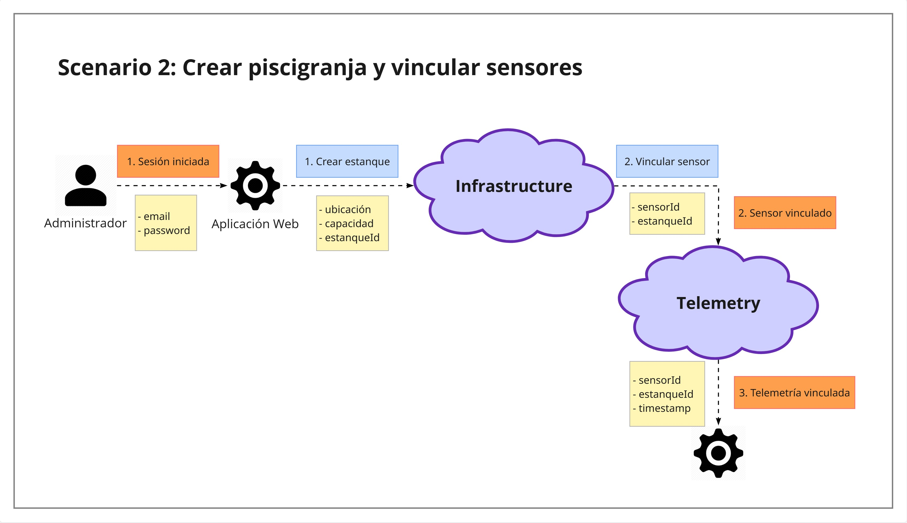

**Escenario 3:** Alertar ante detección de anomalías de los sensores
**Objetivo:** El sensor ESP32 detecta una anomalía en los parámetros del agua y el sistema genera y envía alertas automáticas al administrador y al piscicultor en tiempo real.

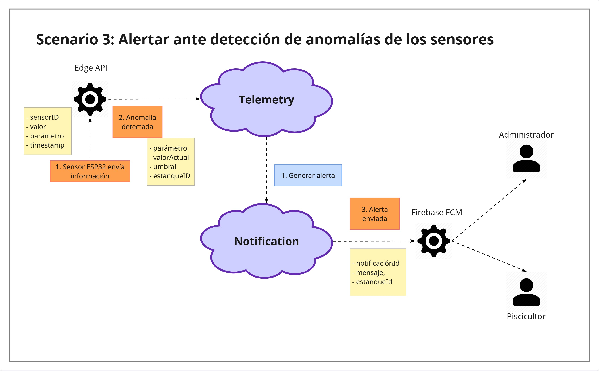

**Escenario 4:** Pagar suscripción
**Objetivo:** El administrador selecciona un plan de suscripción, completa el proceso de pago y el sistema habilita el acceso completo a las funcionalidades de YakuControl.

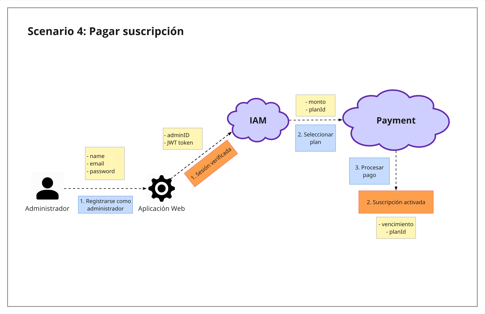

#### 4.1.1.3. Bounded Context Canvases
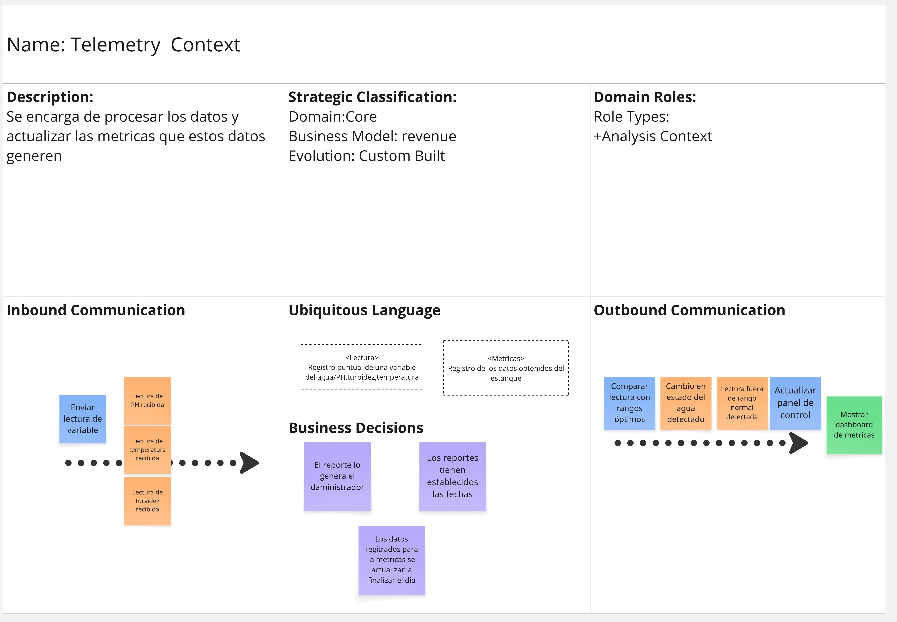

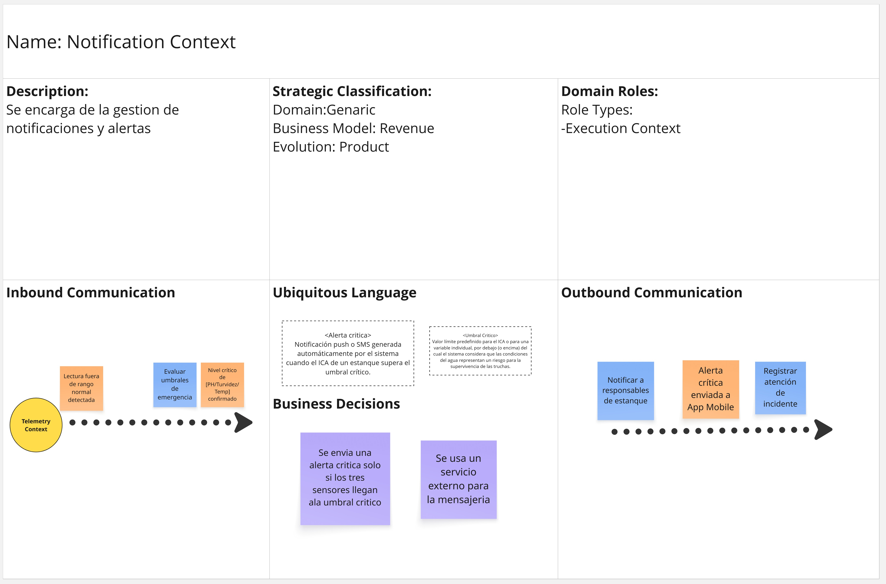

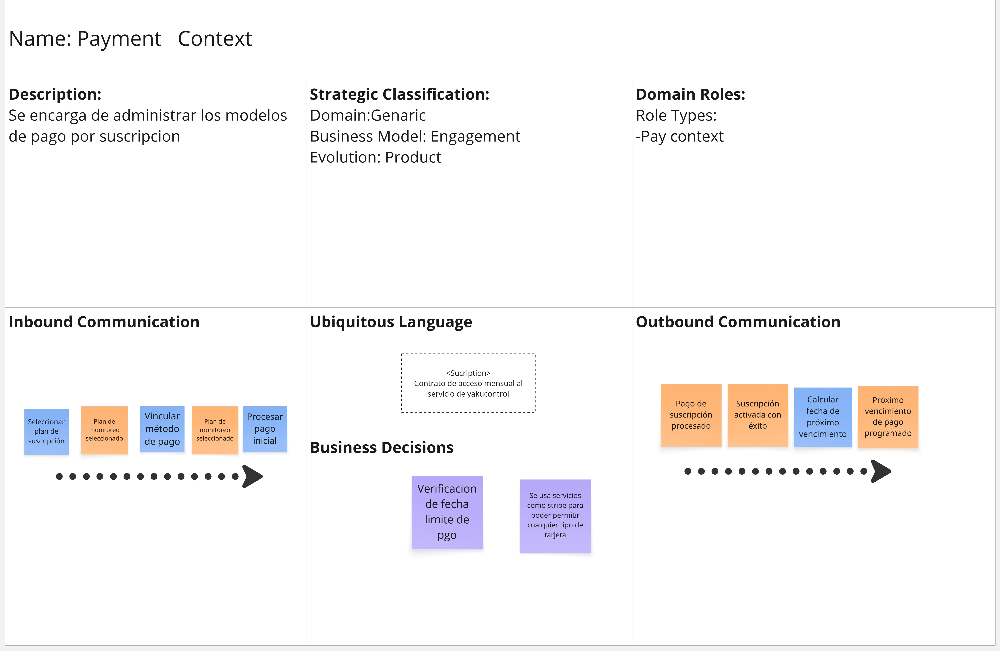

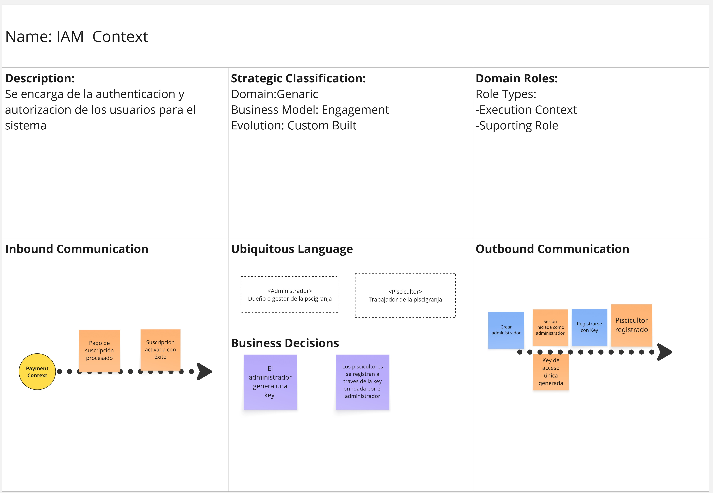

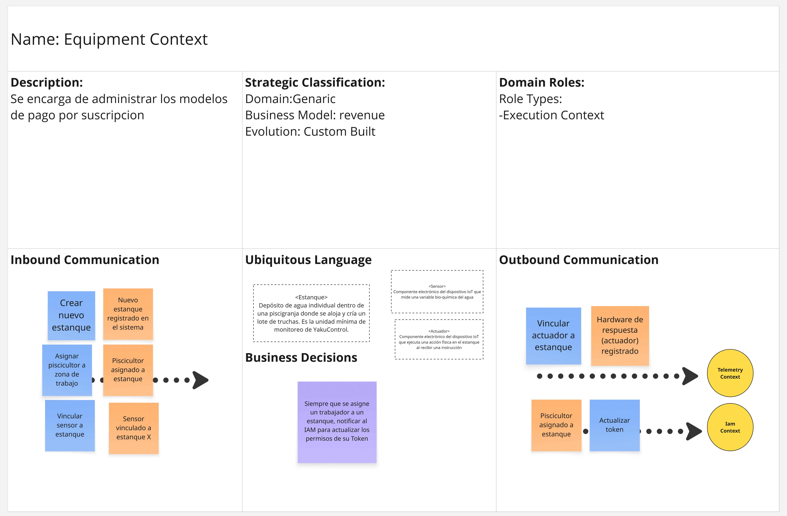

<div style="page-break-after: always;"></div>

### 4.1.2. Context Mapping

Para elaborar el Context Mapping de YakuControl, el equipo revisó los cinco Bounded Context Canvases definidos en la etapa de diseño estratégico: **Identity & Access (IAM)**, **Telemetry**, **Notification**, **Equipment** y **Payment**. A partir de esta revisión, se analizaron las dependencias entre contextos, las responsabilidades de cada uno y las posibles alternativas de diseño antes de determinar la estructura final de relaciones.

#### Proceso de análisis: preguntas de diseño candidato

**¿Qué pasaría si movemos la lógica de umbrales críticos del Telemetry Context al Notification Context?**
Si el Notification Context asumiera la responsabilidad de decidir cuándo emitir alertas basándose en umbrales, crearía una dependencia directa con los datos de configuración del negocio acuícola. Esto contaminaría al Notification Context con reglas de dominio que no le corresponden, haciéndolo frágil ante cambios en los criterios de calidad del agua. Se descarta esta alternativa: la lógica de validación de métricas y detección de anomalías debe permanecer en el Telemetry Context, que es quien procesa e interpreta los datos de los sensores.

**¿Qué pasaría si descomponemos el Telemetry Context y separamos la ingesta de datos crudos del procesamiento de métricas validadas?**
Podría tener sentido crear un contexto exclusivo de ingesta (Edge) y otro de análisis (Analytics). Sin embargo, dado el tamaño del equipo y la naturaleza del MVP, esta separación generaría overhead de comunicación entre contextos sin beneficio real en esta etapa. Se decide mantener la ingesta, validación y persistencia de métricas en un único Telemetry Context cohesivo, con la posibilidad de descomponerlo en una versión futura del producto.

**¿Qué pasaría si partimos el Identity & Access (IAM) Context en un contexto de Autenticación y otro de Autorización?**
Separar la emisión de tokens JWT de la gestión de roles (ROLE_WORKER, ROLE_ADMIN) y llaves de granja permitiría mayor granularidad. Sin embargo, ambas responsabilidades están fuertemente acopladas en la lógica de acceso de YakuControl (el token lleva el rol embebido). Dividirlos introduciría complejidad innecesaria para el MVP. Se mantiene el IAM Context unificado.

**¿Qué pasaría si unimos el Identity & Access Context con el Payment Context para formar un contexto de "Customer Management"?**
La idea de unir la identidad del usuario con su estado de suscripción podría simplificar la verificación de acceso. Sin embargo, mezclaría responsabilidades de dominio distintas: la identidad es un concepto técnico de seguridad, mientras que la suscripción es un concepto de negocio. Mantenerlos separados permite evolucionarlos de forma independiente. Se descarta la unificación.

**¿Qué pasaría si integramos el Equipment Context dentro del Telemetry Context?**
El Equipment Context gestiona el inventario físico (estanques, sensores, instalaciones), mientras que el Telemetry Context procesa los datos que esos sensores generan. Fusionarlos mezclaría la configuración del hardware con el flujo de datos, violando el principio de responsabilidad única. Se mantienen separados: Equipment provee el contexto físico y Telemetry consume esa información para asociar las métricas al estanque correcto.

**¿Qué pasaría si creamos un Shared Service de notificaciones para centralizar los canales de comunicación del sistema?**
Tanto el Telemetry Context (alertas críticas por anomalías) como el Equipment Context (notificaciones de mantenimiento) podrían necesitar enviar mensajes al usuario. Centralizar esto en el Notification Context como un servicio compartido es la solución adoptada: ambos contextos publican eventos y el Notification Context se encarga del canal de entrega (push, SMS vía Twilio), evitando duplicación de integraciones externas.

**¿Qué pasaría si aislamos los core capabilities de monitoreo y movemos la facturación a un contexto genérico externo?**
El core de YakuControl son el Telemetry y el Notification Context. El Payment Context es un dominio genérico de soporte que puede delegarse a pasarelas externas como Stripe o Culqi. Aislarlo como contexto genérico es la decisión correcta: si el proveedor de pagos cambia, solo se afecta el Payment Context sin impacto en el core del negocio acuícola.

---

#### Relaciones entre Bounded Contexts y patrones DDD aplicados

Tras el análisis de alternativas, se definió el siguiente mapa de relaciones para YakuControl:

| Contexto Upstream (U) | Contexto Downstream (D) | Patrón de Relación | Descripción |
| :--- | :--- | :--- | :--- |
| **Identity & Access (IAM)** | **Telemetry** | Open Host Service (OHS) + ACL | El IAM Context expone un servicio de validación de tokens JWT y llaves de granja. El Telemetry Context implementa una Anti-Corruption Layer para traducir la identidad del dispositivo sin depender del modelo interno del IAM. |
| **Identity & Access (IAM)** | **Notification** | Open Host Service (OHS) | El IAM Context provee los tokens de dispositivo y datos de contacto necesarios para que el Notification Context dirija las alertas al usuario correcto. El Notification Context consume este servicio sin modificar su modelo. |
| **Identity & Access (IAM)** | **Equipment** | Open Host Service (OHS) | El Equipment Context consulta al IAM para verificar que el usuario tiene permisos (ROLE_ADMIN) para registrar o modificar estanques y sensores. |
| **Identity & Access (IAM)** | **Payment** | Customer/Supplier | El Payment Context (cliente) depende del IAM (proveedor) para obtener la identidad del usuario al momento de procesar una suscripción. El IAM tiene influencia sobre el modelo del Payment Context. |
| **Equipment** | **Telemetry** | Customer/Supplier | El Equipment Context (proveedor) mantiene el registro de qué sensor está vinculado a qué estanque. El Telemetry Context (cliente) consume esta información para asociar correctamente cada métrica recibida con su estanque y especie correspondiente. |
| **Telemetry** | **Notification** | Customer/Supplier | El Telemetry Context (proveedor) emite eventos de anomalía cuando una métrica validada supera el umbral crítico del OptimalRange. El Notification Context (cliente) consume estos eventos para disparar alertas push o SMS de forma inmediata. |
| **Equipment** | **Notification** | Customer/Supplier | El Equipment Context (proveedor) publica eventos de mantenimiento cuando un sensor queda fuera de línea o un estanque requiere atención técnica. El Notification Context (cliente) consume estos eventos para alertar al administrador de la piscigranja a través del canal correspondiente. |
| **Payment** | **Identity & Access (IAM)** | Conformist | Una vez procesado el pago, el Payment Context notifica al IAM el estado activo de la suscripción. El IAM adopta esta información para habilitar o restringir el acceso de la granja a la plataforma, conformándose al modelo del Payment Context sin transformarlo. |

#### Conclusión del Context Mapping


El mapa de contextos resultante posiciona a **Identity & Access (IAM)** como el contexto genérico central que provee seguridad y autenticación a todos los demás. **Telemetry** e **Equipment** constituyen el núcleo operativo del sistema: Equipment define la realidad física de la piscigranja y Telemetry la convierte en datos de valor. **Notification** es el contexto core que materializa la propuesta de valor diferenciadora de YakuControl: la reacción autónoma e inmediata ante condiciones críticas del agua. Finalmente, **Payment** opera como contexto genérico de soporte de negocio, delegado a servicios externos, con mínima interferencia sobre el dominio acuícola.

El mapa de contextos resultante posiciona a **Identity & Access (IAM)** como el contexto genérico central que provee seguridad y autenticación a todos los demás. **Telemetry** y **Equipment** constituyen el núcleo operativo del sistema: Equipment define la realidad física de la piscigranja y Telemetry la convierte en datos de valor. **Notification** es el contexto core que materializa la propuesta de valor diferenciadora de YakuControl: la reacción autónoma e inmediata ante condiciones críticas del agua. Finalmente, **Payment** opera como contexto genérico de soporte de negocio, delegado a servicios externos, con mínima interferencia sobre el dominio acuícola.


Esta arquitectura garantiza que los cambios en la lógica de pagos o notificaciones no afecten el core del monitoreo, y que cada contexto pueda evolucionar, testearse y desplegarse de forma independiente.

<div style="page-break-after: always;"></div>

### 4.1.3. Software Architecture
#### 4.1.3.1. Software Architecture System Landscape Diagram
En esta sección se ofrece una visión macroscópica del ecosistema tecnológico de la piscigranja. El objetivo de este nivel de abstracción es contextualizar a YakuControl dentro de su entorno operativo real. El diagrama ilustra la convivencia de la plataforma principal con otros sistemas aislados de la empresa y los actores organizacionales. Esto permite comprender los flujos de información y los procesos de negocio en el terreno, existan o no integraciones directas a nivel de código.

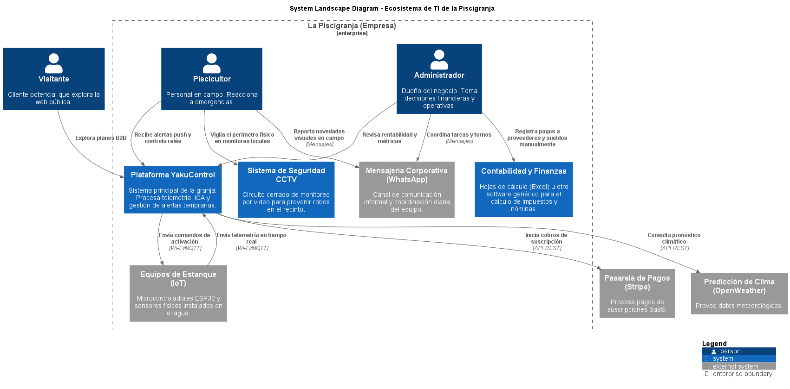
<br>

#### 4.1.3.2. Software Architecture Context Level Diagrams
El propósito de este nivel es definir de manera estricta las fronteras del software en desarrollo. El diagrama detalla a los usuarios directos (el Administrador y el Piscicultor) y las dependencias con sistemas externos críticos para la operatividad y monetización, tales como la infraestructura IoT en los estanques, la pasarela de pagos B2B y las APIs meteorológicas.

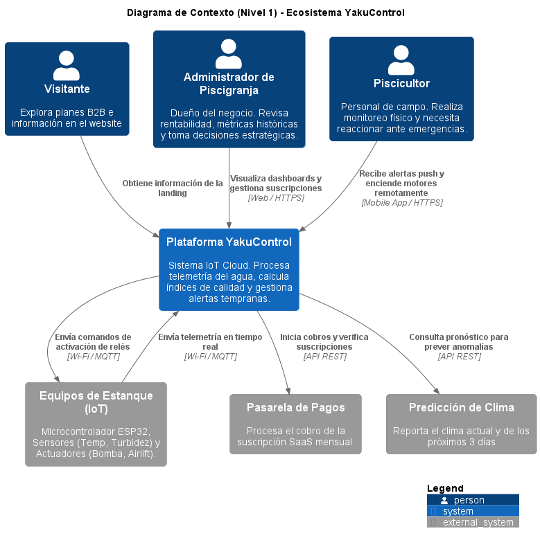
<br>

#### 4.1.3.3. Software Architecture Container Level Diagrams
Se expone la estructura interna de YakuControl y las decisiones tecnológicas de alto nivel. Este esquema identifica las unidades de ejecución independientes que conforman el sistema, abarcando desde las interfaces de usuario (aplicaciones web SPA y aplicaciones móviles nativas) hasta el enrutamiento mediante un API Gateway y la malla de microservicios backend. Asimismo, ilustra la estrategia de persistencia en bases de datos relacionales y de series de tiempo y el modelo de comunicación asíncrona mediante un bus de eventos, demostrando la escalabilidad y el desacoplamiento de la arquitectura.

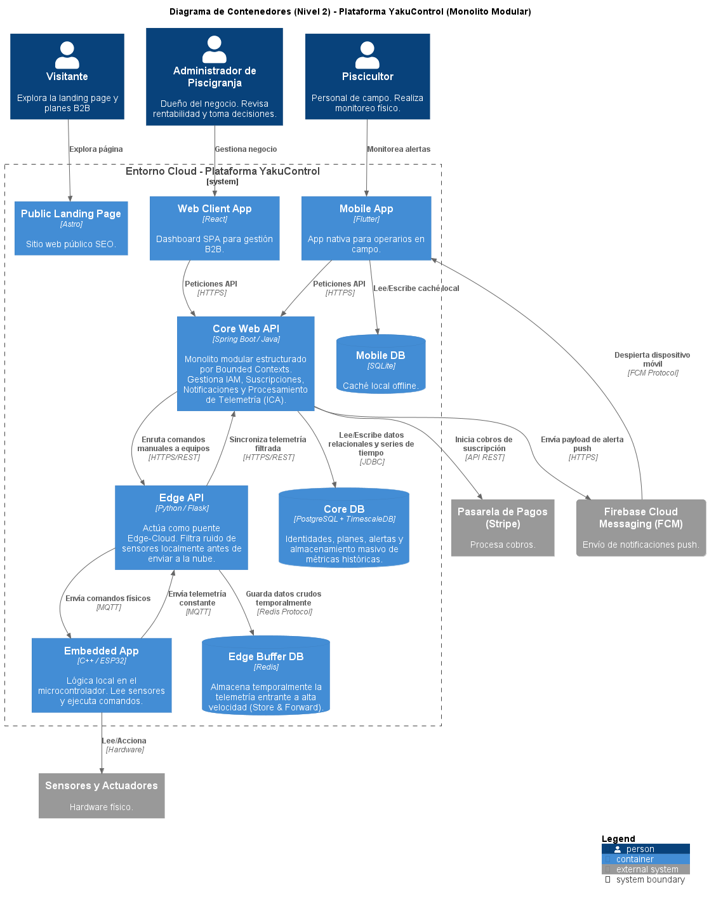
<br>


#### 4.1.3.4. Software Architecture Deployment Diagrams
Mapea la arquitectura lógica hacia la infraestructura física y los servicios en la nube. Este nivel visualiza la distribución topológica y geográfica del software, detallando cómo los artefactos y contenedores se instalan en los entornos de ejecución reales. El esquema evidencia la separación estratégica en ejecución en el "Edge", la distribución global del frontend mediante redes de entrega de contenido, y el despliegue seguro del backend dentro de una red virtual privada (VNet) administrada en la nube de Microsoft Azure.

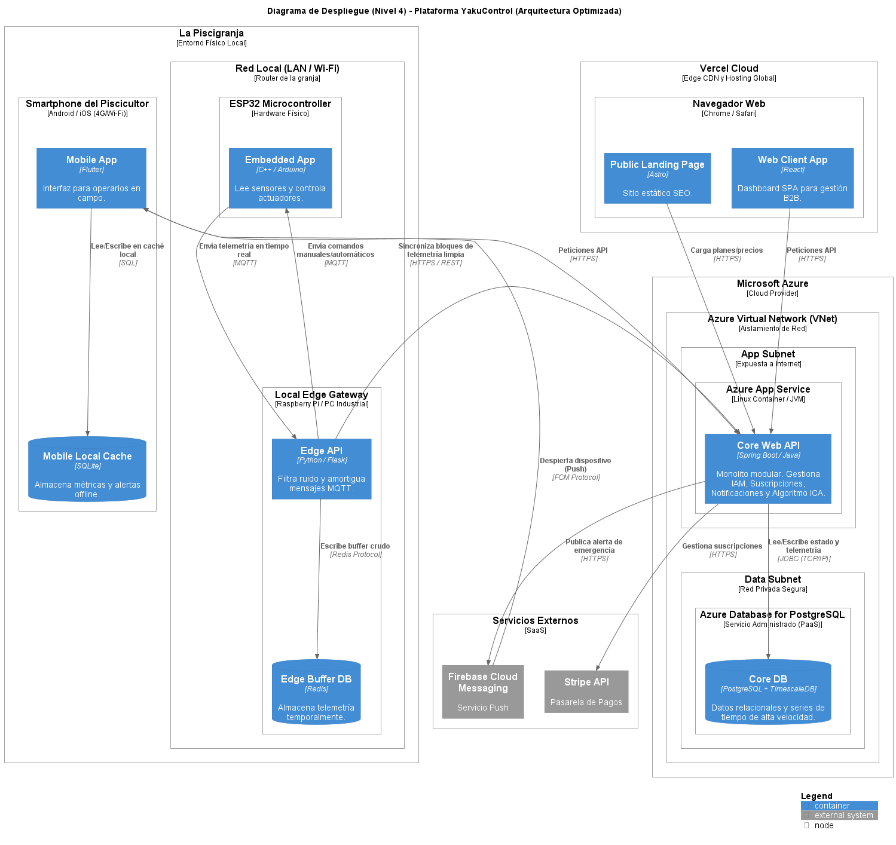
<br>

<div style="page-break-after: always;"></div>

## 4.2. Tactical-Level Domain-Driven Design

### 4.2.1. Bounded Context: Telemetry Context
Este contexto es el núcleo técnico de YakuControl. Su responsabilidad principal es la ingesta masiva, validación y procesamiento de los flujos de datos crudos provenientes de los sensores IoT instalados en los estanques de crianza de truchas. Utilizando principios de **Edge Computing** y arquitectura hexagonal, transforma datos inestables en métricas inmutables y detecta anomalías críticas en tiempo real para activar el soporte vital.

#### 4.2.1.1. Domain Layer

La capa de dominio del Bounded Context Telemetry presenta la descripción estructurada de las clases que conforman el modelo encargado de garantizar la consistencia de los datos hídricos. Diseñado bajo los principios de DDD táctico, este modelo aísla las reglas de la acuicultura (umbrales, calibración, estabilidad) de la tecnología de sensores o bases de datos, utilizando agregados para mantener la integridad de cada estanque.

##### Aggregate Root
* **Pond (Estanque)** : Representa la unidad de producción y es la raíz de consistencia. Encapsula el estado actual de sus variables (PH, Oxígeno, Temperatura) y valida que cualquier nueva métrica entrante sea consistente con su historial y la especie que alberga.

##### Entity
* **ValidatedMetric** : Representa un punto de dato único (ej: PH 6.5) que ha superado los filtros de calidad y ha sido persistido de forma inmutable. Contiene su valor, timestamp y unidad de medida.
* **Sensor** : Entidad que representa el hardware físico. Mantiene su estado de calibración y está vinculado a un tipo de variable específica.

##### Value Object
* **RawReading** : Objeto inmutable que captura el dato crudo recién llegado del dispositivo IoT (sensorId, valor_sin_procesar, timestamp) antes de ser validado.
* **OptimalRange** : Define los límites (mínimo/máximo) aceptables para una variable específica según la etapa de vida de la trucha.
* **WaterVariableType** : Enumerado que define el tipo de métrica (PH, TEMPERATURE, OXYGEN).

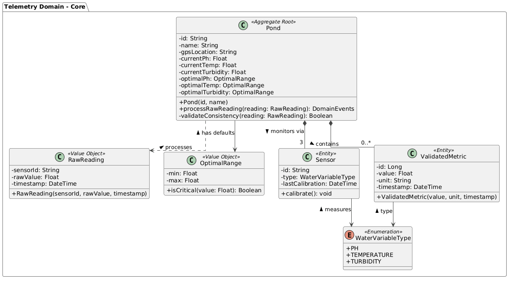

#### 4.2.1.2. Interface Layer

La capa de interfaz en el Bounded Context Telemetry actúa como el punto de contacto primario para la entrada de datos. A diferencia de otros contextos, su interacción principal no es humana, sino de máquina a máquina (M2M), gestionando el flujo masivo de mensajes desde los brokers MQTT o gateways en el Edge y exponiendo APIs para la visualización de datos.

##### Controller
* **PondMetricsController** : Controlador REST que expone los **Read Models** optimizados para las gráficas históricas y el estado actual de los estanques consultados por la App Web/Móvil.
* **IoTDataStreamConsumer** : Adaptador especializado (quizás gRPC o WebSocket listener) que se suscribe al flujo de mensajes crudos provenientes del hardware y los introduce en la capa de aplicación.

##### DTO
* **RawIoTMessageResource** : Objeto que captura la estructura del mensaje crudo enviado por el dispositivo IoT a través del broker.
* **CurrentPondStateResource** : Representa la respuesta optimizada con las últimas métricas validadas de un estanque para el Dashboard en tiempo real.
* **HistoricalTrendResource** : Objeto estructurado para alimentar las gráficas de tendencias históricas, optimizado para series de tiempo.

#### Transform
* **RawReadingFromIoTMessageAssembler** : Componente encargado de transformar el mensaje crudo de red (RawIoTMessageResource) en un Objeto de Valor de dominio puro (RawReading).
* **CurrentStateResourceFromAggregateAssembler** : Convierte el estado actual del Agregado Pond en un formato ligero y optimizado (CurrentPondStateResource) para su visualización.

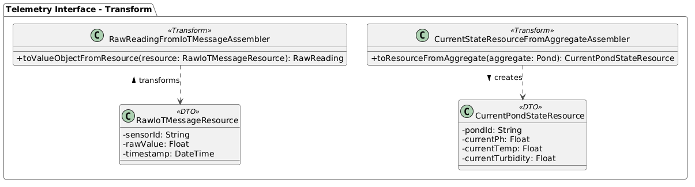

#### 4.2.1.3. Application Layer

La capa de aplicación en el Bounded Context Telemetry coordina el flujo de datos masivos. Siguiendo el patrón CQRS, separa estrictamente la orquestación de la ingesta de datos (comandos de alta frecuencia) de la consulta de información histórica (consultas). No contiene lógica de negocio, pero dirige la validación y la persistencia de las métricas.

##### Command
* **MetricApplicationService** : Servicio encargado de orquestar la ingesta. Recibe una `RawReading`, coordina con el Agregado `Pond` para aplicar las reglas de validación del Dominio y, si el dato es consistente, persiste la `ValidatedMetric`, publicando eventos si se detectan anomalías.
* **RegisterRawReadingCommand** : Objeto inmutable que transporta la intención de registrar un nuevo dato crudo desde la interfaz de IoT.

##### Query
* **PondQueryService** : Servicio encargado de orquestar las consultas de lectura puras. Permite a los clientes (App Web y Móvil) obtener el estado actual o el historial de un estanque consultando repositorios optimizados para series de tiempo (Read Models).
* **GetHistoricalTrendQuery** : Objeto que transporta los parámetros (pondId, rango_fecha) para una consulta histórica.

##### Domain Event Handlers
* **LecturaFueraDeRangoHandler** : Escucha el evento de dominio interno `LecturaFueraDeRangoNormalDetectada` y orquesta su publicación hacia el Event Bus externo para que el contexto de Alertas reaccione.
* 
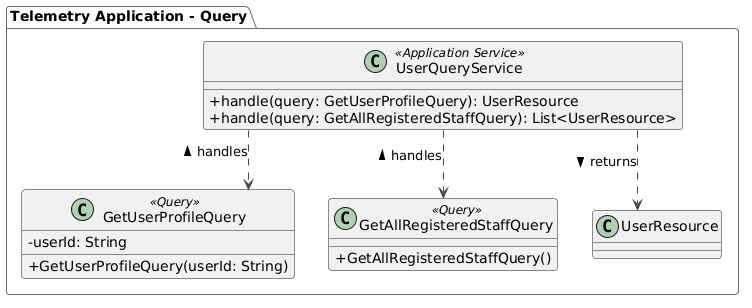

#### 4.2.1.4. Infrastructure Layer

La capa de infraestructura proporciona las capacidades tecnológicas críticas para manejar la alta frecuencia de datos de Telemetry. Implementa los mecanismos de persistencia (optimizados para series de tiempo), la comunicación con el broker de mensajes IoT y el bus de eventos externo, aplicando la inversión de dependencias.

* **PondRepositoryImpl** : Clase que implementa la interfaz UserRepository. Utiliza un repositorio de Spring Data JPA con **PostgreSQL** para persistir y consultar los metadatos y el estado transaccional del Agregado Pond.
* **TimeSeriesRepositoryImpl** : Implementación especializada que gestiona la persistencia masiva e inmutable de las `ValidatedMetric` en una base de datos optimizada para series de tiempo (como **TimescaleDB** o **InfluxDB**).
* **MqttIoTBrokerClient** : Adaptador técnico encargado de la conexión, suscripción y recepción de mensajes desde el broker MQTT (ej: AWS IoT Core o Mosquitto en el Edge).
* **KafkaEventPublisher** : Componente encargado de publicar los eventos de dominio confirmados (ej: `MétricaActualizada`) hacia un bus de eventos externo (como **Apache Kafka**) para la integración con otros Bounded Contexts.

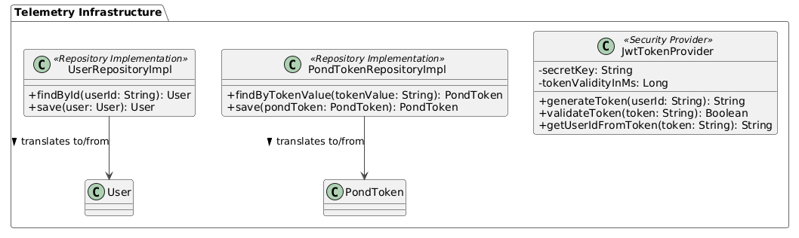

#### 4.2.1.5. Bounded Context Software Architecture Component Level Diagrams

<p align="center">
  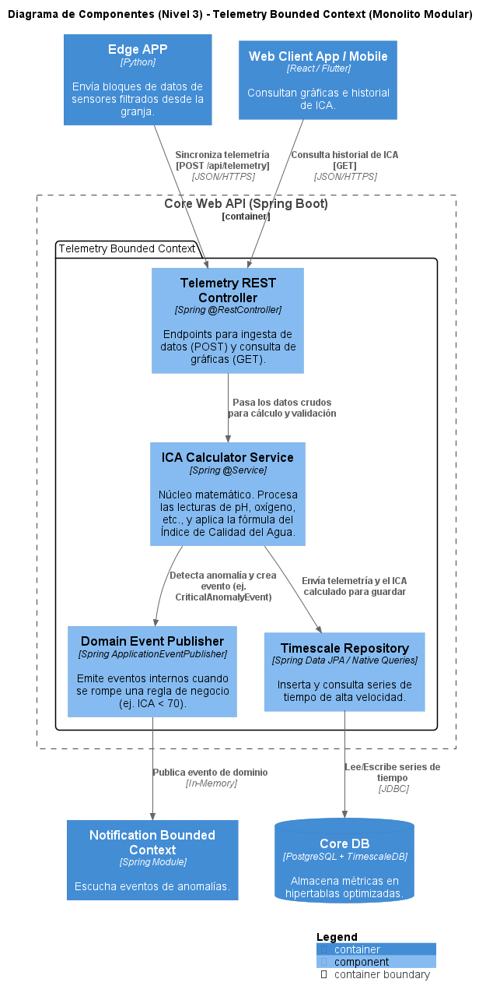
  <br>
  <i>Telemetry-Context</i>
</p>

#### 4.2.1.6. Bounded Context Software Architecture Code Level Diagrams

##### 4.2.1.6.1. Bounded Context Domain Layer Class Diagrams
El diagrama de clases de la capa de dominio de Telemetry detalla la estructura táctica del Bounded Context, especificando cómo el Agregado **Pond** garantiza la consistencia de sus entidades y cómo interactúa con los objetos de valor inmutables generados por el flujo IoT. Muestra los atributos y comportamientos críticos para la validación de la calidad del agua.

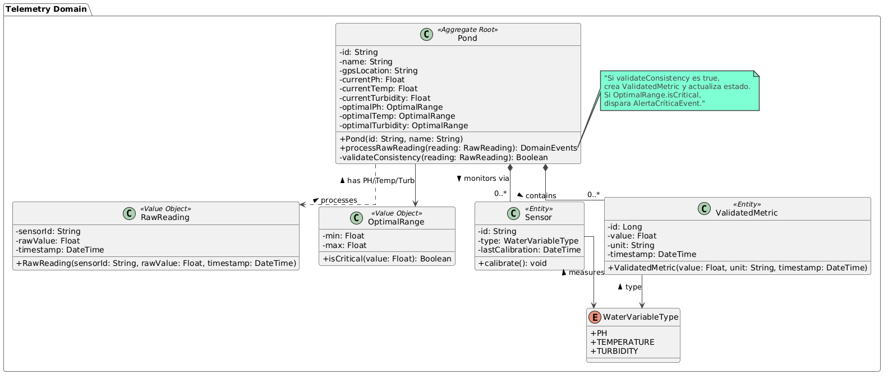

##### 4.2.1.6.2. Bounded Context Database Design Diagram
Detalla la estructura híbrida de persistencia para la gestión de métricas. Define un modelo relacional (**PostgreSQL**) para los metadatos de estanques y sensores, y un modelo optimizado de series de tiempo (**TimescaleDB/Hypertable**) para la ingesta masiva e inmutable de lecturas validadas, garantizando integridad y rendimiento en las consultas históricas.

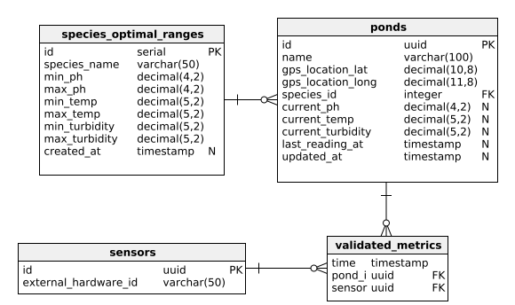

### 4.2.2. Bounded Context: Equipment Context

#### 4.2.2.1. Domain Layer

El Bounded Context Equipment presenta las clases que conforman el modelo de dominio encargado de la gestión de estanques y hardware en el sistema de monitoreo. Este modelo se ha diseñado bajo los principios de DDD, manteniendo una separación clara entre la lógica del dominio y los aspectos técnicos o de infraestructura.

##### Aggregate
* **Pond** : Representa el estanque de crianza como unidad productiva central. Gestiona su ciclo de configuración y la asignación del piscicultor responsable.
* **Equipment** : Representa un dispositivo físico (sensor o actuador). Gestiona su estado operativo y su vinculación a un estanque.
* **PondAssignment** : Registra el historial de asignaciones de piscicultores a estanques.

##### Value Object
* **PondName** : Encapsula el nombre del estanque.
* **PondStatus** : Estado operativo del estanque (ACTIVE, INACTIVE, FULL).
* **EquipmentType** : Tipo de dispositivo físico (SENSOR, ACTUATOR).
* **EquipmentStatus** : Estado del hardware (AVAILABLE, LINKED).

##### Domain Service
* **PondCommandService** : Define las operaciones de escritura sobre estanques.
* **PondQueryService** : Define las consultas de lectura sobre estanques.
* **EquipmentCommandService** : Define las operaciones de escritura sobre hardware.
* **EquipmentQueryService** : Define la consulta de hardware por estanque.
* **PondAssignmentQueryService** : Define la consulta del historial de asignaciones.

##### Repository
* **PondRepository** : Abstrae la persistencia del agregado Pond.
* **EquipmentRepository** : Abstrae la persistencia de Equipment.
* **PondAssignmentRepository** : Abstrae la persistencia del historial de asignaciones.

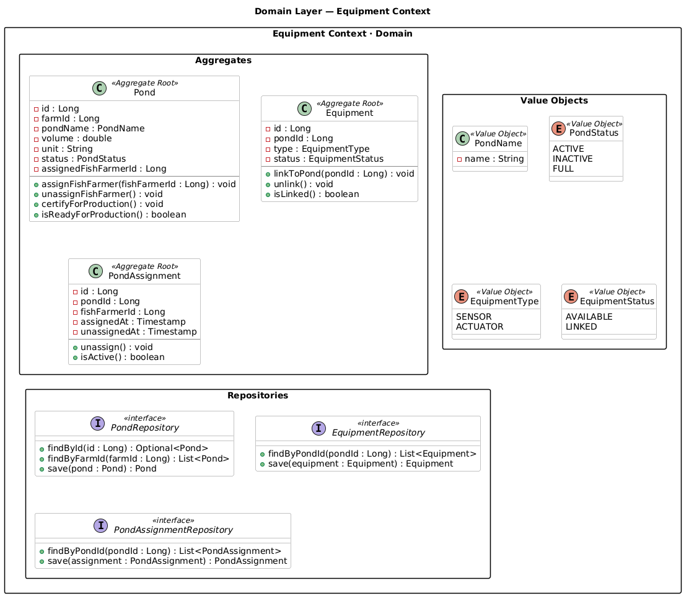

#### 4.2.2.2. Interface Layer

La capa de interfaz expone los endpoints RESTful para la gestión de estanques, registro de hardware y asignación de piscicultores desde el Web Dashboard.

##### Controller
* **PondController** : Gestiona la creación de estanques, consulta por granja, asignación de piscicultores y certificación para producción.
* **EquipmentController** : Gestiona el registro de dispositivos y su vinculación a un estanque.

##### DTO
* **CreatePondResource** : Captura los datos para registrar un nuevo estanque.
* **PondResource** : Respuesta estándar al consultar un estanque.
* **RegisterEquipmentResource** : Captura los datos para registrar un dispositivo.
* **LinkEquipmentResource** : Transporta el identificador del estanque destino.
* **EquipmentResource** : Respuesta estándar al consultar un dispositivo.
* **AssignFishFarmerResource** : Captura el identificador del piscicultor a asignar.

##### Transform
* **CreatePondCommandFromResourceAssembler** : Convierte CreatePondResource en CreatePondCommand.
* **PondResourceFromEntityAssembler** : Convierte el agregado Pond en PondResource.
* **RegisterEquipmentCommandFromResourceAssembler** : Convierte RegisterEquipmentResource en RegisterEquipmentCommand.
* **EquipmentResourceFromEntityAssembler** : Convierte Equipment en EquipmentResource.

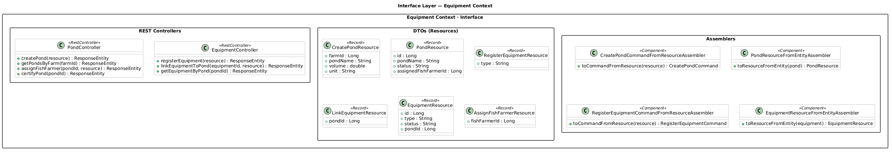

#### 4.2.2.3. Application Layer

La capa de aplicación orquesta los flujos de gestión de activos físicos. Siguiendo el patrón CQRS, se divide en servicios de comandos y servicios de consultas.

##### Command
* **PondCommandService** : Orquesta la creación de estanques, asignación de piscicultores y certificación para producción.
* **EquipmentCommandService** : Orquesta el registro de dispositivos y su vinculación a estanques.
* **CreatePondCommand / AssignFishFarmerCommand / CertifyPondCommand** : Transportan la intención de ejecutar acciones sobre un estanque.
* **RegisterEquipmentCommand / LinkEquipmentToPondCommand** : Transportan la intención de registrar o vincular un dispositivo.

##### Query
* **PondQueryService** : Consulta estanques por ID o por granja.
* **EquipmentQueryService** : Consulta hardware vinculado a un estanque.
* **PondAssignmentQueryService** : Consulta el historial de asignaciones de un estanque.

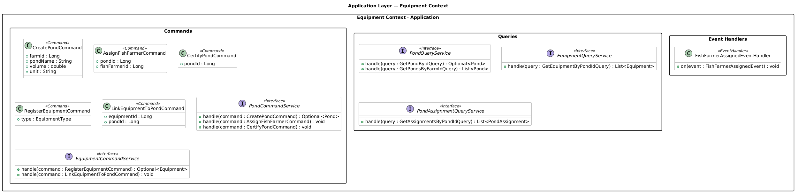

#### 4.2.2.4. Infrastructure Layer

La capa de infraestructura implementa las interfaces definidas en Domain Layer aplicando el principio de Inversión de Dependencias, gestionando la persistencia con JPA/PostgreSQL y la publicación de eventos de dominio.

* **PondRepositoryImpl** : Implementa PondRepository usando Spring Data JPA.
* **EquipmentRepositoryImpl** : Implementa EquipmentRepository usando Spring Data JPA.
* **PondAssignmentRepositoryImpl** : Implementa PondAssignmentRepository para el historial de asignaciones.
* **SpringDomainEventPublisher** : Publica el evento FishFarmerAssignedEvent al bus interno de Spring para que el módulo IAM actualice los permisos del piscicultor.


#### 4.2.2.5. Bounded Context Software Architecture Component Level Diagrams

<p align="center">
  
  <br>
  <i>Equipment-Context</i>
</p>

#### 4.2.2.6. Bounded Context Software Architecture Code Level Diagrams
##### 4.2.2.6.1. Bounded Context Domain Layer Class Diagrams

El diagrama de clases de la capa de dominio del Equipment Context detalla la estructura táctica del Bounded Context, especificando los agregados, comandos, consultas y objetos de valor que lo integran. Este esquema permite visualizar las interacciones y reglas de negocio plasmadas en los atributos y comportamientos de cada componente, desde la creación y configuración de estanques hasta la vinculación de hardware y asignación de piscicultores responsables.


##### 4.2.2.6.2. Bounded Context Database Design Diagram

El siguiente diagrama detalla la estructura relacional para la gestión de activos físicos del sistema de crianza de peces. Define la tabla ponds(estanques) como entidad central que representa cada estanque registrado en una granja, incluyendo su capacidad, estado de configuración y el piscicultor actualmente responsable. La tabla equipment gestiona el inventario de dispositivos físicos (sensores y actuadores) vinculados a cada estanque mediante clave foránea. Finalmente, la tabla pond_assignments mantiene el historial completo de asignaciones de piscicultores, registrando tanto la fecha de asignación como la de desvinculación, lo que permite auditar la trazabilidad de responsabilidades sobre cada estanque a lo largo del tiempo.


### 4.2.3. Bounded Context: Iam Context
#### 4.2.3.1. Domain Layer
Bounded Context IAM presenta una descripción estructurada de las clases que conforman el modelo de dominio encargado de la gestión de identidades, roles y control de acceso de los usuarios dentro del sistema IoT de monitoreo en criaderos de truchas. Este modelo se ha diseñado bajo los principios de Domain-Driven Design (DDD), con el objetivo de reflejar fielmente las reglas del negocio y de seguridad en el código, manteniendo una separación clara entre la lógica del dominio y los aspectos técnicos o de infraestructura.

##### Aggregate
* **User** : Representa un usuario (administrador o piscicultor) registrado en el sistema cuando se otorgue la cuenta al administrador o se registre el usuario como piscicultor.
##### Entity
* **PondToken** : Código único generado por el rol administrador que permite el registro de piscicultores a su nombre.
##### Value Object
* **Role** 


#### 4.2.3.2. Interface Layer
La capa de interfaz (o Interface Layer) en el Bounded Context IAM actúa como el punto de contacto entre el sistema y el mundo exterior. Su responsabilidad principal es exponer los puntos de enlace (endpoints) RESTful para la autenticación de usuarios, la gestión de identidades y el control de acceso, asegurando una comunicación segura y estandarizada con los clientes (App Web y App Móvil).

##### Controller
* **UserController** : Controlador REST que gestiona las operaciones relacionadas con las gestión de identidades, manejo de permisos y roles.

##### DTO
* **SignInResource** : Objeto que captura las credenciales del usuario al intentar acceder al sistema.
* **SignUpResource** : Objeto que captura la información necesaria (incluyendo el PondToken para piscicultores) al momento del registro.
* **UpdateUserProfileResource** : Objeto utilizado para capturar la información al momento de actualizar el perfil de un usuario existente.
* **UserResource** : Representa la respuesta estándar del sistema al consultar los datos de un usuario.
* **AuthenticationResponseResource** : Representa la respuesta exitosa tras el inicio de sesión, conteniendo el token de acceso (JWT).

#### Transform
* **SignInCommandFromResourceAssembler** : Componente encargado de transformar el DTO de entrada (SignInResource) en un comando de dominio puro (SignInCommand) para ser procesado por la capa de aplicación.
* **SignUpCommandFromResourceAssembler** : Transforma el DTO de registro (SignUpResource) en su respectivo comando (SignUpCommand).
* **UserResourceFromEntityAssembler** : Convierte la entidad de dominio User en un formato seguro y estructurado (UserResource) para ser expuesto al cliente.


#### 4.2.3.3. Application Layer
La capa de aplicación en el Bounded Context IAM define los trabajos que el software debe realizar y dirige los objetos de dominio para que resuelvan los problemas de negocio. Siguiendo el principio de inversión de dependencias y el patrón CQRS (separación de comandos y consultas), esta capa se divide en servicios de comandos (para el registro, autenticación y modificación de datos) y servicios de consultas (para leer la información de los perfiles).

##### Command
* **UserCommandService** : Servicio encargado de orquestar las operaciones que alteran el estado del sistema. Coordina el inicio de sesión, la validación de los códigos de acceso (PondToken) requeridos para los piscicultores, la instanciación de la entidad User para nuevos registros y la actualización de perfiles, delegando a la infraestructura la persistencia de los cambios.
* **SignInCommand / SignUpCommand / UpdateUserProfileCommand** : Objetos inmutables que transportan la intención de ejecutar una acción específica desde la capa de interfaz hacia la capa de aplicación. Contienen los datos estrictamente necesarios (credenciales, información personal o tokens de registro) para llevar a cabo su respectiva operación.

##### Query
* **UserQueryService** : Servicio encargado de orquestar las consultas de lectura puras. Permite a los clientes (App Web para Administradores y App Móvil para Piscicultores) obtener la información del perfil de un usuario específico o consultar la lista de personal registrado, sin realizar ninguna modificación en el estado del dominio.


#### 4.2.3.4. Infrastructure Layer
La capa de infraestructura proporciona las capacidades técnicas y tecnológicas que soportan a las demás capas (Interfaces, Aplicación y Dominio) dentro del Bounded Context IAM. Su propósito es implementar las interfaces que definimos en las capas superiores, aplicando el principio de Inversión de Dependencias. Aquí es donde se configura la conexión a la base de datos (por ejemplo, usando JPA/Hibernate con PostgreSQL) y se gestionan los mecanismos técnicos de seguridad.

* **UserRepositoryImpl** : Clase que implementa la interfaz UserRepository. Traduce la entidad de dominio User a su representación técnica en la base de datos (UserJpaEntity) y utiliza un repositorio de Spring Data JPA para persistir o consultar los datos del usuario.
* **PondTokenRepositoryImpl** : Clase que implementa la interfaz PondTokenRepository. Gestiona la traducción y persistencia en base de datos de los códigos de un solo uso generados para el registro de los piscicultores.
* **JwtTokenProvider** : Componente técnico encargado de la infraestructura de seguridad, específicamente de la generación, firma criptográfica y validación de los tokens JWT entregados a los clientes (App Web y App Móvil).


#### 4.2.3.5. Bounded Context Software Architecture Component Level Diagrams

<p align="center">
  
  <br>
  <i>Iam-Context</i>
</p>

#### 4.2.3.6. Bounded Context Software Architecture Code Level Diagrams
##### 4.2.3.6.1. Bounded Context Domain Layer Class Diagrams
El diagrama de clases de la capa de dominio de IAM detalla la estructura táctica del Bounded Context, especificando los agregados, entidades y objetos de valor que lo integran. Este esquema permite visualizar las interacciones y reglas de negocio plasmadas en los atributos y comportamientos de cada componente.


##### 4.2.3.6.2. Bounded Context Database Design Diagram
Detalla la estructura relacional para la gestión de identidades. Define la persistencia de usuarios y sus roles, junto con el sistema de tokens para el registro de piscicultores. El modelo asegura la integridad mediante claves primarias y foráneas, garantizando una base sólida y segura para la autenticación en el sistema.


### 4.2.4. Bounded Context: Notification Context
#### 4.2.4.1. Domain Layer
Bounded Context Notification presenta una descripción estructurada de las clases que conforman el modelo de dominio encargado de la gestión de alertas y notificaciones dentro del sistema IOT de monitoreo en criaderos de truchas. Este modelo se ha diseñado bajo los principios de Domain-Driven Design (DDD), con el objetivo de reflejar fielmente las reglas del negocio en el código, manteniendo una separación clara entre la lógica del dominio y los aspectos técnicos o de infraestructura.

##### Aggregate 
* **Notification** : Representa una alerta (normal o crítica) generada por el sistema cuando los sensores envían datos por debajo del umbral permitido, si hay daño o pérdida de conexión.
##### Entity
* **Recipient** : Representa a la persona (Piscicultor o Administrador/Dueño) que recibe la notificación.
* **SensorData**: Contiene la información capturada por el hardware (temperatura, turbidez, ph, estado de bombas) en el momento de la alerta.
##### Value Object
* **NotificationType**
* **RecipientRole**
* **ContactInfo**
* **HardwareStatus**


#### 4.2.4.2. Interface Layer
La capa de interfaz de usuario (o Interface Layer) en el Bounded Context de Notification actúa como el punto de contacto entre el sistema y el mundo exterior. Su responsabilidad principal es exponer los puntos de enlace (endpoints) RESTful para la gestión de alertas y asegurar que la comunicación con los clientes (App Web y App Móvil).

##### Controller
* **NotificationController:** Controlador REST que gestiona las operaciones relacionadas con las notificaciones, permitiendo la recepción de alertas desde el hardware
##### DTO
* **CreateNotificationResource (DTO):** Objeto de transferencia de datos utilizado para capturar la información necesaria al generar una nueva alerta desde los sensores
* **NotificationResource (DTO):** Representa la respuesta estándar del sistema al consultar una notificación, formateada para ser consumida por la aplicación web o móvil.
* **SensorDataResource (DTO):** Objeto de transferencia de datos utilizndo para capturar la informacion del estado de los Sensores.


#### 4.2.4.3. Application Layer
La capa de aplicación en el Bounded Context de Notification define los trabajos que el software debe realizar y dirige los objetos de dominio para que resuelvan los problemas. Siguiendo el principio de inversión de dependencias y el patrón CQRS (separación de comandos y consultas), esta capa se divide en servicios de comandos (para crear alertas) y servicios de consultas (para leer el historial).

##### Command
* **NotificationCommandService:** Servicio encargado de orquestar la creación de nuevas alertas. Coordina la obtención de los destinatarios correspondientes, crea la entidad Notification y hace el llamado para enviar y guardar la alerta.
* **CreateNotificationCommand:** Objeto inmutable que transporta la intención de crear una notificación desde la capa de interfaz hacia la capa de aplicación. Contiene los datos del sensor y el tipo de alerta.

##### Query
* **NotificationQueryService:** Servicio encargado de orquestar las consultas de lectura para que la App Web (Administradores) y App Móvil (Piscicultores) puedan ver el historial de alertas.


#### 4.2.4.4. Infrastructure Layer
La capa de infraestructura proporciona las capacidades técnicas y tecnológicas que soportan a las demás capas (Interfaces, Aplicación y Dominio). Su propósito es implementar las interfaces (puertos) que definimos en la capa de Aplicación, aplicando el principio de Inversión de Dependencias.

Aquí es donde configuramos la conexión a la base de datos (por ejemplo, usando JPA/Hibernate con PostgreSQL o MySQL

**NotificationRepositoryImpl:** Clase que implementa la interfaz NotificationRepository definida en la capa de Aplicación. Traduce las entidades de dominio a NotificationJpaEntity y utiliza un repositorio de Spring Data JPA para guardar o consultar en la base de datos


#### 4.2.4.5. Bounded Context Software Architecture Component Level Diagrams

<p align="center">
  
  <br>
  <i>Notification-Context</i>
</p>

#### 4.2.4.6. Bounded Context Software Architecture Code Level Diagrams
##### 4.2.4.6.1. Bounded Context Domain Layer Class Diagrams

##### 4.2.4.6.2. Bounded Context Database Design Diagram


### 4.2.5. Bounded Context: Payment Context
El Payment Context gestiona el modelo de negocio SaaS de YakuControl. Su responsabilidad es controlar el ciclo de vida de las suscripciones de cada piscigranja, procesar los cobros recurrentes a través de pasarelas de pago externas (Stripe) y garantizar que el acceso a la plataforma esté siempre vinculado a un estado de suscripción válido. Al ser un contexto genérico, delega la complejidad del procesamiento de pagos a servicios externos, concentrándose en las reglas de negocio de activación, suspensión y facturación.

#### 4.2.5.1. Domain Layer

La capa de dominio del Payment Context modela el ciclo de vida de una suscripción SaaS. Su diseño aísla las reglas de negocio de facturación (planes, periodos, estados) de la tecnología de pago externa, garantizando que el dominio permanezca estable aunque el proveedor de pagos cambie.

##### Aggregate Root
* **Subscription** : Representa el contrato de acceso mensual de una piscigranja a YakuControl. Es la raíz de consistencia del contexto. Encapsula el plan contratado, el estado actual (`TRIAL`, `ACTIVE`, `SUSPENDED`, `CANCELLED`) y el historial de facturación. Garantiza que ninguna transición de estado ocurra sin pasar por sus invariantes de negocio (ej: no se puede activar una suscripción sin un pago confirmado).

##### Entity
* **Invoice** : Representa un comprobante de cobro individual generado dentro de un ciclo de facturación. Tiene su propio ciclo de vida (`PENDING`, `PAID`, `FAILED`) y contiene el monto cobrado, la fecha de emisión y la referencia del cargo externo en Stripe.

##### Value Object
* **SubscriptionPlan** : Enumerado que define los planes disponibles (ej: `BASIC`, `PRO`, `ENTERPRISE`), cada uno con su precio base por estanque y los límites de funcionalidades incluidas.
* **SubscriptionStatus** : Enumerado que representa el estado del contrato (`TRIAL`, `ACTIVE`, `SUSPENDED`, `CANCELLED`).
* **Money** : Objeto inmutable que encapsula un monto numérico y su moneda (PEN/USD), evitando cálculos de dinero sin tipo.
* **BillingPeriod** : Define el rango de fechas de un ciclo de facturación (fecha de inicio y fecha de vencimiento).


#### 4.2.5.2. Interface Layer

La capa de interfaz del Payment Context expone los endpoints REST para la gestión de suscripciones y actúa como receptor de los eventos asincrónicos enviados por Stripe a través de webhooks, siendo este último el mecanismo principal de confirmación de pagos.

##### Controller
* **SubscriptionController** : Controlador REST que expone los endpoints para que el Administrador pueda iniciar una suscripción, consultar su estado actual y ver el historial de facturas desde el Web Dashboard.
* **StripeWebhookController** : Controlador especializado que recibe y valida los eventos HTTP enviados por Stripe (ej: `payment_intent.succeeded`, `invoice.payment_failed`). Traduce estos eventos externos en comandos de dominio internos.

##### DTO
* **CreateSubscriptionResource** : Captura la intención del Administrador de contratar un plan, incluyendo el plan seleccionado y el número de estanques a monitorear.
* **SubscriptionResource** : Respuesta estándar con el estado actual de la suscripción, el plan vigente y la fecha del próximo cobro.
* **InvoiceResource** : Representa un comprobante de pago formateado para su visualización en el historial de facturación del Dashboard.
* **CheckoutSessionResource** : Contiene la URL de redirección generada por Stripe para que el Administrador complete el pago en la pasarela externa.

##### Transform
* **CreateSubscriptionCommandFromResourceAssembler** : Transforma el DTO de entrada (`CreateSubscriptionResource`) en el comando de dominio (`CreateSubscriptionCommand`).
* **SubscriptionResourceFromEntityAssembler** : Convierte el Agregado `Subscription` en un `SubscriptionResource` seguro y estructurado para el cliente.
* **InvoiceResourceFromEntityAssembler** : Convierte la entidad `Invoice` en un `InvoiceResource` para el historial de facturación.


#### 4.2.5.3. Application Layer

La capa de aplicación del Payment Context orquesta el ciclo de vida de las suscripciones aplicando CQRS. Separa las operaciones que modifican el estado (activar, suspender, cancelar) de las consultas de lectura (estado actual, historial de facturas). No contiene lógica de negocio directa, pero coordina el dominio con la infraestructura de pagos.

##### Command
* **SubscriptionCommandService** : Servicio que orquesta todas las operaciones de escritura. Coordina la creación de nuevas suscripciones, la activación tras confirmación de pago, la suspensión por mora y la cancelación, asegurando que cada transición pase por las invariantes del Agregado `Subscription`.
* **CreateSubscriptionCommand** : Objeto inmutable que transporta la intención de crear una nueva suscripción (farmId, plan, cantidadEstanques).
* **ActivateSubscriptionCommand** : Transporta la confirmación de pago recibida desde Stripe (stripePaymentIntentId) para activar una suscripción pendiente.
* **SuspendSubscriptionCommand** : Transporta la notificación de pago fallido para suspender el acceso de la piscigranja a la plataforma.

##### Query
* **SubscriptionQueryService** : Servicio de consulta que permite al Web Dashboard obtener el estado actual de la suscripción de una piscigranja y listar el historial completo de facturas generadas.

##### Domain Event Handlers
* **PaymentConfirmedHandler** : Escucha el evento externo `StripePaymentConfirmed` (publicado por el `StripeWebhookController`) y lo traduce en un `ActivateSubscriptionCommand` para activar la suscripción correspondiente en el dominio.
* **PaymentFailedHandler** : Escucha el evento `StripePaymentFailed` y genera un `SuspendSubscriptionCommand` para restringir el acceso de la piscigranja hasta que regularice su pago.


#### 4.2.5.4. Infrastructure Layer

La capa de infraestructura del Payment Context implementa la persistencia de suscripciones e facturas mediante JPA/PostgreSQL, y provee el adaptador de integración con la API de Stripe, aplicando el principio de inversión de dependencias para que el dominio no dependa directamente de ningún proveedor externo.

* **SubscriptionRepositoryImpl** : Implementa la interfaz `SubscriptionRepository`. Utiliza Spring Data JPA con PostgreSQL para persistir y consultar el estado transaccional del Agregado `Subscription` y sus `Invoice` asociadas.
* **InvoiceRepositoryImpl** : Implementa la interfaz `InvoiceRepository`. Gestiona la persistencia del historial de facturas, permitiendo consultas por rango de fecha y estado de pago.
* **StripePaymentGatewayAdapter** : Adaptador técnico que implementa la interfaz `PaymentGateway` definida en la capa de aplicación. Encapsula toda la comunicación con la API REST de Stripe: creación de `PaymentIntent`, generación de sesiones de `Checkout` y consulta del estado de cargos. Si en el futuro se migra a Culqi u otro proveedor, solo este adaptador cambia.
* **StripeWebhookValidator** : Componente de infraestructura que verifica la firma criptográfica (`Stripe-Signature` header) de cada evento webhook entrante, garantizando que solo Stripe puede disparar cambios de estado en las suscripciones.


#### 4.2.5.5. Bounded Context Software Architecture Component Level Diagrams

<p align="center">
  
  <br>
  <i>Payment-Context</i>
</p>

#### 4.2.5.6. Bounded Context Software Architecture Code Level Diagrams

##### 4.2.5.6.1. Bounded Context Domain Layer Class Diagrams
El diagrama de clases de la capa de dominio del Payment Context detalla la estructura táctica del Bounded Context, especificando cómo el Agregado **Subscription** garantiza la consistencia de su ciclo de vida y cómo se relaciona con la entidad **Invoice**. Muestra los atributos, comportamientos y las transiciones de estado que rigen el modelo de negocio SaaS de YakuControl.


##### 4.2.5.6.2. Bounded Context Database Design Diagram
Detalla la estructura relacional para la gestión de suscripciones y facturación. Define la tabla `subscriptions` para el estado vigente del contrato de cada piscigranja y la tabla `invoices` para el historial de cobros individuales, vinculada mediante clave foránea. El modelo garantiza la trazabilidad completa del historial de pagos y permite auditar cualquier cambio de estado en la suscripción.


<div style="page-break-after: always;"></div>

<div style="page-break-after: always;"></div>

# Capítulo V: Solution UI/UX Design
 
## 5.1. Style Guidelines

Los lineamientos de esta sección aseguran coherencia visual e identidad unificada en todos los componentes y vistas de YakuControl.

### 5.1.1. General Style Guidelines

La guía de estilos establece las bases de diseño para la plataforma YakuControl, asegurando una experiencia de usuario coherente, funcional y visualmente alineada con su propósito. En esta sección se detallan los colores, tipografías, iconografía y demás elementos visuales que conforman la identidad de la marca.

---
#### Color

Los colores desempeñan un papel fundamental en la percepción que los usuarios tienen de YakuControl. En una plataforma de monitoreo acuícola, el color no solo cumple una función estética, sino también informativa y operativa. Los usuarios deben distinguir de un vistazo entre estados normales, advertencias y alertas críticas. Por ello, la paleta fue seleccionada considerando tanto la psicología del color como la teoría del color.


 
La psicología del color estudia cómo los colores influyen en las percepciones y comportamientos humanos. Para YakuControl:
 
- El azul marino oscuro evoca profundidad, confianza tecnológica y autoridad.
- El azul cian eléctrico conecta con tecnología de punta, fluidez y datos en movimiento.
- El turquesa evoca directamente el agua limpia y los ecosistemas acuáticos saludables.
- El blanco neutro aporta limpieza y espacio visual, esencial en dashboards de alta densidad.
Para la armonía cromática se escogió un esquema de colores análogos, todos pertenecientes a la familia cromática del agua. Este esquema proporciona cohesión visual, jerarquía clara mediante la progresión de oscuro a luminoso, y legibilidad óptima en vistas de monitoreo con múltiples indicadores simultáneos.
 
Los colores fueron seleccionados siguiendo los lineamientos de Material Design de Google, adaptados a las necesidades de la plataforma. Además, los color tokens definen la asignación funcional de cada tono dentro del sistema de diseño, garantizando consistencia en todos los componentes y estados de la plataforma:


 
| Rol | Nombre | Hex | Uso |
|-----|--------|-----|-----|
| **Primario** | Navy Deep | `#002B49` | Barra de navegación, encabezados, botones de acción principal. Transmite confianza y autoridad tecnológica. |
| **Secundario** | Cyan Electric | `#00A3E0` | Elementos interactivos secundarios, indicadores activos, gráficas en tiempo real. |
| **Terciario** | Aqua Fresh | `#00E0D1` | Acentos, estados activos y badges de estado óptimo. Evoca agua limpia y ecosistemas saludables. |
| **Neutro** | Off White | `#F8FAFC` | Fondo base de la interfaz. Reduce fatiga visual en sesiones prolongadas. |
| **Información** | Blue 500 | `#2196F3` | Mensajes informativos, tooltips y enlaces contextuales. |
| **Éxito** | Green 600 | `#43A047` | Parámetros dentro del rango óptimo y estados saludables de estanques. |
| **Advertencia** | Amber 700 | `#F9A825` | Parámetros cercanos a límites críticos que requieren atención próxima. |
| **Error** | Red 600 | `#E53935` | Fallos del sistema y parámetros en nivel crítico que requieren intervención inmediata. |

---
#### Tipografía

La tipografía de YakuControl equilibra legibilidad técnica con una personalidad moderna y accesible. Se utilizan dos familias tipográficas con roles diferenciados, ambas disponibles en Google Fonts.
 
**Títulos y Encabezados: Inter**
 
Inter es la fuente principal de YakuControl, utilizada tanto para encabezados como para cuerpo de texto. Diseñada específicamente para interfaces digitales, ofrece alta legibilidad a cualquier tamaño, espaciado optimizado para pantallas y una amplia gama de pesos. Su geometría limpia transmite precisión y modernidad, valores centrales de la plataforma.
 
```
Inter Bold (700)      → Heading 1, Heading 2
Inter SemiBold (600)  → Heading 3, Heading 4, Heading 5, Heading 6
Inter Medium (500)    → Etiquetas, valores de parámetros
Inter Regular (400)   → Body 1, Body 2, Caption
Inter Light (300)     → Texto secundario, placeholders
```
 
La escala tipográfica para encabezados sigue una progresión proporcional con line-height de 1.1x el tamaño de fuente:


 
| Nivel | Tamaño | Line Height |
|-------|--------|-------------|
| Heading 1 | 56px | 61.6px |
| Heading 2 | 48px | 52.8px |
| Heading 3 | 40px | 44px |
| Heading 4 | 32px | 35.2px |
| Heading 5 | 24px | 26.4px |
| Heading 6 | 20px | 22px |
 
Para el cuerpo de texto, el line-height es de 1.5x el tamaño de fuente:


 
| Nivel | Tamaño | Line Height |
|-------|--------|-------------|
| Body 1 | 16px | 24px |
| Body 2 | 14px | 21px |
| Label | 13px | 19.5px |
| Caption | 12px | 18px |
 
---
#### Iconografía

La iconografía de YakuControl sigue un estilo lineal outlined, alineado con las convenciones de plataformas de monitoreo industrial. Los iconos son simples, reconocibles y funcionalmente descriptivos.


Se adopta como base Material Design Icons (Material Symbols) en variante *Outlined*, con tres grupos funcionales:
 
**Iconos de Navegación** (sobre fondo navy `#002B49`): dashboard, estanques, equipos, operadores, notificaciones y configuración. El ícono activo se muestra sobre un fondo navy más claro con color blanco.
 
**Iconos de Acción** (sobre fondo claro, color slate `#64748B`): filtros/sliders, gráfica de barras, copiar, traducir, modo oscuro.
 
**Iconos de Estado y Dominio**: llave en teal `#00796B` (acceso/auth), globo navy (sincronización), lápiz blanco sobre cuadrado verde oscuro (edición activa).
 
Tamaños estándar: 20px (denso), 24px (por defecto), 28px (destacado).

--- 
#### Spacing
 
YakuControl utiliza un sistema de espaciado basado en múltiplos de 8px, garantizando coherencia visual y facilitando la implementación entre diseño y desarrollo.
 


| Token | Valor | Uso típico |
|-------|-------|------------|
| `space-1` | 8px | Micro espaciado interno (entre ícono y etiqueta) |
| `space-2` | 16px | Padding de botones, separación entre campos |
| `space-3` | 24px | Padding interno de tarjetas |
| `space-4` | 32px | Separación entre componentes dentro de una sección |
| `space-5` | 48px | Separación entre secciones |
| `space-6` | 56px | Separación entre bloques de contenido |
| `space-7` | 72px | Separación entre grupos principales |
| `space-8` | 80px | Separación entre secciones de página |
| `space-9` | 96px | Márgenes y separaciones mayores |
 
---
#### Botones
 
Los botones de YakuControl siguen una jerarquía visual clara que comunica el nivel de importancia de cada acción. Todos utilizan Inter SemiBold, border-radius de 8px y altura estándar de 40px.


 
| Variante | Estilo | Uso |
|----------|--------|-----|
| **Primary** | Fondo `#002B49`, texto blanco | Acción principal de la vista |
| **Secondary** | Fondo `#00A3E0`, texto blanco | Acciones secundarias relevantes |
| **Success Action** | Fondo `#00796B`, texto blanco | Confirmaciones y asignaciones (ej. "Asignar a estanque") |
| **Outlined** | Borde `#002B49`, texto `#002B49`, fondo transparente | Acciones alternativas no destructivas (ej. "Editar") |
| **Danger** | Borde `#E53935`, texto `#E53935`, fondo transparente | Acciones destructivas (ej. "Eliminar Registro") |
| **Icon + Label** | Fondo `#00A3E0`, ícono `+` a la izquierda, texto blanco | Creación de nuevos elementos (ej. "+ Registrar Equipo") |
| **Small Badge** | Fondo `#00E0D1`, texto oscuro, pill shape | Indicadores de estado compactos (ej. "ÓPTIMO") |
| **Disabled** | Fondo `#BDBDBD`, texto `#9E9E9E` | Acciones no disponibles en el contexto actual |
 
---
#### Labels & Chips
 
Los labels y chips comunican estados, categorías y acciones rápidas dentro de la interfaz.


 
| Variante | Estilo | Uso |
|----------|--------|-----|
| **Icon Button** | Cuadrado redondeado teal `#00796B`, ícono blanco | Acción rápida compacta (ej. añadir) |
| **Label con ícono** | Pill cyan `#00A3E0`, ícono + texto blanco | Etiqueta de categoría o tipo (ej. "Label") |
| **Filter Chip** | Borde gris, fondo blanco, texto oscuro | Opciones de filtrado seleccionables |
| **Status Badge** | Borde verde, texto verde, punto verde | Indicador de estado activo (ej. "● ACTIVE") |

--- 
#### Branding
 
##### Arquetipo de Marca
 
Los arquetipos de marca, según Brandemia (2024), son modelos de personalidad universales que las marcas adoptan para definir su carácter y generar vínculos emocionales con quienes las usan.


Para YakuControl se identificó el arquetipo del "Explorador" *(The Explorer)* como el más representativo de su esencia. Brandemia (2024) caracteriza a este arquetipo por su búsqueda constante de libertad, nuevas experiencias y autodescubrimiento,rechazando la conformidad y los límites establecidos. Las marcas exploradoras transmiten independencia y autenticidad, motivando a sus usuarios a ir más allá de lo conocido. Sus valores centrales incluyen la aventura, la autonomía  y el descubrimiento, con un tono enérgico e inspirador.

Este arquetipo encaja con YakuControl porque sus usuarios, acuicultores y emprendedores del sector, son personas que eligen la tecnología como herramienta para transformar su forma de trabajar, apostando por datos en tiempo real frente a métodos tradicionales de monitoreo.

##### Tipo de Logotipo

En cuanto a la identidad visual, Holum Studio (2022) distingue siete categorías de logotipos según su estructura y función comunicativa:

- **Logotipo (Wordmark):** construido únicamente con tipografía (ej. Google).
- **Isotipo (Brandmark):** símbolo visual sin texto (ej. Apple).
- **Imagotipo:** ícono y texto conviven pero pueden usarse por separado (ej. Lacoste).
- **Isologo:** ícono y texto forman una unidad inseparable (ej. Burger King).
- **Monograma:** iniciales o siglas con tratamiento gráfico (ej. IBM).
- **Emblema:** texto contenido dentro de una forma o figura (ej. Harley-Davidson).
- **Símbolo abstracto:** figura no literal que evoca un concepto (ej. Nike).


Marcas globales como Jeep, National Geographic y Patagonia son ejemplos representativos del arquetipo Explorador: transmiten aventura, autenticidad y libertad a través de identidades visuales que evocan movimiento y descubrimiento. YakuControl se alinea con esta misma esencia, adoptando la categoría de imagotipo, donde el símbolo y el nombre coexisten como unidad pero mantienen capacidad de uso independiente, permitiendo que la marca se adapte a distintos contextos sin perder su identidad.


El símbolo integra un pez estilizado, ondas de agua y trazos que evocan conectividad digital, dentro de una composición circular de geometría limpia. El color dominante es Navy Deep (`#002B49`), complementado con acentos en Cyan Electric (`#00A3E0`). El nombre se escribe en Inter Bold, con la "u" como rasgo distintivo que preserva la raíz quechua de "Yaku", reforzando la autenticidad y el origen que el arquetipo Explorador valora profundamente.
 
##### Tono de Comunicación
 
El tono de comunicación de YakuControl fue definido considerando cuatro ejes de personalidad de marca:
 
| Eje | Posición | Justificación |
|-----|----------|---------------|
| **Divertido / Serio** | Levemente serio | La plataforma maneja datos críticos de producción. El tono es profesional pero no rígido. |
| **Formal / Casual** | Ligeramente casual | Se evita el lenguaje excesivamente técnico o corporativo para ser accesible a operadores de campo. |
| **Respetuoso / Irreverente** | Respetuoso | Los usuarios confían datos sensibles de su negocio. El tono siempre es empático y considerado. |
| **Entusiasta / Sereno** | Moderadamente entusiasta | Los mensajes de éxito y progreso celebran los logros del usuario sin exagerar. Las alertas son directas y calmadas. |
 
En la práctica, esto se traduce en: frases cortas y directas, verbos en imperativo para llamadas a la acción, uso de términos del dominio acuícola con contexto claro, y mensajes de sistema que priorizan la utilidad sobre la formalidad.

### 5.1.2. Web, Mobile and IoT Style Guidelines

**Web Style Guidelines**
Para la interfaz web de YakuControl, orientada principalmente a administradores de piscigranjas, se han adoptado los estándares de Material Design 3. Esta decisión asegura una navegación intuitiva y una jerarquía visual clara, facilitando la gestión de grandes volúmenes de datos de telemetría y la configuración de los estanques. El diseño utiliza un tema oscuro (Dark Mode) para reducir la fatiga visual durante el monitoreo prolongado.

* **Buttons:** Los botones utilizan esquinas redondeadas y estados claros (hover, focused, disabled) para indicar interactividad[cite: 381]. Se prioriza el uso del color Verde Esmeralda (#00A859) para acciones principales (ej. "Nuevo Estanque") y variantes en "outline" para acciones secundarias.
    


* **Data Cards & Indicators:** Utilizados masivamente en el Dashboard para representar la telemetría en tiempo real (Temperatura, pH, Oxígeno Disuelto). Utilizan anillos de progreso semánticos (Verde para normal, Rojo Coral para estado crítico) para proporcionar feedback visual inmediato sobre la salud del bio-activo.


* **TextField & Selects:** Los campos de texto están diseñados para maximizar la legibilidad durante el ingreso de datos de nuevos operarios o equipos. Los componentes *Select* permiten una navegación eficiente dentro de formularios complejos, como la asignación de sensores a estanques específicos.


**Mobile Style Guidelines**
Para la aplicación móvil "Mobile Commander", el enfoque principal es la facilidad de uso y la reducción de la fricción cognitiva para el operario en campo. Al igual que en la versión web, se utiliza Material Design 3 como marco de referencia, adaptando sus componentes para ofrecer una interfaz táctil amigable en entornos al aire libre. 

* **Offline-First & Feedback Components:** La arquitectura de la interfaz asume condiciones de conectividad inestables, ya que al final a veces no hay ni señal en esos lugares remotos. Por ello, se utilizan Progress Indicators (barras lineales e indicadores circulares) para gestionar la paciencia del usuario durante la sincronización asíncrona de datos locales con la nube.


* **Buttons:** Los botones móviles presentan superficies táctiles amplias y bordes altamente redondeados para facilitar la interacción rápida, incluso si el operario usa guantes protectores.


* **Navigation Bar:** Ubicada en la parte inferior de la pantalla, facilita la navegación con una sola mano, permitiendo saltar rápidamente entre "Inicio", "Perfil", y "Alertas".


**IoT Style Guidelines**
Estas directrices definen las características físicas y visuales de los nodos sensores (AcuNode Industrial) para asegurar que la captura de datos del agua sea fiable y su mantenimiento sea intuitivo. 

**IoT Style Guidelines**
Estas directrices definen las características físicas y de ensamblaje de los nodos sensores (AcuaNode) orientados a un entorno rural. El enfoque prioriza la funcionalidad, el bajo costo de implementación y la facilidad de reparación en campo sobre la estética refinada.

* **Carcasa y Ensamblaje Físico:** Los dispositivos se alojan en cajas estancas industriales de PVC o ABS (grado IP65/IP67), modificadas con prensaestopas para el paso seguro de las sondas hacia el agua. Se utiliza sellador industrial en las uniones para garantizar la impermeabilidad, manteniendo un diseño modular que permita a los operarios abrir la caja y cambiar una batería sin necesidad de herramientas complejas.
* **Feedback Visual y de Estado:** En lugar de interfaces complejas o pantallas, el sistema utiliza indicadores electrónicos básicos para no encarecer el producto. Se emplea un módulo LED estándar de un solo color (o la propia luz de la placa microcontroladora visible a través de una tapa translúcida):
    * **Luz estática:** Indica que el dispositivo está encendido y capturando datos.
    * **Luz parpadeante:** Indica que el dispositivo está intentando sincronizar la información vía red local.

## 5.2. Information Architecture

En esta sección se describe la arquitectura de la información de la plataforma YakuControl, incluyendo la estructura de navegación, la organización del contenido, el sistema de etiquetas, búsqueda y navegación.

### 5.2.1. Organization Systems

Se utilizarán diferentes sistemas de organización para estructurar y categorizar la información en YakuControl, facilitando el acceso a los datos de monitoreo y gestión de piscigranjas. A continuación se describen los principales sistemas implementados:

1. **Visual Organization (organización visual del contenido):**
    - **Jerárquica (visual hierarchy):** La información se presenta en niveles de importancia, con los elementos más crítico destacados visualmente mediante tamaños de fuente, colores semánticos y espaciado. Por ejemplo, los valores fuera de rango se resaltan en rojo (`#E53935`) mientras que los parámetros óptimos aparecen en verde (`#43A047`). Este sistema permite identificar situaciones críticas de un vistazo sin revisar cada dato individualmente.
    - **Secuencial (step-by-step to accomplish):** La información se organiza en orden lógico para guiar al usuario en procesos específicos. Por ejemplo, al registrar un nuevo estanque, el sistema guía desde los datos básicos hasta la asignación de sensores y equipos, evitando omitir pasos esenciales.
    - **Matricial (matrix to show relationships):** La información se presenta en tablas comparativas. Por ejemplo, en "Lecturas en Tiempo Real" del Dashboard, se pueden comparar temperatura, pH y turbidez de múltiples estanques simultáneamente, facilitando la detección de anomalías.

2. **Categorization Schemes (esquemas de categorización)**
    - **Por tema (by topic):** La información se agrupa en categorías temáticas: "Estanques", "Equipos", "Operadores" y "Notificaciones", permitiendo navegar directamente hacia el área de interés.
    - **Por función (by function):** Las opciones se clasifican según las tareas disponibles. Por ejemplo, dentro de un estanque las funciones se dividen en "Telemetría en Tiempo Real", "Análisis Histórico" e "Historial de Lecturas", agilizando la ejecución de tareas específicas.
    - **Por audiencia (by audience):** La información se segmenta según el perfil del usuario que interactúa con la plataforma:
        - **Administradores de Piscigranja:** acceso completo a la gestión de estanques, equipos, personal y configuración del sistema. Son responsables de la supervisión general de la operación acuícola.
        - **Piscicultores:** acceso a las vistas de monitoreo, registro de parámetros y consulta del historial de sus estanques asignados. Su enfoque está en el seguimiento diario de las condiciones del agua y el bienestar de los peces.

### 5.2.2. Labeling Systems

Se implementarán sistemas de etiquetado claros y consistentes para facilitar la navegación en YakuControl. A continuación se describen las etiquetas por tipo de usuario:
 
**Etiquetado para Administradores de piscigranjas:**
 
| Etiqueta | Qué comunica | Qué encontrará el usuario |
|----------|--------------|--------------------------|
| Dashboard | Panel de control principal | Resumen de estanques, sensores, alertas y calidad promedio |
| Estanques | Gestión de piscinas de crianza | Listar, crear y monitorear estanques |
| Equipos | Gestión de hardware desplegado | Registrar, asignar y editar sensores y bombas |
| Operadores | Gestión de usuarios operativos | Crear y administrar cuentas de operadores |
| Notificaciones | Centro de alertas del sistema | Ver y gestionar alertas de parámetros y eventos |
| Configuración | Ajustes generales de la plataforma | Preferencias del sistema y parámetros de umbral |
 
**Etiquetado para Piscicultores:**
 
| Etiqueta | Qué comunica | Qué encontrará el usuario |
|----------|--------------|--------------------------|
| Dashboard | Vista general de monitoreo | Lecturas en tiempo real de los estanques asignados |
| Estanques | Acceso a sus estanques asignados | Parámetros, historial y registro de lecturas |
| Notificaciones | Alertas activas | Alertas pendientes de atención en su área |
| Perfil | Información personal | Ver y editar sus datos de cuenta |

### 5.2.3. SEO Tags and Meta Tags
 
Para mejorar la visibilidad de YakuControl en motores de búsqueda, se implementarán las siguientes etiquetas SEO y meta etiquetas en la landing page, aplicación web y movil:

**Landing Page SEO Tags and Meta Tags:**

| Etiqueta | Contenido |
|----------|-----------|
| Title | YakuControl - Plataforma de Monitoreo Inteligente para Piscigranjas |
| Meta Description | YakuControl es una plataforma tecnológica para la gestión y monitoreo en tiempo real de piscigranjas. Controla temperatura, pH y oxígeno desde cualquier dispositivo. |
| Meta Keywords | monitoreo de piscigranjas, gestión acuícola, sensores de agua, telemetría acuicultura, control de estanques |
| Meta Author | YakuControl Team |
| Meta Viewport | width=device-width, initial-scale=1.0 |
| Meta Charset | UTF-8 |
| OG Title | YakuControl - Tecnología Acuícola Inteligente |
| OG Description | Monitorea y gestiona tus estanques en tiempo real con YakuControl. Alertas automáticas, historial de parámetros y reportes exportables. |
| OG Image | URL del logotipo de YakuControl |
| OG URL | URL de la landing page de YakuControl |
 
Representación en HTML:
 
```html
<title>YakuControl - Plataforma de Monitoreo Inteligente para Piscigranjas</title>
<meta name="description" content="YakuControl es una plataforma tecnológica para la gestión y monitoreo en tiempo real de piscigranjas. Controla temperatura, pH y oxígeno desde cualquier dispositivo.">
<meta name="keywords" content="monitoreo de piscigranjas, gestión acuícola, sensores de agua, telemetría acuicultura, control de estanques">
<meta name="author" content="YakuControl Team">
<meta name="viewport" content="width=device-width, initial-scale=1.0">
<meta charset="UTF-8">
<meta property="og:title" content="YakuControl - Tecnología Acuícola Inteligente">
<meta property="og:description" content="Monitorea y gestiona tus estanques en tiempo real con YakuControl. Alertas automáticas, historial de parámetros y reportes exportables.">
<meta property="og:image" content="https://www.yakucontrol.app/assets/images/yakucontrol-logo.png">
<meta property="og:url" content="https://www.yakucontrol.app">
```
 
**Web Application ASO / SEO:**
 
| Etiqueta | Contenido |
|----------|-----------|
| Title | YakuControl - Gestión de Piscigranjas |
| Meta Description | Plataforma web para el monitoreo en tiempo real de parámetros del agua en piscigranjas: temperatura, pH y oxígeno disuelto. |
| Meta Keywords | acuicultura, monitoreo acuícola, gestión de estanques, sensores IoT, piscigranjas inteligentes |
| Developer Name | YakuControl Team |
| Category | Tecnología / Agricultura y Acuicultura |
 
**Android Native-Mobile Application ASO (Google Play Store):**

| Etiqueta | Contenido |
|----------|-----------|
| Title | YakuControl - Monitoreo de Piscigranjas |
| Short Description | Monitorea y gestiona tus estanques acuícolas en tiempo real desde tu celular. |
| Full Description | YakuControl es una plataforma tecnológica diseñada para piscicultores y administradores de piscigranjas que buscan modernizar su operación. Desde tu dispositivo Android, podrás visualizar en tiempo real los parámetros del agua de cada estanque, recibir alertas automáticas ante condiciones críticas, consultar el historial de lecturas y gestionar tus equipos y sensores, todo en un solo lugar. |
| Keywords | monitoreo acuícola, piscigranjas, sensores de agua, gestión de estanques, acuicultura inteligente |
| Developer Name | YakuControl Team |
| Category | Herramientas / Productividad |
| Icon | Ícono de la aplicación (512x512 PNG) |
| Feature Graphic | Gráfico destacado (1024x500 PNG) |
| Screenshots | Capturas de pantalla de la aplicación (mínimo 2, máximo 8) |


### 5.2.4. Searching Systems

A medida que crece el número de estanques, equipos y registros históricos en YakuControl, resulta esencial contar con herramientas que permitan a los usuarios localizar información de forma rápida y precisa. Para ello se implementarán los siguientes sistemas de búsqueda:
 
**Búsqueda por palabras clave:**
 
Se implementará una barra de búsqueda global, visible en la parte superior de todas las vistas de la plataforma, con el placeholder "Buscar estanque o alerta...". Esta herramienta permite buscar por nombre de estanque, ID de sensor, código de equipo o tipo de alerta, mostrando resultados en tiempo real mientras el usuario escribe.
 
**Filtros por categoría:**
 
En las vistas de listado y tablas de datos se ofrecerán filtros contextuales. Por ejemplo, en la vista de "Estanques" los usuarios podrán filtrar por estado (Óptimo, Crítico, Inactivo); en "Equipos", por disponibilidad (Asignado, Libre); y en "Historial de Lecturas", por rango de fechas o parámetro específico (temperatura, pH, oxígeno).
 
**Visualización de resultados:**
 
Los resultados se presentarán en tablas con columnas relevantes según el contexto, resaltando visualmente los valores que se encuentren fuera de rango. En vistas con grandes volúmenes de datos, como el historial de lecturas, se implementará paginación para evitar la sobrecarga visual.
 
**Mensajes de ayuda:**
 
Si una búsqueda no arroja resultados, el sistema mostrará un mensaje descriptivo sugiriendo revisar el término ingresado o ampliar los criterios de filtrado, evitando que el usuario quede ante una pantalla vacía sin orientación.

### 5.2.5. Navigation Systems

Para garantizar una experiencia fluida en YakuControl, se implementarán los siguientes sistemas de navegación:
 
**Landing Page Navigation:**
 
La página de inicio cuenta con un menú de navegación superior fijo con enlaces a las secciones: "Soluciones", "Tecnología", "Precios" y "FAQ". En el extremo derecho se ubica el botón de llamada a la acción principal "Solicitar Demo" en color primario `#002B49`, diseñado para captar la atención de visitantes interesados en conocer la plataforma.
 
**Web Application Navigation:**
 
La aplicación web utiliza un menú lateral fijo (sidebar) ubicado en el lado izquierdo de la pantalla, visible en todo momento independientemente del scroll. Este menú contiene los íconos y etiquetas de las secciones principales: Dashboard, Estanques, Equipos, Operadores, Notificaciones y Configuración. El ítem activo se resalta con un fondo navy claro para indicar la sección actual.
 
Adicionalmente, dentro de cada sección se implementan:
 
- Breadcrumbs de navegación contextual: por ejemplo, "← Volver a Estanques" al ingresar al detalle de un estanque, permitiendo retroceder sin usar el botón del navegador.
- Botones de acción primaria: como "+ Nuevo Estanque" o "+ Registrar Equipo", ubicados en la esquina superior derecha de cada vista de listado.
- Acciones en tabla: botones de "Ver detalles", "Editar" y opciones de menú contextual (ícono de tres barras) disponibles por fila para acceso rápido a funciones específicas de cada registro.
El flujo de navegación es coherente en todas las secciones, asegurando que los usuarios puedan moverse entre módulos sin perder el contexto de su tarea actual.

**Mobile Application Navigation (Android):**

La aplicación móvil nativa para Android utiliza un menú inferior (bottom navigation bar) como sistema de navegación principal, 
accesible en todo momento desde cualquier vista. Este patrón es el estándar recomendado por Material Design para aplicaciones móviles con entre 3 y 5 destinos principales, ya que permite el acceso con el pulgar sin necesidad de desplazar la mano.

Las secciones accesibles desde el menú inferior son:
- Dashboard: vista general con métricas resumen y alertas activas.
- Estanques: listado y detalle de estanques asignados al usuario.
- Notificaciones: centro de alertas y eventos del sistema.
- Perfil: información de cuenta y configuración personal.

Adicionalmente, dentro de cada sección se implementan:

- Navegación contextual hacia el detalle: al seleccionar un estanque o equipo, se accede a su vista de detalle con un encabezado que incluye "← Volver" para retroceder sin usar el botón nativo del dispositivo.
- Botones de acción flotante (FAB): para acciones de creación rápida como registrar una nueva lectura o reportar una incidencia, ubicados en la esquina inferior derecha de las vistas de listado.
- Pull-to-refresh: en las vistas de monitoreo en tiempo real, el usuario puede deslizar hacia abajo para forzar una actualización de los datos del sensor.

El flujo de navegación es coherente entre la versión web y móvil, garantizando que los usuarios puedan alternar entre plataformas sin necesidad de reaprender la estructura de la aplicación.

## 5.3. Landing Page UI Design
En esta sección se detalla el diseño de la interfaz de usuario para la Landing Page de YakuControl, la cual constituye el principal canal de captación B2B y presencia digital de la startup AcuaNode. El diseño está orientado a comunicar de manera efectiva la propuesta de valor de la solución, destacando beneficios como la reducción de mortalidad de truchas y el monitoreo IoT en tiempo real para atraer a potenciales administradores de piscigranjas.

### 5.3.1. Landing Page Wireframe
Se presentan los wireframes de baja fidelidad para la Landing Page, enfocándose en la disposición estructural de los elementos clave definidos en las User Stories EP01. El esquema prioriza una jerarquía visual clara que guía al visitante desde la explicación del producto hasta las secciones de catálogo de planes, FAQ de soporte y el formulario de contacto para ventas.

| Vista Previa Desktop Web Browser | Vista Previa Mobile Web Browser |
|----------------------------------|----------------------------------|
|  | 

Link Figma: https://www.figma.com/design/FdwCU88zpBqlCuHjQ9iY69/YacuControl?node-id=0-1&t=pGGdjtmP24aklmtz-1

### 5.3.2. Landing Page Mock-up
El Mock-up de alta fidelidad para la Landing Page materializa las guías de estilo del proyecto en una interfaz visual acabada. Este diseño incorpora los elementos gráficos, tipografía y paleta de colores del sistema para transmitir profesionalismo y confianza, facilitando la visualización final de cómo los clientes interactuarán con la plataforma antes de su implementación.
| Vista Previa Desktop Web Browser | Vista Previa Mobile Web Browser |
|----------------------------------|----------------------------------|
|  | 

Link Figma: https://www.figma.com/design/FdwCU88zpBqlCuHjQ9iY69/YacuControl?node-id=0-1&t=pGGdjtmP24aklmtz-1

## 5.4. Applications UX/UI Design
Este apartado describe el diseño de experiencia (UX) e interfaz (UI) de las aplicaciones cliente de YakuControl: la Web App para administradores y la App Móvil para piscicultores. El diseño se fundamenta en las necesidades identificadas en el análisis de arquetipos, priorizando la visualización de datos telemétricos, la gestión de alertas push y el control remoto de actuadores en los estanques.

### 5.4.1. Applications Wireframes
Se exhiben los esqueletos estructurales de las aplicaciones, detallando la organización de los dashboards y paneles de control. Los wireframes para la aplicación móvil se centran en la simplicidad de uso para operarios en campo, mientras que los de la aplicación web priorizan la claridad en gráficos de tendencias e informes de mortalidad para la toma de decisiones estratégicas.

- *Wireframes para el Segmento 1: Piscicultores*

| Inicio Sesión |
|----------------------------------|
|  |

| Register |
|----------------------------------|
|  |

| Sección Home |
|----------------------------------|
|  |

| Sección Home - Detalles de Estanque|
|----------------------------------|
|  |

| Sección Home - Historial de Lecturas|
|----------------------------------|
|  |

| Sección Alertas |
|----------------------------------|
|  |

| Sección Perfil |
|----------------------------------|
|  |


- *Wireframes para el Segmento 2: Administradores de Piscigranja*

| Inicio Sesión |
|----------------------------------|
|  |

| Register |
|----------------------------------|
|  |

| Registro de Granja |
|----------------------------------|
|  |

| Sección DashBoard|
|----------------------------------|
|  |

| Sección Estanques|
|----------------------------------|
|  |

| Sección Registrar Estanques|
|----------------------------------|
|  |

| Sección Registrar Estanques -   Detalles de Estanque|
|----------------------------------|
|  |

| Sección Equipos |
|----------------------------------|
|  |

| Sección Operadores |
|----------------------------------|
|  |

| Sección Notificaciones |
|----------------------------------|
|  |

| Sección Configuracion |
|----------------------------------|
|  |


### 5.4.2. Applications Wireflow Diagrams
Los diagramas de wireflow ilustran el flujo de navegación combinado con la disposición de las pantallas. Este análisis permite validar la ruta que sigue el usuario para completar tareas críticas, como la configuración de umbrales de alerta o la activación remota de aireadores, asegurando una interacción fluida y lógica entre los distintos contextos del sistema.

- *User Flow Diagrams para el Segmento 1: Piscicultores*

| User Goal: Como Usuario. Deseo poder registrarme en la aplicación móvil para poder acceder a las funcionalidades del sistema |
|----------------------------------|
|  |

| User Goal:  Como Usuario. Deseo poder visualizar la información básica de un Estanque (nivel de PH, sensores, etc) para conocer su estado actual en tiempo real.  |
|----------------------------------|
|  |

| User Goal: Como Usuario. Deseo poder visualizar las alertas en la aplicación móvil, para poder ver el estado de un estanque, prioridad y el estado de un mantenimiento (completo o en curso). |
|----------------------------------|
|  |

| User Goal: Como Usuario. Deseo poder visualizar mi perfil en la aplicación móvil, para poder editar mi información, editar mi foto de perfil, ver las opciones de accesibilidad y cerrar mi sesión.  |
|----------------------------------|
|  |

- *User Flow Diagrams para el Segmento 2: Administradores de Piscigranja*

| User Goal:  Como Usuario. Deseo poder registrarme en la aplicación web para obtener acceso a la plataforma  |
|----------------------------------|
|  |

| User Goal: Como Usuario. Deseo tener una sección exclusiva para la creación de estanques para mantener un registro ordenado  |
|----------------------------------|
|  |

| User Goal: Como Usuario. Deseo tener una sección exclusiva para la visualización y gestión de los equipos, para poder asignar, agregar o eliminar diferentes equipos industriales para los estanques.  |
|----------------------------------|
|  |

| User Goal: Como Usuario. Deseo tener una sección exclusiva para la visualización y gestión de los operadores, para poder ver y editar la información de cada uno.  |
|----------------------------------|
|  |

| User Goal: Como Usuario. Deseo tener una sección exclusiva para la visualización de notificaciones con filtros por fecha, nombre y el estado del mensaje (leído, no leído o todos), para poder tener las últimas actualizaciones sobre un estanque en específico. |
|----------------------------------|
|  |

| User Goal: Como Usuario. Deseo tener una sección exclusiva para la visualización y edición de datos personales para administrar mi cuenta de forma segura y personalizar mi experiencia de uso. |
|----------------------------------|
|  |


Link LucidChart: https://lucid.app/lucidchart/ebc666ba-9266-48a0-a19c-b1b3f64247ab/edit?viewport_loc=2786%2C5222%2C4017%2C2011%2C0_0&invitationId=inv_dc87452a-958f-4f51-8df3-0b6797858cb2

### 5.4.3. Applications Mock-ups
Se presentan las interfaces finales de alta fidelidad para las aplicaciones Web y Móvil. Estos mock-ups reflejan la implementación de componentes interactivos y estados de sistema (como lecturas en tiempo real y notificaciones de emergencia), siguiendo los lineamientos de diseño táctico para garantizar una experiencia de usuario intuitiva en entornos rurales y administrativos.

- *Mockups para el Segmento 1: Piscicultores*

| Inicio Sesión |
|----------------------------------|
|  |

| Register |
|----------------------------------|
|  |

| Sección Home |
|----------------------------------|
|  |

| Sección Home - Detalles de Estanque|
|----------------------------------|
|  |

| Sección Home - Historial de Lecturas|
|----------------------------------|
|  |

| Sección Alertas |
|----------------------------------|
|  |

| Sección Perfil |
|----------------------------------|
|  |


- *Mockups para el Segmento 2: Administradores de Piscigranja*

| Inicio Sesión |
|----------------------------------|
|  |

| Register |
|----------------------------------|
|  |

| Registro de Granja |
|----------------------------------|
|  |

| Sección DashBoard|
|----------------------------------|
|  |

| Sección Estanques|
|----------------------------------|
|  |

| Sección Registrar Estanques|
|----------------------------------|
|  |

| Sección Registrar Estanques -   Detalles de Estanque|
|----------------------------------|
|  |

| Sección Equipos |
|----------------------------------|
|  |

| Sección Operadores |
|----------------------------------|
|  |

| Sección Notificaciones |
|----------------------------------|
|  |

| Sección Configuracion |
|----------------------------------|
|  |

### 5.4.4. Applications User Flow Diagrams
En esta sección se diagraman los flujos de usuario completos, representando los pasos lógicos que realizan los distintos roles (ROLE_ADMIN y ROLE_WORKER) para alcanzar sus objetivos. Estos diagramas conectan las acciones de los usuarios con los eventos de dominio y sistemas externos, como el procesamiento de pagos vía Stripe o el envío de alertas mediante Firebase.

- *User Flow Diagrams para el Segmento 1: Piscicultores*

| User Goal: Como Usuario. Deseo poder registrarme en la aplicación móvil para poder acceder a las funcionalidades del sistema |
|----------------------------------|
|  |

| User Goal:  Como Usuario. Deseo poder visualizar la información básica de un Estanque (nivel de PH, sensores, etc) para conocer su estado actual en tiempo real.  |
|----------------------------------|
|  |

| User Goal: Como Usuario. Deseo poder visualizar las alertas en la aplicación móvil, para poder ver el estado de un estanque, prioridad y el estado de un mantenimiento (completo o en curso). |
|----------------------------------|
|  |

| User Goal: Como Usuario. Deseo poder visualizar mi perfil en la aplicación móvil, para poder editar mi información, editar mi foto de perfil, ver las opciones de accesibilidad y cerrar mi sesión.  |
|----------------------------------|
|  |

- *User Flow Diagrams para el Segmento 2: Administradores de Piscigranja*

| User Goal:  Como Usuario. Deseo poder registrarme en la aplicación web para obtener acceso a la plataforma  |
|----------------------------------|
|  |

| User Goal: Como Usuario. Deseo tener una sección exclusiva para la creación de estanques para mantener un registro ordenado  |
|----------------------------------|
|  |

| User Goal: Como Usuario. Deseo tener una sección exclusiva para la visualización y gestión de los equipos, para poder asignar, agregar o eliminar diferentes equipos industriales para los estanques.  |
|----------------------------------|
|  |

| User Goal: Como Usuario. Deseo tener una sección exclusiva para la visualización y gestión de los operadores, para poder ver y editar la información de cada uno.  |
|----------------------------------|
|  |

| User Goal: Como Usuario. Deseo tener una sección exclusiva para la visualización de notificaciones con filtros por fecha, nombre y el estado del mensaje (leído, no leído o todos), para poder tener las últimas actualizaciones sobre un estanque en específico. |
|----------------------------------|
|  |

| User Goal: Como Usuario. Deseo tener una sección exclusiva para la visualización y edición de datos personales para administrar mi cuenta de forma segura y personalizar mi experiencia de uso. |
|----------------------------------|
|  |


Link LucidChart: https://lucid.app/lucidchart/9e8dcc5e-ae46-4a6d-b271-2eb041e48f6c/edit?viewport_loc=-5787%2C-1324%2C21334%2C10682%2C0_0&invitationId=inv_d552ef41-c861-4992-bb3f-5d33e590ebfb

## 5.5. Applications Prototyping
Finalmente, se describe el prototipado interactivo de las aplicaciones, el cual permite simular la funcionalidad real del ecosistema digital de YakuControl. Este prototipo sirve como herramienta de validación para verificar la usabilidad del sistema, la eficiencia en la recepción de alertas críticas y la integración del control de hardware antes de proceder a la fase de implementación y despliegue.

- *Applications Prototyping para el Segmento 1: Piscicultores*


- *Applications Prototyping para el Segmento 2: Administradores de Piscigranja*


Link Figma: https://www.figma.com/design/FdwCU88zpBqlCuHjQ9iY69/YacuControl?node-id=0-1&t=pGGdjtmP24aklmtz-1


## 5.6. IoT Device Design

### Introducción

El dispositivo IoT de YakuControl está diseñado para monitorear en tiempo real las variables bioquímicas críticas de los estanques de piscigranja: temperatura, pH y turbidez. Las decisiones de diseño priorizan la simplicidad de conexión, la claridad visual del circuito y la correspondencia con la arquitectura de información definida para el sistema.

### Componentes del dispositivo

El nodo IoT está compuesto por los siguientes elementos:

- **Microcontrolador ESP32**: Unidad central de procesamiento. Gestiona la lectura de los tres sensores, controla los actuadores y se encarga de la transmisión de datos hacia la nube.

- **Sensor DS18B20**: Sensor digital de temperatura del agua. Conectado al GPIO 4 del ESP32 con una resistencia pull-up de 4.7kΩ para garantizar la estabilidad de la señal en el protocolo 1-Wire.

- **Sensor de pH (Custom Chip)**: Sensor analógico que mide el nivel de pH del agua del estanque. Conectado al GPIO 34 del ESP32.

- **Sensor de turbidez (Custom Chip)**: Sensor analógico que mide la turbidez del agua, indicador de presencia de sedimentos o contaminantes. Conectado al GPIO 35 del ESP32.

- **3 LEDs (actuadores de alerta)**: Indicadores visuales de estado crítico, uno por cada variable monitoreada. Cada LED cuenta con una resistencia de 220Ω para limitar la corriente. Conectados a los GPIO 25, 18 y 19 del ESP32 respectivamente.

- **Breadboard**: Placa de prototipado utilizada para gestionar las conexiones de alimentación y las señales entre componentes.

### Convención de colores de cables

| Color | Función |
|-------|---------|
| Rojo | Alimentación 3.3V que sale del ESP32 hacia el breadboard |
| Naranja | VCC de cada sensor (alimentación desde el breadboard) |
| Negro | GND — tierra de todos los componentes |
| Amarillo | Señal DATA del sensor DS18B20 hacia GPIO 4 |
| Morado | Señal OUT del sensor de turbidez hacia GPIO 35 |
| Azul | Señal OUT del sensor de pH hacia GPIO 34 |
| Verde y marrón | Conexiones internas de resistencias (pull-up y limitadoras de corriente) |

### Diagrama del circuito

El siguiente diagrama fue elaborado en Wokwi y muestra el diseño físico del nodo IoT de YakuControl:


[https://wokwi.com/projects/463918475424417793](https://wokwi.com/projects/463918475424417793)

### Descripción del flujo

El ESP32 alimenta todos los componentes a través del breadboard con sus 3.3V. Cada sensor entrega su lectura al microcontrolador: el DS18B20 mediante protocolo digital 1-Wire por GPIO 4, mientras que el sensor de pH y el de turbidez envían señales analógicas por GPIO 34 y GPIO 35 respectivamente. Ante una lectura fuera del rango aceptable, el ESP32 activa el LED correspondiente como alerta visual inmediata en el estanque, mientras simultáneamente transmite los datos hacia la plataforma en la nube para su procesamiento y notificación remota.

<div style="page-break-after: always;"></div>

# Capítulo VI: Product Implementation, Validation & Deployment
## 6.1 Software Configuration Management

En esta sección el equipo establece las decisiones y convenciones que permitirán mantener la consistencia durante el ciclo de vida del proyecto YakuControl.

### 6.1.1 Software Development Environment Configuration

En esta sección se especifican los productos de software y herramientas utilizados por los miembros del equipo para colaborar en el ciclo de vida del producto digital YakuControl.

| Categoría | Producto | Propósito | Referencia / Descarga |
| :--- | :--- | :--- | :--- |
| **Project Management** | Miro | Modelado de EventStorming y dinámicas colaborativas iniciales. | [miro.com](https://miro.com/) |
| **Requirements Management** | GitHub | Gestión del Product Backlog, User Stories e hitos del proyecto. | [github.com](https://github.com/) |
| **Product UX/UI Design** | Figma | Diseño de Wireframes, Mockups y Prototipos interactivos de las aplicaciones Web y Móvil. | [figma.com](https://figma.com/) |
| **Product UX/UI Design** | Lucidchart | Elaboración de diagramas de flujo de usuario (Wireflows). | [lucid.app](https://lucid.app/) |
| **Software Development** | IntelliJ IDEA | IDE principal para el desarrollo del Backend con Java y Spring Boot. | [jetbrains.com/idea/](https://www.jetbrains.com/idea/) |
| **Software Development** | Visual Studio Code | IDE para el desarrollo de la Landing Page y componentes Frontend. | [code.visualstudio.com](https://code.visualstudio.com/) |
| **Software Development** | Android Studio | Entorno para el desarrollo y emulación de la aplicación móvil con Flutter. | [developer.android.com/studio](https://developer.android.com/studio) |
| **Software Development** | Java JDK 17 | Lenguaje de programación y entorno de ejecución para el Backend. | [oracle.com/java/](https://www.oracle.com/java/) |
| **Software Development** | Flutter SDK | Framework para el desarrollo de la aplicación móvil multiplataforma. | [flutter.dev](https://flutter.dev/) |
| **Software Testing** | JUnit 5 | Framework de pruebas unitarias y de integración para el Backend. | [junit.org](https://junit.org/junit5/) |
| **Software Testing** | Postman | Herramienta para pruebas y documentación de las APIs REST. | [postman.com](https://www.postman.com/) |
| **Software Deployment** | Microsoft Azure | Plataforma Cloud para el despliegue de servicios y bases de datos. | [azure.microsoft.com](https://azure.microsoft.com/) |
| **Software Deployment** | Docker | Contenerización de servicios para asegurar paridad entre entornos. | [docker.com](https://www.docker.com/) |
| **Software Documentation** | GitHub (Markdown) | Documentación técnica y gestión del reporte final del proyecto. | [github.com](https://github.com/) |

### 6.1.2 Source Code Management

Para el seguimiento de las modificaciones del código fuente y la documentación, el equipo utiliza **GitHub** como plataforma principal.

### Repositorios de Software

A continuación, se detallan las URLs de los repositorios para cada producto de la solución:

*   **Project Report:** [https://github.com/AcuaNode/yaku-report](https://github.com/AcuaNode/yaku-report)
*   **Web Services (Backend):** [https://github.com/AcuaNode/yaku-backend](https://github.com/AcuaNode/yaku-backend)
*   **Landing Page:** [https://github.com/AcuaNode/yaku-landing](https://github.com/AcuaNode/yaku-landing)

### Estrategia de Ramas (GitFlow)

El equipo implementa el flujo de trabajo **GitFlow** para la gestión de versiones. Se han definido las siguientes ramas principales y convenciones:

*   **main branch:** Contiene el código en estado de producción, siempre estable y listo para despliegue.
*   **develop branch:** Rama de integración donde se consolidan las funcionalidades terminadas antes de pasar a producción.
*   **Feature branches:** Ramas temporales creadas para el desarrollo de nuevas características o capítulos del informe.
    *   **Convención:** `feature/nombre-de-la-caracteristica` (Ej: `feature/chapter-I`, `feature/iam-context`).
*   **Release branches:** Ramas de preparación para una nueva entrega o lanzamiento oficial.
    *   **Convención:** `release/vX.Y.Z` aplicando **Semantic Versioning 2.0.0**. (Ej: `release/v1.0.0`).
*   **Hotfix branches:** Ramas para correcciones críticas urgentes que deben aplicarse directamente sobre la rama `main`.
    *   **Convención:** `hotfix/nombre-del-error` (Ej: `hotfix/urgent-fix`).

### Estándares de Commits

Para mantener un historial de cambios legible y profesional, el equipo aplica la convención de **Conventional Commits**. Los mensajes de commit deben seguir la estructura: `<tipo>: <descripción breve>`.

*   **feat:** Una nueva funcionalidad.
*   **fix:** Corrección de un error.
*   **docs:** Cambios en la documentación.
*   **style:** Cambios que no afectan el significado del código (espacios, formato, etc.).
*   **refactor:** Un cambio en el código que no corrige un error ni añade una funcionalidad.
*   **test:** Añadir o corregir pruebas.
*   **chore:** Cambios en el proceso de construcción o herramientas auxiliares.


### 6.1.3. Source Code Style Guide & Conventions

### 6.1.4. Software Deployment Configuration

## 6.2. Landing Page, Services & Applications Implementation
### 6.2.1. Sprint n
#### 6.2.1.1. Sprint Planning n
<table>
    <thead>
        <tr>
            <th>Sprint #</th>
            <th>Sprint 1</th>
        </tr>
    </thead>
    <tbody>
        <tr>
            <td colspan="2"><b>Sprint Planning Background</b></td>
        </tr>
        <tr>
            <td>Date</td>
            <td>2026-05-05</td>
        </tr>
        <tr>
            <td>Time</td>
            <td>10:00 AM</td>
        </tr>
        <tr>
            <td>Location</td>
            <td>Aula H51</td>
        </tr>
        <tr>
            <td>Prepared by</td>
            <td>Lopez Acuna, Mario Joaquin</td>
        </tr>
        <tr>
            <td>Attendees (to planning meeting)</td>
            <td>
                <li>Aponte Cruzado, Andrea Marielena</li>
                <li>Lopez Acuna, Mario Joaquin</li>
                <li>Urrutia Pena, Jasmin Adriana</li>
                <li>Vivanco Salazar, Rafael Andres</li>
                <li>Velasquez Chambi, Ruben Genaro</li>
            </td>
        </tr>
        <tr>
            <td>Sprint 0 Review Summary</td>
            <td>
                Se realizó la reunión inicial de investigación y definición del modelo de negocio para YakuControl, estableciendo los cimientos estratégicos del proyecto.
            </td>
        </tr>
        <tr>
            <td>Sprint 0 Retrospective Summary</td>
            <td>
                El equipo validó la propuesta de valor y segmentación de clientes, acordando priorizar el desarrollo de la infraestructura base y la presencia digital.
            </td>
        </tr>
        <tr>
            <td colspan="2"><b>Sprint Goal & User Stories</b></td>
        </tr>
        <tr>
            <td>Sprint 1 Goal</td>
            <td>
                <li><b>Landing Page:</b> Nuestro enfoque está en desarrollar una landing page profesional y responsiva para AcuaNode. Creemos que esto permitirá comunicar nuestra propuesta de valor a potenciales clientes B2B. Esto se confirmará cuando la landing page esté desplegada y sea accesible públicamente.</li>
                <li><b>Backend Services:</b> Nuestro enfoque está en implementar el 80% de los servicios core del backend utilizando Domain-Driven Design (DDD) y Arquitectura Limpia. Creemos que esto proporcionará una base sólida y escalable para la telemetría y notificaciones. Esto se confirmará cuando los contextos de IAM, Telemetry y Notification tengan su lógica de negocio implementada y documentada en OpenAPI.</li>
                <li><b>Web Application:</b> Nuestro enfoque está en desarrollar la primera versión de la Aplicación Web para administradores. Creemos que esto entregará visibilidad en tiempo real a los gestores de piscigranjas. Esto se confirmará cuando el dashboard web visualice los primeros datos de telemetría provenientes del backend.</li>
                <li><b>Mobile Design:</b> Nuestro enfoque está en el diseño UI/UX de la aplicación móvil para piscicultores. Creemos que esto garantizará una interfaz intuitiva para las operaciones en campo. Esto se confirmará cuando los mockups de alta fidelidad y flujos de usuario estén completados y aprobados por el equipo.</li>
            </td>
        </tr>
        <tr>
            <td>Sprint 1 Velocity</td>
            <td>
                30
            </td>
        </tr>
        <tr>
            <td>Sum of story points</td>
            <td>
                37
            </td>
        </tr>
    </tbody>
</table>


#### 6.2.1.2. Aspect Leaders and Collaborators
En esta sección el equipo que incluye la elaboración de un artefacto Leadership-andCollaboration Matrix (LACX)


|Team Members| Github Username| IoT Device Design | Landing Page | Backend Services | Web App | Report |
|---|---|---|---|---|---|---|
|Aponte Cruzado, Andrea Marielena |iconicmiau | C | C | C | L | C |
|Lopez Acuna, Mario Joaquin | tertegen | L | C | C| C | C |
|Urrutia Pena, Jasmin Adriana |SrtaYeis| C | L | C | C | C |
|Vivanco Salazar, Rafael Andres | RafaelVivanco | C | C | L | C | C |
|Velasquez Chambi, Ruben Genaro | RubenGenaro10 | C | C | C | C | L |

#### 6.2.1.3. Sprint Backlog n
<table>
  <tr>
    <td> <strong>Sprint #</strong></td>
    <td align="center" colspan="7"> <strong>Sprint 1</strong> </td>
  </tr>

   <tr>
    <td align="center" colspan="2"> <strong>User Story</strong></td>
    <td align="center" colspan="6"> <strong>Work-item/Task</strong></td>
  </tr>
  <tr>
    <td align="center"> <strong>ID</strong> </td>
    <td align="center"> <strong>Title<strong></td>
    <td align="center"> <strong>ID</strong> </td>
    <td align="center"> <strong>Title<strong></td>
    <td align="center"> <strong>Description<strong></td>
    <td align="center"> <strong>Estimation (Hours)<strong></td>
    <td align="center"> <strong>Assigned To<strong></td>
    <td align="center"> <strong> Status (To-do/In-Process/To-Review/Done)  <strong></td>
  </tr>
  <!---------------------------------------------------------------------- -->
  <tr>
    <td rowspan="1" align="center"> US01 </td>
    <td rowspan="1" align="center"> Propuesta de Valor</td>
    <td align="center"> TA01 </td>
     <td align="center">Diseño Landing </td>
    <td align="center">Diseñar la sección de beneficios clave en la landing page.</td>
    <td align="center"> 0.5 </td>
    <td align="center"> Urrutia Peña Jasmin Adriana</td>
    <td align="center">Done</td>
  </tr>
    <!---------------------------------------------------------------------- -->
  <tr>
    <td rowspan="1" align="center"> US02 </td>
    <td rowspan="1" align="center"> Catálogo de Planes</td>
    <td align="center"> TA01 </td>
     <td align="center">Precios y Planes </td>
    <td align="center">Diseñar la sección de suscripciones y costos.</td>
    <td align="center"> 0.5 </td>
    <td align="center"> Urrutia Peña Jasmin Adriana</td>
    <td align="center">Done</td>
  </tr>
    <!---------------------------------------------------------------------- -->
  <tr>
    <td rowspan="1" align="center"> US03 </td>
    <td rowspan="1" align="center"> FAQ de Soporte</td>
    <td align="center"> TA01 </td>
     <td align="center">Preguntas Frecuentes </td>
    <td align="center">Diseñar la sección FAQ para resolución de dudas.</td>
    <td align="center"> 0.5 </td>
    <td align="center"> Urrutia Peña Jasmin Adriana</td>
    <td align="center">Done</td>
  </tr>
    <!---------------------------------------------------------------------- -->
  <tr>
    <td rowspan="1" align="center"> US04 </td>
    <td rowspan="1" align="center"> Formulario de Ventas</td>
    <td align="center"> TA01 </td>
     <td align="center">Formulario Contacto </td>
    <td align="center">Diseñar el formulario para captación de leads.</td>
    <td align="center"> 0.5 </td>
    <td align="center"> Urrutia Peña Jasmin Adriana</td>
    <td align="center">Done</td>
  </tr>
    <!---------------------------------------------------------------------- -->
    <tr>
    <td rowspan="1" align="center"> TS01 </td>
    <td rowspan="1" align="center"> API de Ingesta</td>
    <td align="center"> TA01 </td>
     <td align="center">API de Ingesta </td>
    <td align="center">Cuando hardware envía telemetría
entonces Backend guarda los datos en la base de datos.</td>
    <td align="center"> 4 </td>
    <td align="center"> Vivanco Salazar, Rafael Andres</td>
    <td align="center">Done</td>
  </tr>
  <tr>
    <td rowspan="1" align="center"> TS02 </td>
    <td rowspan="1" align="center"> Seguridad JWT</td>
    <td align="center"> TA01 </td>
     <td align="center">Implementación Auth </td>
    <td align="center">Configurar Spring Security y generación de tokens JWT.</td>
    <td align="center"> 3 </td>
    <td align="center"> Vivanco Salazar, Rafael Andres</td>
    <td align="center">Done</td>
  </tr>
    <!---------------------------------------------------------------------- -->
  <tr>
    <td rowspan="1" align="center"> US10 </td>
    <td rowspan="1" align="center"> Gestión de Usuarios</td>
    <td align="center"> TA01 </td>
     <td align="center">CRUD de Usuarios </td>
    <td align="center">Implementar la lógica de creación y gestión de operarios.</td>
    <td align="center"> 4 </td>
    <td align="center"> Vivanco Salazar, Rafael Andres</td>
    <td align="center">Done</td>
  </tr>
    <!---------------------------------------------------------------------- -->
  <tr>
    <td rowspan="1" align="center"> US15 </td>
    <td rowspan="1" align="center"> Registro de Estanque</td>
    <td align="center"> TA01 </td>
     <td align="center">Gestión Equipment </td>
    <td align="center">Implementar el registro de estanques y vinculación IoT.</td>
    <td align="center"> 4 </td>
    <td align="center"> Vivanco Salazar, Rafael Andres</td>
    <td align="center">Done</td>
  </tr>
    <!---------------------------------------------------------------------- -->
  <tr>
    <td rowspan="1" align="center"> US07 </td>
    <td rowspan="1" align="center"> Alertas Push</td>
    <td align="center"> TA01 </td>
     <td align="center">Lógica de Notificación </td>
    <td align="center">Implementar alertas básicas ante anomalías (sin FCM).</td>
    <td align="center"> 4 </td>
    <td align="center"> Velasquez Chambi, Ruben Genaro</td>
    <td align="center">Done</td>
  </tr>
    <!---------------------------------------------------------------------- -->
  <tr>
    <td rowspan="1" align="center"> US06 </td>
    <td rowspan="1" align="center"> Dashboard Web App</td>
    <td align="center"> TA01 </td>
     <td align="center">Core Monitoring </td>
    <td align="center">Desarrollar el dashboard de visualización.</td>
    <td align="center"> 8 </td>
    <td align="center"> Lopez Acuna, Mario Joaquin</td>
    <td align="center">Done</td>
  </tr>

</table>


#### 6.2.1.4. Development Evidence for Sprint Review

En la siguiente tabla se muestran los commits realizados en la organizacion yakuControl en el sprint 1.

| Repositorio                | Branch*   | Commit Id                               | Commit Message                                                                               | Commit Message Body                                             | Commitido en (Fecha)        |
|----------------------------|-----------|-----------------------------------------|----------------------------------------------------------------------------------------------|------------------------------------------------------------------|-----------------------------|
| AcuaNode/yaku-backend      | main         | ab2b308337cb5a8e6573df0d1bf5685ac763bdb3 | Merge pull request #5 from AcuaNode/feature/telemetry<br>feat(telemetry): implement telemetry logic and manual data ingestion | feat(telemetry): implement telemetry logic and manual data ingestion | 2026-05-08T21:37:19Z        |
| AcuaNode/yaku-backend      | main         | a728336c161e652da852515f9f6b03b94b087681 | Merge pull request #4 from AcuaNode/feature/notifications<br>feat(notification): implement notification logic and details     | feat(notification): implement notification logic and details        | 2026-05-08T21:37:04Z        |
| AcuaNode/yaku-backend      | develop         | 0b45811f11d648d8f359c4f1fceae873c14cc3dd | Merge pull request #3 from AcuaNode/feature/iam<br>feat(iam): implement IAM logic, roles and farmid verification              | feat(iam): implement IAM logic, roles and farmid verification       | 2026-05-08T21:36:49Z        |
| AcuaNode/yaku-backend      | develop         | 259390cd7b9ba9b0a8ffc04d8a0cb394929eb3ee | Merge pull request #2 from AcuaNode/feature/subscription<br>feat(subscription): implement subscription logic and plan details | feat(subscription): implement subscription logic and plan details   | 2026-05-08T21:36:29Z        |
| AcuaNode/yaku-backend      | develop         | 5686ca3502f796f58c14c223d0ab721db4015b69 | Merge pull request #1 from AcuaNode/feature/equipment<br>feat(equipment): implement Equipment, Ponds and Farm logic/details  | feat(equipment): implement Equipment, Ponds and Farm logic/details  | 2026-05-08T21:36:09Z        |
| AcuaNode/yaku-backend      | develop         | c62e66a94b011a2b20c6f5a854fb9383e473d34d | feat(notification): implement notification logic and details                                 |                                                                          | 2026-05-08T21:34:05Z        |
| AcuaNode/yaku-backend      | feature/telemetry         | 70f9345326e12e77a4315291f05fa9509e76ccbe | feat(telemetry): implement telemetry logic and manual data ingestion                         |                                                                          | 2026-05-08T21:30:35Z        |
| AcuaNode/yaku-backend      | feature/equipment         | 5e6d713a5d35f88171a65729bb29226ddc734723 | feat(equipment): implement Equipment, Ponds and Farm logic/details                           |                                                                          | 2026-05-08T21:28:01Z        |
| AcuaNode/yaku-backend      | feature/suscription         | a99a34aef6682110450e8cc06e428a6abdaeeb44 | feat(subscription): implement subscription logic and plan details                            |                                                                          | 2026-05-08T21:25:47Z        |
| AcuaNode/yaku-backend      | feature/iam         | b6817667a16dd64ed461be6e175d9942c4b5e09d | feat(iam): implement IAM logic, roles and farmid verification                                |                                                                          | 2026-05-08T21:23:28Z        |
| AcuaNode/yaku-backend      | develop         | bd5f2aeec4a2b7483acde5a2fcf44532896f2591 | chore: activate debug mode                                                                   |                                                                          | 2026-05-08T21:22:09Z        |
| AcuaNode/yaku-backend      | develop         | 955af624cc901040b157d768d3bc9cf063412f56 | feat: implement Spring Boot Application, properties, seed sql data  and shared files         |                                                                          | 2026-05-08T05:05:54Z        |
| AcuaNode/yaku-backend      | main         | a008c73bb7dea6f48e70efc7993a5e9038f06910 | feat: initial backend config (dependencies and containerization)                             |                                                                          | 2026-05-08T04:59:50Z        
| AcuaNode/yaku-landing      | main (asumido; no explicitado) | 556b08bf683771d4e99f915718edd5f46b8a743a | Delete CNAME    | (vacío)            | 2026-05-08T06:54:32Z    |
| AcuaNode/yaku-landing      | main (asumido; no explicitado) | aa9e68c6b6d8f92eefce62d01fe5fd1aa365c0b1 | Create CNAME    | (vacío)            | 2026-05-08T06:54:11Z    |
| AcuaNode/yaku-landing      | main (asumido; no explicitado) | 718f1bac8adcf7e6fd0c62aed5a92e6cdf11766b | feat: add code  | (vacío)            | 2026-05-08T06:52:55Z    |

#### 6.2.1.5. Testing Suite Evidence for Sprint Review

#### 6.2.1.6. Execution Evidence for Sprint Review

En este Sprint 1, se han completado las bases fundamentales de la solución YakuControl, abarcando desde la presencia digital hasta la infraestructura de servicios y la primera interfaz de gestión.

### 1. Landing Page - AcuaNode
Se implementó una página de aterrizaje profesional y responsiva diseñada para comunicar la propuesta de valor de YakuControl a potenciales clientes. La página incluye secciones estratégicas como la descripción del ecosistema IoT, beneficios clave, catálogo de planes y medios de contacto . Utiliza una estética moderna basada en HSL y tipografía premium para transmitir confianza y precisión tecnológica.

- **Evidencia:**


- **Link de despliegue:** [https://acuanode.github.io/yaku-landing/#](https://acuanode.github.io/yaku-landing/#)

---

### 2. Backend Services - API Core
Se desarrolló el núcleo de servicios RESTful utilizando Spring Boot bajo los principios de Clean Architecture y Domain-Driven Design (DDD). Se implementaron satisfactoriamente los contextos de IAM (Seguridad JWT), Telemetry (Ingesta de datos), Equipment (Gestión de dispositivos) y Subscription. La API cuenta con persistencia en PostgreSQL y está documentada íntegramente mediante Swagger UI para facilitar la integración con las aplicaciones cliente.

- **Evidencia:**


- **Link de despliegue:** [Ver API Documentation](ESCRIBIR_LINK_AQUI)

---

### 3. Web Application - Dashboard v1
Se realizó la entrega de la primera versión funcional de la aplicación web orientada a administradores de piscigranjas. Esta versión inicial se centra en el dashboard de monitoreo, permitiendo la visualización en tiempo real de los datos de telemetría (temperatura, pH, turbidez) provenientes del backend. La interfaz permite al usuario tener una visión panorámica del estado de sus estanques y recibir alertas visuales ante condiciones críticas.

- **Evidencia:**


- **Link de despliegue:** [Ver Web App](ESCRIBIR_LINK_AQUI)

#### 6.2.1.7. Services Documentation Evidence for Sprint Review

En esta sección se presenta la documentación de los servicios RESTful desarrollados durante el sprint. La API sigue el estilo arquitectónico REST y utiliza JSON como formato de intercambio de datos. El backend ha sido implementado utilizando Spring Boot y sigue los principios de Domain-Driven Design (DDD).

## API Endpoints

| Bounded Context | Method | Endpoint | Description |
| :--- | :--- | :--- | :--- |
| **IAM** | POST | `/api/v1/users/signup` | Registrar un nuevo usuario en el sistema. |
| | POST | `/api/v1/users/signin` | Autenticar un usuario y obtener un token JWT. |
| | GET | `/api/v1/users/by-username` | Obtener información de un usuario por su nombre de usuario. |
| | GET | `/api/v1/users` | Listar todos los usuarios, con opción de filtrado por ID de granja. |
| | GET | `/api/v1/users/available-roles` | Listar los roles disponibles para el registro de usuarios. |
| **Subscription** | GET | `/api/v1/plans` | Listar todos los planes de suscripción disponibles. |
| | GET | `/api/v1/subscriptions/{userId}` | Obtener el estado de suscripción de un usuario específico. |
| | POST | `/api/v1/subscriptions/{userId}` | Suscribir a un usuario a un plan específico. |
| | DELETE | `/api/v1/subscriptions/{userId}` | Cancelar la suscripción activa de un usuario. |
| **Telemetry** | GET | `/api/v1/telemetry/ponds/{pondId}/status` | Obtener el estado actual (lecturas en tiempo real) de un estanque. |
| | GET | `/api/v1/telemetry/ponds/{pondId}/historical` | Obtener datos históricos de telemetría con filtros de tiempo. |
| | POST | `/api/v1/telemetry/manual-ingest` | Ingesta manual de datos de telemetría para pruebas. |
| **Equipment** | POST | `/api/v1/equipment` | Registrar un nuevo equipo o dispositivo IoT. |
| | POST | `/api/v1/equipment/{equipmentId}/link/{pondId}` | Vincular un equipo registrado a un estanque específico. |
| | GET | `/api/v1/equipment` | Listar todos los equipos registrados. |
| | DELETE | `/api/v1/equipment/{id}` | Eliminar el registro de un equipo. |
| | POST | `/api/v1/farms` | Crear una nueva piscigranja. |
| | GET | `/api/v1/farms` | Listar las granjas del administrador autenticado. |
| | DELETE | `/api/v1/farms/{id}` | Eliminar una granja. |
| | PATCH | `/api/v1/farms/{id}/token` | Regenerar el token de acceso de una granja. |
| | POST | `/api/v1/ponds` | Crear un nuevo estanque dentro de una granja. |
| | GET | `/api/v1/ponds` | Listar todos los estanques disponibles. |
| | GET | `/api/v1/ponds/{id}` | Obtener detalles de un estanque específico. |
| | DELETE | `/api/v1/ponds/{id}` | Eliminar un estanque. |
| | GET | `/api/v1/ponds/farm/{farmId}` | Listar todos los estanques de una granja específica. |
| | POST | `/api/v1/ponds/{pondId}/assignments` | Asignar un operario/piscicultor a un estanque. |
| | DELETE | `/api/v1/ponds/{pondId}/deassignments/{operatorId}` | Desvincular a un operario de un estanque. |

#### Evidence


#### 6.2.1.8. Software Deployment Evidence for Sprint Review

#### 6.2.1.9. Team Collaboration Insights during Sprint

# Conclusiones
El proyecto YakuControl demuestra ser una solución funcional y tecnológicamente robusta para la optimización de la piscicultura. Al integrar el monitoreo de sensores en tiempo real con una gestión de accesos controlada, se mitigan los riesgos de pérdida de producción por parámetros inadecuados del agua. La arquitectura propuesta no solo digitaliza el proceso, sino que transforma datos técnicos en decisiones operativas accionables para el piscicultor, resolviendo la brecha tecnológica en la gestión de criaderos de truchas.

Usar los patrones tácticos de DDD nos ayudó a separar muy bien lo que son las reglas de negocio de los detalles más técnicos. Al definir "Contextos Delimitados" independientes (por ejemplo, para gestionar usuarios o para la telemetría), conseguimos que la lógica de cómo se manejan los usuarios y la de cómo se vigilan los estanques no se mezclaran. Así es mucho más fácil mantener y mejorar el sistema con el tiempo.

Elegir una arquitectura de Monolito Modular nos dio la mezcla perfecta entre lo sencillo que es ponerlo a funcionar y lo bien ordenado que está todo por dentro. Gracias a esta forma de organizarse, cada parte (o módulo) funciona de manera independiente. Esto nos prepara para que, si un día necesitamos, podamos pasar a microservicios, sobre todo si la cantidad de datos de los sensores de las piscifactorías crece mucho, y todo sin tener que cambiar la base principal del programa.

## Conclusiones y recomendaciones

Se recomienda que, ante un incremento masivo en la cantidad de estanques y la frecuencia de muestreo de los sensores de telemetría, se evalúe la migración del módulo de Telemetry hacia un microservicio independiente. Dado que el diseño actual utiliza Bounded Contexts bien definidos y desacoplados, esta transición permitiría escalar los recursos de procesamiento de datos de forma aislada, sin comprometer la disponibilidad de los módulos en la plataforma, asegurando así un rendimiento óptimo bajo alta demanda.

## Video About-the-Team

<div style="page-break-after: always;"></div>

# Bibliografía
Organización para la Cooperación y el Desarrollo Económicos. (2025). *Políticas para el futuro de la pesca y la acuicultura en Perú.* OECD Publishing. https://www.oecd.org/es/publications/politicas-para-el-futuro-de-la-pesca-y-la-acuicultura-en-peru_712e7084-es/full-report/aquaculture-policies-in-peru_a47e9e62.html

Ministerio de la Producción. (2024). *Catastro Acuícola Nacional (referenciado en Informe de Evaluación de la Intervención de Extensionismo Acuícola).* Gobierno del Perú. https://www.producempresarial.pe/wp-content/uploads/2025/02/05-Informe-ER-Extensionismo-Acuicola_rev.pdf

Actualidad Ambiental. (28 de mayo de 2025). *Huarochirí: mueren 200 mil truchas en piscigranja por posible contaminación en el río Santa Eulalia.* https://www.actualidadambiental.pe/huarochiri-mueren-200-mil-truchas-en-piscigranja-por-posible-contaminacion-en-el-rio-santa-eulalia/

# Anexos
